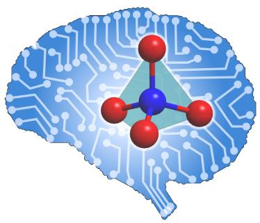

<details>
<summary>chemical</summary>

Molecular model of a brain with red and blue atoms connected by bonds, enclosed in a circuit board pattern
</details>

# JAMIP

Jilin Artificial-intelligence aided Materials-design Integrated Package

- JAMIP简介 1  
- 1. 软件安装及运行环境配置 …… 2

\- 1.1 软件安装 2

■ 1.1.1 下载源代码并安装 …… 2  
■ 1.1.2 环境变量初始化 …… 3  
■ 1.1.3 程序安装测试 …… 3

\- 1.2 程序运行环境配置 3

■ 1.2.1 集群参数 …… 3  
■ 1.2.2 高通量计算默认参数 …… 4  
■ 1.2.3 数据库参数 …… 5

• 2. 快速使用指南 6

\- 2.1 高通量计算任务输入文件准备 …… 6

■ 2.1.1 任务控制文件 …… 6  
■ 2.1.2 本地配置文件 …… 7

- 2.2 高通量计算任务提交 8  
- 2.3 任务状态监控与检查 8  
- 2.4 数据提取与处理 10

■ 2.4.1 数据提取与存储 …… 10  
■ 2.4.2 利用数据绘图 11  
■ 2.4.3 数据挖掘研究 …… 13

3.数据库 14

3.1 数据库框架 14  
- 3.2 数据库安装与配置 …… 15  
- 3.3 数据库查询与存储 16

■ 3.3.1 结构的输入/输出 …… 16  
■ 3.3.2 数据的持久化 …… 17  
■ 3.3.3 数据库查询语法 …… 18

3.4 结构建模方法 21

■ 3.4.1 Structure/MolStructure类 …… 21  
■ 3.4.2 StructureFactory类 …… 22

3.5 结构原型数据库 30

\- 4. 高通量计算流程 31

\- 4.1 任务流程简介 …… 31

■ 4.1.1 参数设置 …… 31

■ 第一性原理计算参数  
■ 集群管理参数

■ 4.1.2 任务池管理机制及任务批量提交 …… 35  
■ 4.1.3 任务执行流程 …… 36  
■ 4.1.4 任务监控与纠错 …… 39

监控模块  
■ 集群检查

- 纠错计算和纠错集设置  
■ 4.1.5 计算结果提取与分析 …… 40  
■ 4.1.6 计算结果存储 …… 42

## - 4.2 基于VASP软件的高通量计算任务流程 43

■ 4.2.1 自洽场计算与结构优化 …… 43

■ 自洽场计算  
结构优化  
- 收敛测试

■ 4.2.2 热力学性质 …… 45

- 分解焓  
- Convex hull  
- Triangle zone

■ 4.2.3 电子结构 …… 45

■ 能带结构  
■ 电子态密度  
■ 总电荷密度及部分电荷密度  
STM图模拟计算  
■ 形变势  
■ 杂化泛函相关计算  
■ 成键轨道分析  
■ 电荷布局分析  
■ 能带反折叠

■ 4.2.4 力学性质 …… 49

■ 弹性模量及弹性常数  
泊松比

■ 4.2.5 光学性质 …… 50

- 光吸收谱相关计算  
■ 介电常数  
■ 激子结合能及波尔半径  
■ 自陷态激子  
■ 非线性二次谐波成像  
■ 太阳能电池理论转换效率  
GW计算

■ 4.2.6 电输运性质 …… 51

载流子有效质量  
■ 载流子迁移率计算(二维材料)

■ 4.2.7 声子及热学性质 …… 52

- 软模相变  
- gruneisen常数  
零点能

■ 声子谱及声子态密度

IR光谱  
■ Raman光谱  
热导率

■ 4.2.8 其他性质 …… 54  
XRD图谱  
- Packing factor  
- 径向分布函数  
■ 容差因子及八面体因子（钙钛矿结构）

■ 4.2.9 人工智能算法引导 …… 54

\- 4.3 基于Quantum ESPRESSO软件的高通量计算任务流程 55

■ 4.3.1 自洽场计算与结构优化 …… 56  
■ 自洽场计算  
结构优化  
■ 4.3.2 电子结构 …… 56  
■ 能带结构  
■ 电子态密度

5. 机器学习 57

\- 5.1 数据预处理 …… 57

■ 5.1.1 数据清洗 57  
■ 5.1.2 类别特征编码 …… 60

5.2 特征工程 62

■ 5.2.1 特征缩放 …… 62  
■ 5.2.2 特征构造 …… 67  
■ 5.2.3 特征选择 …… 68

\- 5.3 模型处理与评估 …… 73

■ 5.3.1 模型构建及后处理 74  
■ 5.3.2 模型评估 …… 75

\- 5.4 数据可视化 80

6. 开发者文档 84

- 6.1 任务检查 84  
- 6.2 绘图模块 87  
- 6.3 自定义任务流程 89

任务命名规则  
流程设计框架  
■ 程序运行流程

\- 6.4 数据库接口类 92

7.命令行工具 94

- 7.1 任务提交 94  
- 7.2 任务检查 95  
- 7.3 数据处理 95  
◦ 7.4 辅助工具 96

## JAMIP简介

JAMIP (Jilin Artificial-intelligence aided Materials-design Integrated Package)是由吉林大学张立军课题组开发的人工智能辅助、数据驱动的材料设计集成软件包。软件包为满足材料基因工程与材料信息学的研究需求设计，涵盖半导体材料、介电材料、金属材料等材料体系，为基于功能材料大数据与人工智能机器学习算法结合的新材料发现和设计提供工具支撑。

课题组在发展的基于大规模高通量材料计算框架的材料设计方法基础之上，深度结合数据管理、分析及存储技术与机器学习数据挖掘算法，解决了系列材料信息学研究面临的关键技术难题，开发了拥有自主知识产权的材料设计集成软件包JAMIP。JAMIP软件包受中国版权局的保护，注册号是2017SR514752和2021SR0349238。软件包主体使用Python语言开发，代码开源，供国内外同行在签订版权协议的条件下免费使用。

软件包主体框架包含以高通量材料计算为核心的数据产生，数据收集、管理工具及数据存储，机器学习/数据挖掘功能模块。各部分之间高度融合，为高效产生、分析、管理和学习计算材料大数据，进而开展新材料设计与发现研究提供专业操作化软件平台。

## i. 以高通量材料计算为核心的数据产生：

JAMIP具有强大的材料制造工坊，包含便于开展高通量材料计算的结构原型数据库（版权注册号2019SR1060756），仍在不断发展中的结构操作方法集（可方便快捷构建缺陷、表面、晶界、异质结等复杂材料结构），为批量产生用于大规模高通量材料计算的材料结构提供了工具基础。JAMIP集成的高通量第一性原理计算引擎（支持VASP、Quantum Espresso等计算软件）可针对批量生成的材料结构进行高度自动化的计算模拟。软件集成的自动化任务递交、监控、纠错模块为计算任务的高效、顺利完成提供保障。以下列出当前JAMIP版本支持的材料性质计算流程模块（以VASP程序为例）：

- 自洽场计算与结构优化;  
- 热力学性质：分解焓，Convex hull，Triangle zone;  
- 电子结构：能带结构，电子态密度，总及部分电荷密度，成键轨道分析、形变势、电荷布居分析等；  
- 力学性质：弹性模量，体模量，泊松比等；  
- 光学性质：光吸收谱计算，介电函数，激子结合能，太阳能电池理论转换效率、非线性二次谐波成像等；  
- 声子与热学性质：声子谱及声子态密度，软模相变，gruneisen常数、热导率等；  
- 电输运性质：载流子有效质量，载流子迁移率；  
- 其他性质：XRD图谱，径向分布函数，容差因子及八面体因子(钙钛矿结构)

我们正致力于不断扩展以上材料性质计算流程模块，涵盖更多功能材料体系的性质，为实现功能导向的材料设计提供有效计算工具支撑。

## ii. 数据收集、管理工具及数据存储：

JAMIP集成了针对不同类别的功能材料，对高通量第一性原理计算结果的自动化数据提取、分析工具。针对材料信息学的材料大数据特点，集成了以Django框架为基础的数据库平台接口，支持MySQL，Sqlite3，postgresql等多种主流数据库管理语言。数据库系统实现使用环境的纯Python化，用户无需学习复杂的结构化查询语言（SQL），即可在多种平台上对特定研究课题的计算数据进行存储，共享与快速检索。目前数据收集、管理工具及数据存储模块支持以下功能：

- 高通量计算数据自动提取；  
- 计算数据分析工具、绘图工具；  
- 计算数据的自动存储到数据库；  
- 数据库的便捷数据查询与导出

## iii. 机器学习/数据挖掘模块：

在JAMIP当前版本中，我们集成了数据前处理，数据特征工程，以及常用机器学习算法的模型构建和性能评估子模块。用户可根据训练和测试数据集的特征，选择合适的机器学习算法开展机器学习研究，探索材料性质与结构之间的内在关系、不同性质之间的关联、主导材料高性能化的物理规律，进而开展新材料设计。

目前机器学习/数据挖掘模块支持以下功能：

- 数据预处理：数据清洗、类别特征编码；  
- 特征工程：特征缩放、特征构造、特征选择；  
- 机器学习模型构建及后处理、模型评估;  
- 基于数据挖掘结果开展材料设计研究

如果想了解更多的关于JAMIP方法和程序，请参考以下文献:

Xin-Gang Zhao, Kun Zhou, Bangyu Xing, Ruoting Zhao, et al., Yuhao Fu, Lijun Zhang, “JAMIP: an artificial-intelligence aided data-driven infrastructure for computational materials informatics”, arXiv:2103.07957 (2021)

虽然JAMIP开发团队和现有用户已对JAMIP软件包进行了大量测试，但由于新功能的不断添加和算法的不断完善，程序中的bug在所难免。当您在使用过程中发现任何问题，请随时和我们联系，我们将非常高兴地接受所有用户提出的宝贵建议和批评。

如果发现程序中的bug，请通过电子邮件发送输入和输出文件的副本到JAMIP开发团队(admin@jamip-code.com)，感谢大家的理解与支持。

## 1. 软件安装及运行环境配置

当前JAMIP版本基于Linux环境开发、安装和运行，安装及运行环境配置步骤如下：

## 1.1 软件安装

## 1.1.1 下载源代码并安装

在JAMIP软件主页（http://www.jamip-code.com）注册并签订版权协议，下载源码安装包 JAMIP-V1.0.tar.gz,

解压后执行：

```batch
sh install.sh
```

目前JAMIP依赖的Python库在用户机器联网状态下默认安装。或在安装前，可安装Conda或自行配置以下依赖的Python库：

- Python $\geq 3.7$  
- numpy $\geq 1.14$  
- spglib  
- Django $\geq 3.1$  
- matplotlib $\geq 2.1$  
- scikit-learn $\geq 0.22$  
- seaborn $\geq 0.10$  
- scipy $\geq 1.5.4$  
- ruamel.yaml ≥ 0.16  
- psutil

## 1.1.2 环境变量初始化

默认安装时，JAMIP可执行程序路径为：\$HOME/.jamip/bin，并默认添加至.bashrc文件。

## 1.1.3 程序安装测试

在终端输入jp指令正常执行：

```txt
jp -h/--help
```

## 1.2 程序运行环境配置

初始安装JAMIP程序时,需要对高通量计算环境(集群参数、第一性原理计算的默认参数)和数据库做初始化的环境配置。所有配置文件都在 \$HOME/.jamip/env 路径下。

在程序运行过程中，将基于上述目录下的用户配置文件，在计算目录下生成本地配置文件副本。

注意：预先修改并测试配置文件，将有助于减少在程序使用过程中遇到的一些异常问题。

## 1.2.1 集群参数

在执行计算时，JAMIP默认会基于初始化的集群参数（任务管理系统信息、机器硬件信息）构建任务文件，实现跨集群的任务提交与管理。

JAMIP目前预置了三种作业管理系统的配置文件：PBS、LSF、SLURM，分别存放

在 \$HOME/.jamip/env 目录下的pbs.yaml, lsf.yaml和sbatch.yaml。我们正在持续扩展对其他作业管理

系统的支持。作业管理系统配置文件的格式如下（以PBS作业管理系统为例）：

pbs.yaml  
```yaml
manager: PBS # 作业管理系统类型
project: VASP.pbs # 默认的提交任务名称
walltime: 04:00:00 # 默认的程序运行最大时间
queue batch # 默认的提交队列名
cmd: qsub # 提交任务的命令
mpi: mpirun # 并行任务的命令
maximum: 10 # 提交队列中，默认的提交任务上限值（正在计算和等待计算的任务）
env: # 自定义程序执行所需的依赖库/编译器
- module load intel # 例如：加载intel编译器
- export PATH=$HOME/anaconda3/bin:$PATH # 例如：添加Python环境变量
cores: 36 # 单个计算节点使用的核数
nodes: 1 # 使用的计算节点数
```

运行程序时，基于默认设置生成的PBS任务脚本如下：

```shell
#!/bin/bash    # shell路径
#PBS -N VASP.pbs    # 任务名
#PBS -q batch    # 队列名
#PBS -l nodes=1:ppn=36    # 节点数：核数
#PBS -l walltime=04:00:00    # 程序最大运行时间
#PBS -e .error    # 脚本的异常信息输出到 xxx.error
#PBS -o .output    # 脚本的标准日志输出到 xxx.output

cd $PBS_O_WORKDIR    # 切换目录到提交目录
    #（注意：针对PBS作业管理系统，JAMIP会自动添加这行）
module load intel    # 加载程序执行所需的依赖库/编译器
export PATH=$HOME/anaconda3/bin:$PATH

python $JAMIP_PYTHONPATH/manager.py NAME.dat directory >.running
```

## 备注:

在执行 jp -r prepare 命令后，JAMIP会根据默认路径下（\$HOME/.jamip/env）的集群配置文件和临时集群配置文件，在提交目录下生成副本配置文件 .cluster 。在后续提交任务和程序运行期间，JAMIP将读取从该副本文件来加载所需的集群参数。如果您想了解更多作业管理系统的配置方法和管理模块，请参阅集群管理模块：集群管理模块。

## 1.2.2 高通量计算默认参数

在高通量计算中，批量计算一系列材料的性质通常会采用固定的计算流程和计算参数。

JAMIP为常见的计算任务提供了一套稳健的计算流程，默认的任务计算参数储存

在 \$HOME/.jamip/env 目录下，如vasp.yaml（用于VASP）、qe.yaml（用于QE）。用户可以根据自己的实际计算需求，修改对应计算任务的初始化参数。以VASP的计算任务为例：

vasp.yaml  
```yaml
base:
    system: jamip
    ismear: 0
    sigma: 0.05
    algo: fast
    npar: 4
relax:
    addgrid: true
    nelm: 5
scf:
    lcharg: true
    lwave: true
dos:
    lwave: false
    ismear: -5
    nedos: 3001
    lorbit: 11
```

JAMIP目前支持的第一性原理计算软件有：VASP和 Quantum Espresso。我们正在更新对其他主流计算软件和程序的支持。

## 备注:

在执行 jp -r prepare 命令来生成计算的任务池后，JAMIP将在当前目录下生成/更新任务计算参数的文件副本 .incar 。在程序运行期间，JAMIP将从该副本文件中加载计算参数。用户可以通过修改此文件，实现动态地修改本次计算参数。

在修改 .incar 文件时，尽量简化参数设置，避免因重复设置参数而导致的计算参数遗忘或更新混乱 (详细信息见 DFT 参数设置)

## 下面列出了计算参数文件中通用的键名：

base: 默认参数集，各个计算任务的incar均在此基础上更新  
计算任务部分:  
```yaml
relax: 结构优化参数
scf: 自洽计算参数
band: 能带计算参数
dos: 态密度计算参数
force: 力常数计算参数
optics: 含频介电常数参数
hse_gap: hse修正带隙计算
```

交换关联泛函部分:  
```txt
soc: 自旋轨道耦合计算参数
hse: 杂化泛函参数
gw: gw参数
```

## 1.2.3 数据库参数

JAMIP中的数据库是以Django框架为基础开发的，数据库系统实现了使用环境的纯Python化，用户无需学习复杂数据库编程方法和结构化查询语言（SQL），通过调用JAMIP程序内部方法，就能完成对数据库中数据的更新维护及查询操作。JAMIP数据库支持多种主流关系型数据库后端，如MySQL, MariaDB, Sqlite3, Oracle, PostgreSQL。

在使用数据库相关功能前，用户需要先完成数据库初始化和Django的参数配置工作。

目前，JAMIP支持自动化配置MySQL和Sqlite3数据库，数据库配置文件保存在

```txt
~/.jamip/env/django.json
```

如果您是轻量级用户，推荐使用Python环境自带的Sqlite3数据库。下面列出初始化数据库的相关命令：

```shell
jp --django mysql # 配置MySQL参数，交互式输入数据库名称、登陆等信息
jp --django sqlite # 配置Sqlite3参数，默认的数据库生成路径为$HOME/bin/jamipdb
jp --django makemigrations # 数据库迁移--生成迁移文件
jp --django migrate # 数据库迁移--同步到数据库
```

## 2. 快速使用指南

JAMIP的核心命令行工具为：jp。用户可以通过该命令，与JAMIP进行交互 (完整的jp命令介绍请参阅：jp命令介绍)

本章以单晶硅(空间群号：227)的VASP能带计算为例，展示如何使用jp命令进行如下操作：文件准备、参数配置、任务提交、任务检查、以及数据处理的一般计算流程。

## 2.1 高通量计算任务输入文件准备

首先，用户需要先完成以下准备工作：

1. 准备VASP可执行程序  
2. 准备完整的VASP赝势库，用于JAMIP程序自动调用赝势  
3. 待计算的结构文件(以单晶硅为例)，输入文件的格式可以是vasp、cif、qe等

## 2.1.1 任务控制文件

JAMIP通过Python文件(input.py)设置计算任务的主要参数。程序将根据input.py内的设置的参数生成计算类。可通过jp -i vasp命令生成默认input.py文件，示例如下(更为详细的信息请参阅：input参数设置):

```python
from jamip.abtools.vasp.setvasp import SetVasp
from jamip.compute.prepare import Prepare

def jump_input(name=None,*args, **kwargs):
    vasp=SetVasp()    # 初始化SetVasp类
    vasp.program='/install_path/vasp_std'    # vasp程序路径
    vasp.potential = '/install_path/paw_pbe'    # vasp赝势目录
    vasp.tasks = 'shape volume ions scf band'    # vasp计算任务列表

    vasp.xc_func = 'pbe'    # vasp计算使用的泛函
    vasp.force    = 1e-2    # vasp计算的力收敛标准，对应EDIFFG = 1e-2
    vasp.energy    = 1e-6    # vasp计算的能量收敛标准，对应EDIFF = 1e-6
    vasp.cutoff    = 1.3    # vasp计算的截断能，支持两种设置方式：1)直接设置截断能值，如：500
    # 2) POTCAR中的所有赝势的ENMAX中的最大值的倍数，如：1.3(即：ENCUT=1.3*ENMAX)
    vasp.kpoints = 0.25    # vasp计算使用的K点类型，0.25表示采用：KSPACING = 0.25

    pool=Prepare.pool(vasp)    # 初始化Prepare类
    pool.set_structure('Input','Output')    # 设置计算的输入和输出目录
    # 在此示例中，input为输入结构文件目录，output为计算输出目录
    pool.save('Silicon.dat')    # 保存任务池，任务池名为'Silicon.dat'
    Prepare.cluster('pbs')    # 生成/更新.cluster文件，可选(pbs/lsf/slurm)
    Prepare.incar(vasp.tasks)    # 生成/更新.incar文件，根据计算任务添加参数字典
```

## 备注:

进行批量计算时，需要将结构文件保存在同一目录下。在生成任务池时，JAMIP程序将从该目录统一读取结构。

用户需要为结构文件设置正确的后缀，目录内出现无法识别的文件将导致结构读入失败。

结构文件名将用于后续的计算目录、批量绘图等的命名。

## 2.1.2 本地配置文件

JAMIP采用在任务提交目录下生成配置文件副本的方式，方便用户跨集群递交计算任务和自定义批量计算参数。

在任务提交前，建议用户对下列配置文件进行细致地检查：

- .incar 用于设置批量VASP计算的INCAR控制参数（以VASP计算为例）；  
- .cluster 用于设置批量计算使用的集群参数;  
- .extra 用于设置针对特定结构的参数，如计算磁性结构、铁电极化、LDA+U等；

## 备注:

1. 当前目录不存在配置文件时,执行 jp -r prepare 后,JAMIP将生成基于初始化环境 \$HOME/.jamip/env 的模板;  
如果已经存在本地配置文件，执行 jp -r prepare，JAMIP 将检查现有配置文件并做补充。

2. .extra 文件仅在计算特定体系时输出，详细信息见：补充参数设置

在完成准备工作后，提交目录下应当包含如下文件：

```txt
| -- input.py    # 任务控制文件
| -- .incar    # 计算参数文件
| -- .cluster    # 集群参数文件
| -- .extra    # 补充参数文件
` -- Input    # 结构文件目录
| -- Si.vasp    # 结构文件
` -- ...
```

## 2.2 高通量计算任务提交

JAMIP通过任务池文件实现对任务的管理和批量自动化提交，以下是提交使用的命令

```txt
jp -r prepare # 在当前目录下，生成任务池
jp -r qsub -f Silicon.dat # 提交任务池<Silicon.py>中的任务
```

## 备注：

1. 单次任务提交的任务数由 .cluster 内的 maximum 参数决定(默认为10)  
2. JAMIP程序将在上一任务完成后，自动从任务池中提交新的任务，维持计算队列中的任务总数不变  
3. 任务池文件储存了计算信息和运行状态，计算完成前不可进行修改，使用任务检查命令也需要保留任务池文件

## 提交任务后的提交目录:

```txt
| -- input.py    # 任务提交脚本
| -- input    # 结构文件目录
| `-- Si.vasp    # 结构文件
| -- Silicon.dat    # 任务池
| -- .cluster    # 集群配置文件
| -- .incar    # INCAR配置文件
`-- output    # 计算总目录
`-- Si.vasp    # 计算目录
| -- relax    # 结构优化计算目录
| | -- S0    # 分步优化，S0为粗优化
| `-- S1    # 分布优化，S1为第一步标准优化
| -- scf    # 自洽计算目录
`-- electric    # 电子结构目录
`-- band    # 能带计算目录
```

## 2.3 任务状态监控与检查

JAMIP提供了多种输出日志，用户可以从日志中获取任务的详细信息。以下日志文件都存储在计算任务的根目录中：

\- 实时输出：

.status 记录任务的完成状态

.history 记录任务的开始和完成时间，重新计算不会更新该文件

cpu.log 记录计算节点的状态和当前任务完成阶段，每次计算重新生成

\- 计算完成后输出:

.running 任务标准输出信息

.error 任务报错信息

用户可以使用 jp 命令查询任务池中所有任务的计算状态统计：

\$ jp -c show -f Silicon.dat # show命令查看当前任务池的完成状态  
```txt
| job_id | prior | status | scf | relax | path |
| 203764 | 9 | finish | True | True | OUTPUT/Si.vasp |
```

\# 表格信息说明：

> job\_id：在任务管理系统中的任务号；

> prior：任务优先级（依赖于自重启计算次数，自重启计算次数越多优先级越低）；

> status : 任务运行状态;

> relax/scf：各个子任务的完成状态；

> path：计算路径（基于提交目录的相对路径）

## 备注:

\- 任务状态status包含以下情况：

wait 代表任务未提交;

finish 代表任务正常结束;

running 代表任务已提交但未完成，用户需要在确定任务全部完成的情况下，着重检查这部分任务的实际运行情况

用户也可以从日志中获取任务的详细信息。以下日志均位于计算任务的根目录：

\- 实时输出：

.status 记录任务的完成状态;

.history 记录及追加任务的开始和完成时间;

cpu.log 记录计算节点的状态和当前任务完成阶段;

\- 计算完成后输出:

.running 任务标准输出信息

.error 任务报错信息

任务状态文件 .status :

```yaml
relax/S0:    # key值：计算目录，唯一值
    task:    # task：任务名称，值为空时不被检查模块识别
    finish: true    # finish：计算是否完成
    success: true    # success：任务是否完成
    electronic: true    # electronic：电子步收敛
    force: 0.00489    # force：晶格力收敛
    ionic: true    # ionic：离子步收敛

relax/S1:
    task: relax    # relax任务的有效目录
    finish: true    # 当检查模块读取.status文件时，将以此作为优化计算的最终目录
    success: true    # 并读取相关的任务状态

electronic: true

force: 0.0057

ionic: true

scf:
    task: scf    # scf任务的有效目录
    finish: true

success: true

electric/partchg/scf:
    task:    # 对于需要多步计算完成的任务，如果记录其子任务的完成状态，
    finish: true    # 其task值应为None，待计算完成后补充整体任务的完成情况
    success: true

electric/partchg:
    task: partchg    # partchg任务的有效目录
    finish: true

success: true
```

## 2.4 数据提取与处理

## 2.4.1 数据提取与存储

JAMIP的数据处理主要依靠内部的Python提取模块实现，运行 jp 命令可以在terminal内实现部分功能，用户也可以基于相关模块手动构建数据提取脚本。详细信息请参阅：jamip.analysis代码说明文档。

## 使用 jp -o 命令可以在命令行环境快速查看数据，例如：

```txt
$ jp -o bandgap free_energy emass # 提取并输出统计数据
+----+----+----+----+----+----+
| path    | bandgap    | isdirect    | free_energy    | H-mass    | e-mass    |
+----+----+----+----+----+----+
| Si.vasp    | 0.7041    | False    | -43.38044857    | 1.013    | 0.287    |
+----+----+----+----+----+----+
```

```txt
$ jp -o csv bandgap free_energy emass # 提取并以csv格式输出数据
```

```txt
format, bandgap, isdirect, free_energy, H-mass, e-mass
Si.vasp, 0.7041, False, -43.38044857, 1.013, 0.287
```

使用功能化函数提取数据，例如提取vasp计算的能带数据

\# 提取vasp计算的能带数据

from jamip.analysis.vasp import BandFinder

path = '/home/jamip-test/ICSD/CsPbI3.vasp'

bf = BandFinder(path)

banddata = bf.get\_bands()

\# 计算目录

\# 实例化类

\# 提取能带数据

## 2.4.2 利用数据绘图

JAMIP以Python脚本的形式提供常用的绘图功能，用户可以使用绘图脚本为一组计算批量绘图。绘图功能基于Matplotlib包实现，部分绘图参数设置存储在：\$HOME/.jamip/viewer/，用户可通过修改对应任务的 .mplstyle 文件来调整图片绘制参数。更多绘图信息参阅：绘图模块

## 支持的绘图功能：

电子结构相关:

band: 能带

fatband: 投影能带（需要PROCAR）

tdos: 态密度

pdos: 投影态密度

absorb: 光吸收谱

dielectric: 介电函数

unfolding: 能带反折叠

hseband: 杂化泛函能带

tdm: 跃迁矩阵元

cohp: 成键轨道分析

phonopy相关

phband: 声子谱

phdos: 声子态密度

gruneisen: Gruneisen常数

thermal: 热膨胀系数

softmode: 软膜相变

光谱相关:

xrd: x射线衍射

ir\_spectrum: 红外光谱

raman\_spectrum: 拉曼光谱

其他：

convex\_hull: 二元相图分析

triangle\_zone: 三元相图分析

执行 jp -i plot 命令生成绘图脚本，代码如下：

```python
# Plot Params
BAND_EMIN = -1    # 能带能量区间下限
BAND_EMAX = 3    # 能带能量区间上限
BAND_SHIFT = 0    # 能带的导带偏移值(用于修正带隙)
BAND_XLABEL = ''    # 能带图的X轴标签
BAND_YLABEL = 'Energy (eV)'  # 能带图的Y轴标签

DOS_EMIN = -1    # DOS能量区间下限
DOS_EMAX = 3    # DOS能量区间上限
DOS_LIMIT = 0.04    # DOS的态密度上限
DOS_XLABEL = 'Energy (eV)'  # DOS图的X轴标签
DOS_YLABEL = '$PDOS\ (states/eV/\AA^{3})'$  # DOS图的Y轴标签

ABSORB_EMIN = 0    # 光学绘图的能量区间下限
ABSORB_EMAX = 5    # 光学绘图的能量区间上限
ABSORB_XLABEL = 'Energy (eV)'  # 光吸收图的X轴标签
ABSORB_YLABEL = '$Absorb (10^6 \cpot m^{-1}$)'  # 光吸收图的Y轴标签
TDM_YLABEL = '$TDM\ P2^2(Debye^2)$'  # 跃迁偶极矩图的Y轴标签
TITLE = ''    # 图像标题

if __name__ == '__main__':
    # from jamip.utils.qeplot import QEPlot
    # pl = QEPlot(path='output/Si.vasp')  # 适用于QE格式数据
    from jamip.utils.plot import Plot
    pl = Plot(path='output/Si.vasp')   # 适用于VASP格式数据
    pl.plots('band','tdos')
    #pl.plots('pdos')
    #pl.plots('dielectric')
    #pl.plots('tdm')
    #pl.plots('unfolding')
```  
默认绘图样式: \$HOME/.jamip/viewer/dos.mplstye

```yaml
figure.figsize: 12,6
figure.dpi: 144
axes.titlesize: 24
axes.labelsize: 20
legend.fontsize: 18
xtick.labelsize: 20
ytick.labelsize: 20
lines.linewidth: 2.5
lines.markersize: 10
```

## 备注：

1. 画布默认大小为(12,12)，字体大小、线宽均是在此基础上设计。

如果进行单一任务绘图，画布将依据style文件设置

如果绘制组合图，默认按从左到右的顺序横向排开，画布大小将根据任务类型相应扩展如果用户需要手动设置组图位置，可采用如下形式来指定画布和绘图区间：

```txt
pl = Plot(path='output/Si.vasp')
a, b = slice(0, 7), slice(7, 10)
pl.plots('band', 'pdos', 'tdm', grid=(10, 10), slices=[(a, a), (a, b), (b, a)])
```

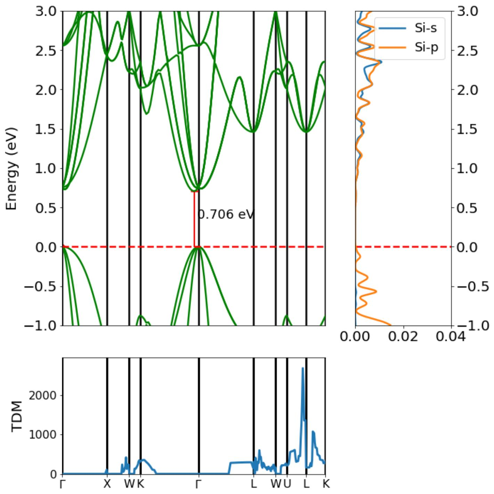

## 2.4.3 数据挖掘研究

在利用高通量软件进行大规模材料计算的同时，如何充分利用计算过程产生的大量数据，从中挖掘出有价值的规律性认知，是材料信息学的研究的重点。

JAMIP数据库和机器学习包为材料计算的大数据分析提供了有力的工具，用户可以将海量的计算数据转化为机器学习可用的描述符集，并在需要时从数据库中提取并加以分析。下面介绍构建描述符集的基本方法。

```python
import os
from jamip.db.connect import Read, Structure
from jamip.m1.descriptorsSet.descriptorsSet import DescriptorsSetBuilder

structures = []
for file in os.listdir('TEST'):
    raw = Read(os.path.join('TEST', file)).run()
    s = Structure().create(raw, isPersist=False)
    structures.append(s)
features = ['mass','natoms','volume','a','b','c','BX']  # 设置提取特征

df=DescriptorsSetBuilder(structures).set_features(features) # 提取特征
df.save('test.csv') # 将提取结果存入csv文件
```

## 3. 数据库

本章节介绍JAMIP数据库的使用方法。高通量计算必然引发海量数据的管理问题，而数据库的使用将大大降低用户管理和维护数据的成本，提高数据的共享性和安全性，提高材料研发效率。

## 3.1 数据库框架

JAMIP数据库包含了针对材料数据信息特点开发的应用层、Django框架作为中间件、关系型数据作为底层数据的持久化存储，实现使用环境的纯Python化，无需额外学习复杂的结构化查询语言（SQL）。目前程序支持主流的关系型数据库，如PostgreSQL、MySQL、MarialDB、Oracle、Sqlite等。

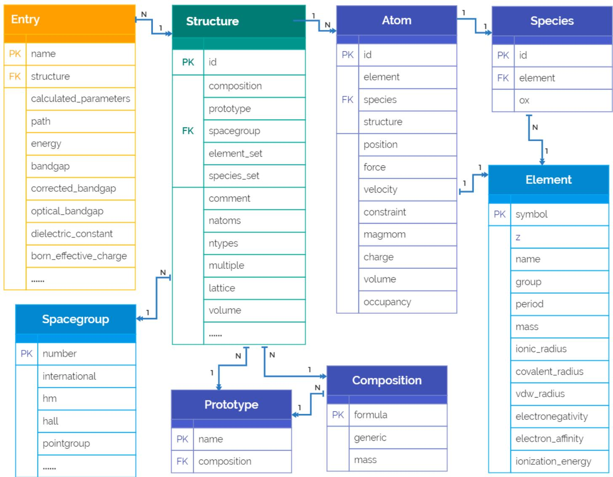

<details>
<summary>flowchart</summary>


```mermaid
graph TD
  A["Entry"] -->|N| B["Structure"]
  A -->|1| C["Atom"]
  A -->|1| D["Species"]
  B -->|1| E["Element"]
  B -->|N| F["Spacegroup"]
  B -->|1| G["Prototype"]
  B -->|1| H["Composition"]
  C -->|1| I["Element"]
  C -->|1| J["Spacegroup"]
  C -->|1| K["Prototype"]
  C -->|1| L["Composition"]
  D -->|1| M["Element"]
  D -->|1| N["Spacegroup"]
  D -->|1| O["Prototype"]
  D -->|1| P["Composition"]
  E -->|1| Q["Element"]
  E -->|1| R["Spacegroup"]
  E -->|1| S["Prototype"]
  E -->|1| T["Composition"]
  F -->|1| U["Element"]
  F -->|1| V["Spacegroup"]
  F -->|1| W["Prototype"]
  F -->|1| X["Composition"]
  G -->|1| Y["Element"]
  G -->|1| Z["Spacegroup"]
  G -->|1| AA["Prototype"]
  G -->|1| AB["Composition"]
  H -->|1| AC["Element"]
  H -->|1| AD["Spacegroup"]
  H -->|1| AE["Prototype"]
  H -->|1| AF["Composition"]
  I -->|1| AG["Element"]
  I -->|1| AH["Spacegroup"]
  I -->|1| AI["Prototype"]
  I -->|1| AJ["Composition"]
  J -->|1| AK["Element"]
  J -->|1| AL["Spacegroup"]
  J -->|1| AM["Prototype"]
  J -->|1| AN["Composition"]
  K -->|1| AO["Element"]
  K -->|1| AP["Spacegroup"]
  K -->|1| AQ["Prototype"]
  K -->|1| AR["Composition"]
  L -->|1| AS["Element"]
  L -->|1| AT["Spacegroup"]
  L -->|1| AU["Prototype"]
  L -->|1| AV["Composition"]
  M -->|1| AW["Element"]
  M -->|1| AX["Spacegroup"]
  M -->|1| AY["Prototype"]
  M -->|1| AZ["Composition"]
  N -->|1| BA["Element"]
  N -->|1| BB["Spacegroup"]
  N -->|1| BC["Prototype"]
  N -->|1| BD["Composition"]
  O -->|1| BE["Element"]
  O -->|1| BF["Spacegroup"]
  O -->|1| BG["Prototype"]
  O -->|1| BH["Composition"]
  P -->|1| BI["Element"]
  P -->|1| BJ["Spacegroup"]
  P -->|1| BK["Prototype"]
  P -->|1| BL["Composition"]
  Q -->|1| BM["Element"]
  Q -->|1| BN["Spacegroup"]
  Q -->|1| BO["Prototype"]
  Q -->|1| BP["Composition"]
  R -->|1| BQ["Element"]
  R -->|1| BR["Spacegroup"]
  R -->|1| BS["Prototype"]
  R -->|1| BT["Composition"]
```
</details>

## 3.2 数据库安装与配置

安装数据库需要以下python依赖：

- django $\geq 3.1$  
- mendeleev

mendeleev是一个开源的python API，JAMIP通过其访问元素周期表中的元素、离子的部分属性。如果您在科学出版物中使用了相关功能，请考虑添加以下引用：

L. M. Mentel, mendeleev - A Python resource for properties of chemical elements, ions and isotopes., Available at: https://github.com/lmmentel/mendeleev.

JAMIP默认使用sqlite3数据库。如果用户希望使用MySQL等数据库，可以参考开发者手册中的安装教程。

数据库使用命令 通过jp命令可以快速实现数据库的配置、初始化和数据迁移

jp --django mysql/sqlite

执行命令后，将在 \$HOME/.jamip/env/django.json 文件内储存数据库连接信息

对于JAMIP未支持的数据库，可以通过修改此文件手动完成链接

jp --django makemigrations

jp --django migrate

当用户完成数据库安装与配置后，需要在新建数据库中导入JAMIP数据库结构

执行以下两个命令进行数据库结构的迁移工作：

jp --django loaddata -f [file]

在完成数据库迁移操作后，数据库中不包含任何数据，用户将在使用过程中逐渐扩充数据同时，用户可以通过此命令从选择的json文件导入数据库

jp --django dumpdata

将当前数据库以json格式导出，默认文件名为 jamip.json，该文件可用于数据的迁移和共享

## 备注：

1. MySQL的默认储存位置为 \$HOME/mysql/data，  
Sqlite的默认储存位置为 \$HOME/.jamip/bin/jamipdb  
2. 在进行数据库迁移时的同时，jamip将自动删除原有迁移文件，  
如果是新建sqlite3数据库，将重命名旧数据库为 \$HOME/.jamip/bin/db.bk  
3. 在更新jamip版本前，建议先将现有数据库导出，避免因数据库结构更新使原有数据库失效

## 3.3 数据库查询与存储

## 3.3.1 结构的输入/输出

iostream.read(path, dtype,\*\*kwargs)

从指定的路径(path)和文件格式(dtype)读入结构。目前支持的文件格式有：CIF、POSCAR、xyz、mol,

以及包含多个结构的文件，如XDATCAR、CALYPSO结构文件。

```python
from jamip.db.iostream.read import Read
raw_struct0=Read(path='./CsPbI3/POSCAR', dtype='poscar').run() # read single structure
raw_structs=Read(path='./CsPbI3/XDATCAR', dtype='poscar').run() # read multiple structures
```

## 备选参数：(适用于POSCAR)

- isContainedConstraints: bool, default: False
是否读入文件中的选择动力学信息  
- isContainedVelocities: bool, default: False
是否读入文件中的原子速度信息  
- isContainedElement: bool, default: True
是否需要读入文件包含元素信息。如果POSCAR为VASP.5.2及以前的版本，需要添加isContainedElement=False  
- srange: list, optional
设置XDATCAR文件读入结构的范围，例如：

```txt
raw_structs=Read(path='./CsPbI3/opt/XDATCAR', dtype='poscar', srange=[100,200]).run() # read structures of index from 100 to 200
```

## iostream.write(structure, path, dtype)

输出结构对象(structure)中的结构到指定的路径(path)和文件格式(dtype）。目前支持的输出文件格式：CIF、POSCAR、xyz、mol。

## 备选参数:

- coordinate\_type: bool, default: 'Direct'  
指定输出坐标的类型 ('Direct' / 'Cartesian')  
- isContainedConstraints bool, default: False  
当结构对象包含动力学信息时，是否将其输出至结构文件(POSCAR)  
- isContainedVelocities: bool, default: False  
当结构对象包含原子速度信息时，是否将其输出至结构文件(POSCAR)

## 3.3.2 数据的持久化

JAMIP数据库中提供了多种数据存储方式。首先，可以打开Structure类方法中的isPersit（default: False）开关，如create()和update()。update()方法可以在需要的时候更新内存及底层数据库中的数据。

```python
from jamip.db.iostream.read import Read
from jamip.db.materials.structure import Structure

# method 1
raw_struct0 = Read('./CsPbI3/opt/POSCAR', dtype='poscar').run()
s0 = Structure().create(raw_structure=raw_struct0, isPersist=True)

# method 2
s1 = Structure().create(raw_structure=raw_struct0)
...
S1.update(isPersist=True)
```

结构操作类方法中也提供了类似的持久化开关

```python
from jamip.db.iostream.read import Read
from jamip.db.materials.structure import Structure
from jamip.db.modeling.structureFactory import StructureFactory

raw_struct0 = Read(path='/CsPbI3/opt/POSCAR',dtype='poscar').run()
s0 = Structure().create(raw_structure=raw_struct0)

# method 1
sf = StructureFactory(structure=s0).supercell(dim=[2,2,2], isPersist=True)

# method 2
sf = StructureFactory(structure=s0).supercell(dim=[2,2,2])
s1 = sf.structure
s1.update(isPersist=True)
```

此外，JAMIP提供了批量保存数据的命令，可以在终端下调用 jp-db，实现数据的持久化

```shell
jp --db entry -f [path] # 批量存储计算结果
jp --db structure -f [path] # 批量存储结构文件
在shell环境下快速实现数据库存储功能，未指定路径时将输入当前目录
```

## 3.3.3 数据库查询语法

JAMIP数据库中并存了两种数据形式：1. 临时驻留内存的内建数据；2. 存储在磁盘中的数据。前者是为了方便快速查找、处理读入到内存中的与自身结构相关的信息，无需访问存储在磁盘中的数据库，提高程序响应速度。如，查找结构中的原子坐标，删除结构中的原子等。后者可以进行批量过滤查询所有存储在磁盘介质中的数据。其中，查询语法上前者基于JAMIP内建规则，后者遵循标准的Djaong查询语法规则。

## 内建数据查询

查询结构自身相关信息只需要访问结构类(Structure)的实例化对象的相关属性，如atoms、elements、species等，或者访问结构类中的方法，如get\_atom()、get\_atoms\_of\_element()等。

获取结构中的原子对象，可以访问结构类下的atoms属性，或调用方法get\_atom(formatted\_atom)其中，formatted\_atom的格式为：[元素符号，坐标，坐标类型]。例如：

```txt
['Na', 0.1, 0.1, 0.0, 'Direct']
['Na', 0.1, 0.1, 0.0] (JAMIP数据库中，晶体结构的原子坐标类型默认为分数坐标，因此分数坐标类型可以不显示指定)
['Na', 5.234, 0.1, 0.0, 'Cartesian']。
```

获取结构中指定元素(element)或元素种类(species)下的原子对象，可以调用方法
get\_atoms\_of\_element(symbol) 和 get\_atoms\_of\_species(name)。其中，symbol为元素名，如 'Na'; name为元素种类名，如 'Na+'。

```python
# method 1 by structure's attributes
atoms=s0. atoms    # get all atoms of this structure
atom0=s0. atoms[0]

# method 2 by structure's method
atom1=s0.get_atom(formatted_atom=['Na',0.1,0.1,0.1,'Direct'])
# get all atoms of given element or species in this structure
atoms0=s0.get_atoms_of_element(symbol='Na')
atoms2=s0.get_atoms_of_species(name='Na+')
```

获取结构中的元素对象，可以访问结构类下的elements属性，或调用方法get\_element(symbol)。

获取结构中指定元素对象，可以调用方法get\_element(symbol)。此外，可以通过链式查询获取对象（扩展功能）。其机制是，与结构相关的类下，维护了一系列相互关联的属性数组。如，

```txt
Structure composition element species
|-entries | -prototypes | -structures | -structures
|-elements | -structures | -compositions | -atoms
|-species | -elements | -species
|-atoms
```

```python
# method 1 by structure's attributes
elements=s0.elements
element0=s0.elements[0]

# method 2 by structure's method
element1=s0.get_element(symbol='Na')

# method 3 by chain rule (extend)
element2=s0. atoms[0]. element
elements2=s0.composition.elements
```

获取结构中的元素种类、对称信息、其他属性(质量、体积、晶胞参数等)，以及结构对应条目，方法同上。

## Django查询语法

查询JAMIP数据库中的数据信息，需要遵循标准的Django查询、过滤语法规则。以下简要介绍日常使用涉及到的语法，详细教程可以参阅Django手册。参考链接：

```txt
https://docs.djangoproject.com/en/3.1/topics/db/examples/many_to_one/
https://docs.djangoproject.com/en/3.1/topics/db/examples/many_to_many/
```

首先，查询数据库中一个表里面的所有条目，其语法为：类名.objects.all()。返回类型为包含所有条目的数组。

Django支持强大的过滤查询，如：类名.objects.get(id=xxx)

```python
from jamip.db.connect import Connect
from jamip.db.materials.structure import Structure
structures=Structure.objects.all() # get all structures from database structure1=Structure.objects.get(id=1) # get the structure of index 1
```

其次，Django的查询语法会与表与表之间的关系而变化。在JAMIP中，使用了多对一和多对多关系。多对一关系(many-to-one): 例如，一个结构(one)包含多个原子(many); 从这些原子看，他们都只属于同一个结构。ForeignKey定义了多对一关系，放在具有'many'性质的类中，如Atom。

```python
class Atom(models.Model, object):
    ...
    structure=models.ForeignKey('Structure', null=True, on_delete=models.PROTECT)
    ...    # define the "many-to-one" relationship
    class Meta:
    app_label='materials'
    db_table='atom'
    default_related_name='atom_set'  # define the name for reverse lookup
    ...
```

查询Atom中的条目对应的structure，只需要执行Atom.structure(正向查询)；反向查询为通过Structure中条目对应的atoms，需要使用包含ForeignKey类中定义在子类Meta中default\_related\_name的值('atom\_set')来查询。

```python
# forward query
Structure=Atom.objects.all()[0].structure    # get structure associated with atom 0
# reverse lookup
atoms0=Structure.objects.all()[0].atom_set.all()  # get all atoms associated with structure 0
```

多对多关系(many-to-many): 例如，一个结构包含多种元素；从这些元素看，每个元素可能对应多个不同结构。ManyToManyField定义了多对多关系，可以放在任意其中一个类中，如Structure。

```python
class Structure(models.Model, object):
    ...
    element_set=models.ManyToMany('Element',blank=True,null=True)
    ...    # define the "many-to-many" relationship
    class Meta:
    app_label='materials'
    db_table='structure'
    default_related_name='structure_set'  # define the name for reverse lookup
    ...
```

注：为了避免与Structure类中内建数据结构的属性数组elements命名冲突，用于Django查询element的变量名设置为element\_set。

查询Structure中条目对应的elements，只需要执行Structure.element\_set.all() (正向查询)；反向查询Element中条目对应的structures，同上需要使用包含ManyToManyField类中定义的default\_related\_name的值('structure\_set')。

```python
# forward query
elements0=Structure.objects.element_set.all()[0].structure
# get structure associated with atom 0

# reverse lookup
structures0=Elements.objects.all()[0].structure_set.all()
# get all atoms associated with structure 0
```

## 最后列出常用的Django查询语法

```python
from jamip.db.connect import Connect    # 初始化Django连接
from jamip.db.materials.entry import Entry    # 引入待查询的数据表

# 支持链式调用的接口
Entry.objects.all()  # 查询所有数据
Entry.objects.filter(name='ICSD-235.vasp')    # 根据条件过滤数据
Entry.objects.exclude(spacegroup_id='227')    # 根据条件反向过滤数据

# 不支持链式调用的接口
Entry.objects.count()  # 查询数据表中记录数
Entry.objects.values(name,energy,bandgap)    # 查询数据表的某些字段，不直接返回实例
Entry.objects.filter(name='ICSD-103.vasp').delete()    # 根据条件删除数据

# 使用示例：删除数据库中组分为Si，且未关联计算实例的结构
for s in Structure.objects.filter(composition_id='Si'):
    if Entry.objects.filter(structure=s.id).count() == 0:
    Atom.objects.filter(structure=s.id).delete()
    s.delete()
```

## 3.4 结构建模方法

对结构的操作可以通过两个途径实现：

1. Structure、MolStructure类中定义了基本的结构操作方法，如原子的添加、删除、替换；  
2. StructureFactory类中定义了常见的结构操作方法，如超胞、构建真空层等。

## 3.4.1 Structure/MolStructure类

结构类中的add\_atom()、del\_atom()和substitute\_atom()可以实现对结构中原子信息的基本操作。需要注意的是，方法中设置了同步数据和保存到数据库的开关，在连续对原子进行操作时，建议保持这两个参数处于关闭状态，提高程序的响应速度、避免将中间过渡且不需要的结构保存进数据库，在完成所有的结构操作后，调用update()方法来同步数据/保存到数据库等操作。

```python
from jamip.db.connect import Connect
from jamip.db.iostream.read import Read
from jamip.db.materials.atom import Atom
from jamip.db.materials.molAtom import MolAtom
from jamip.db.materials.structure import Structure
from jamip.db.materials.molStructure import MolStructure

# for crystal
raw_struct0=Read(path='/CsPbI3/opt/POSCAR', dtype='poscar').run()
s0=Structure().create(raw_structure=raw_struct0)

# add_atom
s0.add_atom(atom=Atom().create(formatted_atom=['Na', 0.1, 0.0, 0.0, 'Direct'])) 
# delete atom
s0.del_atom(atom=s0. atoms[0])
# substitute_atom
s0.substitute_atom(atom=s0. atoms[0], symbol_of_element_or_species='K')

# for molecule
raw_struct1=Read(path='/CsPbI3/CH3NH3.xyz', dtype='xyz').run()
s1=MolStructure().create(raw_structure=raw struct1)

# add atom
s1.add_atom(atom=MolAtom().create(formatted_atom=['N', 5.23, 0.0, 0.0, 'Cartesian']))
# delete atom
s1.del_atom(atom=s0. atoms[0])
# substitute atom
s1.substitute_atom(atom=s0. atoms[0], symbol_of_element='K')
```

## 3.4.2 StructureFactory类

结构工厂类中集成了大量常用的结构操作方法，通过对这些操作方法的进一步组合可以实现对复杂结构的构建。此外，这些方法中大部分都支持链式操作。以下对类中的方法进行简单介绍：

注意：支持链式操作的方法返回值为StructureFactory对象，获取结构操作后的结构对象需要调用StructureFactory类属性structure；获取结构操作前的原始对象，调用StructureFactory类属性raw\_structure。

建议：在结构操作过程中，设置isUpdatedInfo和isPersist为False，可以提高程序的响应速度，并且可以避免将操作过程中产生的无用结构保存进数据库；在完成所有结构操作后，调用操作后得到的结构对象的update()方法，同步内存中内建数据结构中的数据，可以避免后续抛出一些异常情况。

## structure

类属性，获取结构操作后的结构对象

## raw\_structure

类属性，获取结构操作前的结构对象

## zoom(scale, isPersist=False)

晶格基矢缩放。

- scale: float 放缩系数值  
- isPersist: bool, default: Fasle 是否保存结构到数据库中

## scale(direction, isPersist=False)

对指定晶格基矢方向，进行晶胞的放缩。

\- direction: list 指定需要缩放的晶格基矢方向的系数其数据格式为：[scale of a, scale of b, scale of c]，如：

```txt
[0.9, 1, 1]（只压缩a方向0.9）
[0.9, 0.9, 1]（压缩a和b方向0.9）
[0.9, 0.9, 0.9]（三个方向都压缩0.9，等同于调用zoom(0.9))
```

\- isPersist: bool, default: Fasle 是否保存结构到数据库中

add\_atoms(atoms, isUpdatedInfo=False, isPersist=False, \*\*kwargs) 在结构中增添多个原子。

\- atoms: array-like 包含原子信息的列表数组，数组的每个原子可以为以下形式：

a. 原子的实例化对象，如：[atom0, atom1, atom2];  
b. 原子的标准格式化数组，其格式为：[元素名，坐标，坐标类型]，例如：

```txt
['Na', 0.1, 0.0, 0.0, 'Direct']
['Na', 0.1, 0.0, 0.0] (JAMIP数据库中，晶体结构中原子坐标默认为分数坐标，因此分数坐标类型可以不显示指定)
['Na', 5.234, 0.0, 0.0, 'Cartesian']
```

可包含元素信息如:

```javascript
['Na1+', 0.1, 0.0, 0.0, 'Direct']
['Na1+', 0.1, 0.0, 0.0]
['Na1+', 5.234, 0.0, 0.0, 'Cartesian']
```

- isUpdatedInfo: bool, default: False 是否同步结构操作引起结构中其他关联信息的变化，如元素、化学式等  
- isPersist: bool, default: Fasle 是否保存结构到数据库中  
- isNormalizingCoordinate: bool, default: True 是否规范化原子的坐标，移除周期性，保证原子位于晶胞基矢表示的晶胞内部，如：分数坐标1.3将转化为0.3  
- precision: float, default: 1e-3 检查过程中判定原子是否重叠的精度参数，单位为埃 (Å)  
- symprec: float, default: 1e-5 寻找结构对称性时原子位置的误差精度  
- angle\_tolerance: float, default: -1.0 寻找结构对称性时基矢间角度的误差精度

## del\_atoms(atoms, isUpdatedInfo=False, isPersist=False, \*\*kwargs)

在结构中删除多个原子。

\- atoms: array-like 包含原子信息的列表数组，数组的每个原子可以为以下形式：

a. 原子的实例化对象，如：[atom0, atom1, atom2];  
b. 原子的标准格式化数组，其格式为：[元素名，坐标，坐标类型]，例如：

```txt
['Na', 0.1, 0.0, 0.0, 'Direct']
['Na', 0.1, 0.0, 0.0] (JAMIP数据库中，晶体结构中原子坐标默认为分数坐标，因此分数坐标类型可以不显示指定)
['Na', 5.234, 0.0, 0.0, 'Cartesian']
```

可包含元素信息如：

```javascript
['Na1+', 0.1, 0.0, 0.0, 'Direct']
['Na1+', 0.1, 0.0, 0.0]
['Na1+', 5.234, 0.0, 0.0, 'Cartesian']
```

- isUpdatedInfo: bool, default: False 是否同步结构操作引起结构中其他关联信息的变化，如元素、化学式等  
- isPersist: bool, default: Fasle 是否保存结构到数据库中  
- symprec: float, default: 1e-5 寻找结构对称性时原子位置的误差精度  
- angle\_tolerance: float, default: -1.0 寻找结构对称性时基矢间角度的误差精度

substitute\_atoms(atoms, symbol\_of\_elements, isUpdatedInfo=False, isPersist=False, \*\*kwargs)

替换结构中的多个原子的元素类型。

\- atoms: array-like 包含原子信息的列表数组，数组的每个原子可以为以下形式：

a. 原子的实例化对象，如：[atom0, atom1, atom2];  
b. 原子的标准格式化数组，其格式为：[元素名，坐标，坐标类型]，例如：

```txt
['Na', 0.1, 0.0, 0.0, 'Direct']
```

```txt
['Na', 0.1, 0.0, 0.0] (JAMIP数据库中，晶体结构中原子坐标默认为分数坐标，因此分数坐标类型可以不显示指定)
```

```json
['Na', 5.234, 0.0, 0.0, 'Cartesian']
```

可包含元素信息如：

```txt
['Na1+', 0.1, 0.0, 0.0, 'Direct']
```

```txt
['Na1+', 0.1, 0.0, 0.0]
```

```json
['Na1+', 5.234, 0.0, 0.0, 'Cartesian']
```

- symbol\_of\_elements: string or list 替换成的新元素名。如果全部需要替换的原子都换成同一种元素，可以仅指定一个元素类型。如：'Na'。否则，需要给出每个原子对应的新的元素名的列表数组，如：['Na', 'Na', 'Na']。  
- isUpdatedInfo: bool, default: False 是否同步结构操作引起结构中其他关联信息的变化，如元素、化学式等  
- isPersist: bool, default: Fasle 是否保存结构到数据库中  
- symprec: float, default: 1e-5 寻找结构对称性时原子位置的误差精度  
- angle\_tolerance: float, default: -1.0 寻找结构对称性时基矢间角度的误差精度

center(direction, dtype\_of\_move='position', isUpdatedInfo=False, isPersist=False, \*\*kwargs) 按照给定的方向，移动结构中的原子，实现中心对齐。

- direction 原子移动的方向向量，格式为：[a, b, c]，如：[1,0,0] (沿a方向)、[0,1,0] (沿b方向)、[0,0,1] (沿c方向)  
- type\_of\_move: {'position', 'mass'}, default: 'position' 指定对齐方式。其中，'mass'为按质心对齐，'position'为以左右边界位置对齐

- isUpdatedInfo: bool, default: False 是否同步结构操作引起结构中其他关联信息的变化，如元素、化学式等  
- isPersist: bool, default: Fasle 是否保存结构到数据库中  
- symprec: float, default: 1e-5 寻找结构对称性时原子位置的误差精度  
- angle\_tolerance: float, default: -1.0 寻找结构对称性时基矢间角度的误差精度

vacuum(direction, isUpdatedInfo=False, isPersist=False, \*\*kwargs)

在指定方向增加真空层。

\- direction: list 为沿着某个晶格矢量方向增加真空层的方向矢量，格式为：[坐标，坐标类型]。例如：

```txt
[0.1, 0, 0, 'direct']
[0.1, 0, 0]
[5.234, 0, 0, 'Cartesian']
```

- isUpdatedInfo: bool, default: False 是否同步结构操作引起结构中其他关联信息的变化，如元素、化学式等  
- isPersist: bool, default: Fasle 是否保存结构到数据库中  
- isCenter: bool, default: True 是否中心对齐结构  
- distance: float, optional 将结构中的所以原子沿着给定的方向移动指定的距离，单位为埃 (Å)。

注意：移动距离不能超过添加真空层之后的晶胞参数的长度，即不能将原子移动到晶胞之外

\- symprec: float, default: 1e-5 寻找结构对称性时原子位置的误差精度

\- angle\_tolerance: float, default: -1.0 寻找结构对称性时基矢间角度的误差精度

redefine(operator\_matrix, isPersist=False)

利用给出的操作矩阵M，重新定义晶格，其转换关系为： $C' = C \times M$ 。

\- operator\_matrix: int array-like of shape (3, 3) 3x3的操作矩阵(M)，M中的每个矩阵元都为整数。例如：

```json
[[0,1,1], [1,0,1], [1,1,0]]
```

注意：M所代表的体积要大于0，即计算M的行列式值要为正整数。

\- isPersist: bool, default: Fasle 是否保存结构到数据库中

standardize(isUpdatedInfo=False, isPersist=False, \*\*kwargs)

将当前结构转化为标准化结构。

- isUpdatedInfo: bool, default: False 是否同步结构操作引起结构中其他关联信息的变化，如元素、化学式等  
- isPersist: bool, default: Fasle 是否保存结构到数据库中  
- symprec: float, default: 1e-5 寻找结构对称性时原子位置的误差精度  
- angle\_tolerance: float, default: -1.0 寻找结构对称性时基矢间角度的误差精度

\- hall\_number: int, default: 0 霍尔符号。注意，如果该值为0，默认选取Seto网站列出的所有可选空间群列表中的最小序数对应的空间群结构。

## primitive(symprec=default\_constants.symprec.value, isPersist=False)

获取原胞结构。

- symprec: float, default: 1e-5 寻找结构对称性时原子位置的误差精度  
- isPersist: bool, default: Fasle 是否保存结构到数据库中

## conventional(symprec=default\_constants.symprec.value, isPersist=False)

获取单胞结构。

- symprec: float, default: 1e-5 寻找结构对称性时原子位置的误差精度  
- isPersist: bool, default: Fasle 是否保存结构到数据库中

## supercell(dim, isPersist=False, \*\*kwargs)

获取超胞结构。

- dim: list 需要扩胞的大小，格式为 $[a, b, c]$ ，如：[2, 2, 2]  
- isPersist: bool, default: Fasle 是否保存结构到数据库中  
- symprec: float, default: 1e-5 寻找结构对称性时原子位置的误差精度  
- angle\_tolerance: float, default: -1.0 寻找结构对称性时基矢间角度的误差精度

## joint(jointed\_structure, direction, isUpdatedInfo=False, isPersist=False, \*\*kwargs)

在给定的方向上，拼接两个晶体结构。注意：拼接时，传入的jointed\_structure结构，会对垂直拼接方向的横截面进行缩放，以使两个结构的横截面匹配。

- jointed\_structure 拼接结构实例化对象。  
- direction: list 指定拼接的方向向量，格式为[方向向量，方向向量类型] (注意：只能为'Direct')，例如：

[1, 0, 0, 'Direct'] (拼接到a轴右侧)

[-1, 0, 0, 'Direct'] (拼接到a轴左侧)

- isUpdatedInfo: bool, default: False 是否同步结构操作引起结构中其他关联信息的变化，如元素、化学式等  
- isPersist: bool, default: Fasle 是否保存结构到数据库中  
- symprec: float, default: 1e-5 寻找结构对称性时原子位置的误差精度  
- angle\_tolerance: float, default: -1.0 寻找结构对称性时基矢间角度的误差精度

## rotation(atoms, axis, theta, isUpdatedInfo=False, isPersist=False, \*\*kwargs)

对选定的原子进行旋转操作。注意，如果不设置旋转的原点位置，默认的原点设置为坐标系的原点[0, 0, 0]。

\- atoms: array-like 需要旋转的原子的列表数组，数组的每个原子可以为以下形式：

a. 原子的实例化对象，如：[atom0, atom1, atom2];

b. 原子的标准格式化数组，其格式为：[元素名，坐标，坐标类型]，例如：

```txt
['Na', 0.1, 0.0, 0.0, 'Direct']
['Na', 0.1, 0.0, 0.0] (JAMIP数据库中，晶体结构中原子坐标默认为分数坐标，因此分数坐标类型可以不显示指定)
['Na', 5.234, 0.0, 0.0, 'Cartesian']
```

可包含元素信息如：

```javascript
['Na1+', 0.1, 0.0, 0.0, 'Direct']
['Na1+', 0.1, 0.0, 0.0]
['Na1+', 5.234, 0.0, 0.0, 'Cartesian']
```

\- axis: list 旋转轴向量，格式为[坐标向量，坐标向量类型]。注：对于分子来说，旋转轴的格式只支持笛卡尔坐标('Cartesian')。例如：

```txt
[0.1, 0, 0, 'Direct']
[0.1, 0, 0]
[5.234, 0, 0, 'Cartesian']
```

- theta: list 旋转角度，格式为[角度，角度类型]，如：[30, 'Degree'], [0.2, 'Radian']  
- isUpdatedInfo: bool, default: False 是否同步结构操作引起结构中其他关联信息的变化，如元素、化学式等  
- isPersist: bool, default: Fasle 是否保存结构到数据库中  
- symprec: float, default: 1e-5 寻找结构对称性时原子位置的误差精度  
- angle\_tolerance: float, default: -1.0 寻找结构对称性时基矢间角度的误差精度  
- origin: list, optional 旋转矢量的原点 (注意，它是旋转轴的原点，而不是轴上的一个点)，格式为[坐标，坐标类型]，例如：

```txt
[0.1, 0.0, 0.0, 'Direct']
[0.1, 0.0, 0.0]
[5.234, 0.0, 0.0, 'Cartesian']
```

## translation(atoms, direction, isUpdatedInfo=False, isPersist=False, \*\*kwargs)

对选定的原子进行平移操作。

\- atoms: array-like 需要平移的原子的列表数组，数组的每个原子可以为以下形式：

a. 原子的实例化对象，如：[atom0, atom1, atom2];  
b. 原子的标准格式化数组，其格式为：[元素名，坐标，坐标类型]，例如：

```txt
['Na', 0.1, 0.0, 0.0, 'Direct']
['Na', 0.1, 0.0, 0.0] (JAMIP数据库中，晶体结构中原子坐标默认为分数坐标，因此分数坐标类型可以不显示指定)
['Na', 5.234, 0.0, 0.0, 'Cartesian']
```

可包含元素信息如：

```javascript
['Na1+', 0.1, 0.0, 0.0, 'Direct']
['Na1+', 0.1, 0.0, 0.0]
['Na1+', 5.234, 0.0, 0.0, 'Cartesian']
```

\- direction: list：指定的方向向量，格式为[坐标，坐标类型]，例如：

```txt
[0.1, 0, 0, 'Direct']
[0.1, 0, 0]
[5.234, 0, 0, 'Cartesian']
```

- isUpdatedInfo: bool, default: False 是否同步结构操作引起结构中其他关联信息的变化，如元素、化学式等  
- isPersist: bool, default: Fasle 是否保存结构到数据库中  
- symprec: float, default: 1e-5 寻找结构对称性时原子位置的误差精度  
- angle\_tolerance: float, default: -1.0 寻找结构对称性时基矢间角度的误差精度

perturb(cutoff=0.1, isUpdatedInfo=False, isPersist=False, \*\*kwargs)

对结构中的原子进行随机扰动。

- cutoff: float, default: 0.1 扰动的截断距离，单位为埃(Å)  
- isUpdatedInfo: bool, default: False 是否同步结构操作引起结构中其他关联信息的变化，如元素、化学式等  
- isPersist: bool, default: Fasle 是否保存结构到数据库中  
- symprec: float, default: 1e-5 寻找结构对称性时原子位置的误差精度  
- angle\_tolerance: float, default: -1.0 寻找结构对称性时基矢间角度的误差精度

getUnit(unit, tolerance=0.1, \*\*kwargs)

获取指定区域的格式化原子信息。

\- unit 指定结构区域，其格式有两种：

1. 沿着晶胞基矢的选取一定范围，格式为[起点，终点，方向(0/1/2)]

(0/1/2 分别代表x,y,z三个方向)，如：[0.234, 0.324, 2]

2. 通过分别指定三个晶胞基矢方向的起始点，选中晶胞中的一个区域，其格式为3x2的数组，格式与示例如下：

\# 格式 [[x0, x1], [y0, y1], [z0, z1]]

\# 示例 [[0.1, 0.2], [0.1, 0.2], [0.1, 0.2]]

注意：只支持晶体结构对象，不可用于分子结构对象。

- tolerance: float, default: 0.1 选取范围右侧边界处原子坐标的容差，其目的是选取原子在选取范围以外但是非常靠近右侧的原子（在一些情况下，原子存在微小扰动而偏离高对称位置，确保程序可以正确选中给定区域内的原子，避免调用该方法的其他结构操作方法，出现漏选或原子重叠现象的发生），单位为埃(Å)  
- symbol\_of\_atoms: list, optional 只选择在给定区域内的指定元素类型，其值为元素符号的列表数组，如['Na', 'Cl']

removeUnit(unit, tolerance=0.1, isMoveAtoms=True, isUpdatedInfo=False, isPersist=False, \*\*kwargs)

删除指定区域的原子。

- unit 指定的范围，格式为[起点，终点，方向(0/1/2)]，如：[0.234, 0.324, 2]  
注意：只支持晶体结构对象，不可用于分子结构对象。  
- tolerance: float, default: 0.1 选取范围右侧边界处原子坐标的容差，其目的是选取原子在选取范围以外但是非常靠近右侧的原子（在一些情况下，原子存在微小扰动而偏离高对称位置，确

保程序可以正确选中给定区域内的原子，避免调用该方法的其他结构操作方法，出现漏选或原子重叠现象的发生），单位为埃(Å)

- isMoveAtoms: bool, default: True 删除指定区域的原子后，是否移动删除区域右侧的原子，填充移除单元之后的空位  
- isUpdatedInfo: bool, default: False 是否同步结构操作引起结构中其他关联信息的变化，如元素、化学式等  
- isPersist: bool, default: Fasle 是否保存结构到数据库中  
- symprec: float, default: 1e-5 寻找结构对称性时原子位置的误差精度  
- angle\_tolerance: float, default: -1.0 寻找结构对称性时基矢间角度的误差精度  
- isPersistLattice: bool, default: True : 是否在删除结构单原之后保持原有结构的晶胞参数。如果设为False，在删除结构单元后，晶胞基矢会沿着删除方向收缩相同长度的值

addUnit(unit, nrepeat, tolerance=0.1, isUpdatedInfo=False, isPersist=False, \*\*kwargs)沿指定方向重复该区域内的结构单元。

\- unit 指定的范围，格式为[起点，终点，方向(0/1/2)]，如：[0.234, 0.324, 2]注意：只支持晶体结构对象，不可用于分子结构对象。

\- nrepeat: int 复制结构单元的次数。

\- tolerance: float, default: 0.1 选取范围右侧边界处原子坐标的容差，其目的是选取原子在选取范围以外但是非常靠近右侧的原子（在一些情况下，原子存在微小扰动而偏离高对称位置，确保程序可以正确选中给定区域内的原子，避免调用该方法的其他结构操作方法，出现漏选或原子重叠现象的发生），单位为埃(Å)

\- isUpdatedInfo: bool, default: False 是否同步结构操作引起结构中其他关联信息的变化，如元素、化学式等

\- isPersist: bool, default: Fasle 是否保存结构到数据库中

\- symprec: float, default: 1e-5 寻找结构对称性时原子位置的误差精度

\- angle\_tolerance: float, default: -1.0 寻找结构对称性时基矢间角度的误差精度

\- isPersistLattice: bool, default: True : 是否在删除结构单原之后保持原有结构的晶胞参数。如果设为False，在删除结构单元后，晶胞基矢会沿着删除方向收缩相同长度的值

insertMolecule(structure\_of\_molecule, position\_in\_molecule, position, isUpdatedInfo=False, isPersist=False, \*\*kwargs)

在晶体结构中插入分子。分别选取分子和晶体坐标系中一个参考点，计算两个参考点的距离差作为平移的矢量，实现在晶体中插入分子结构。

注意：只支持晶体结构对象，不可用于分子结构对象。

- structure\_of\_molecule 分子的实例化对象  
- position\_in\_molecule 分子结构中的参考点，其格式为[坐标, 'Cartesian']，如:  
- position 晶体结构中的参考点，其格式为[坐标，坐标类型]。例如：

```json
[5.234, 0, 0, 'Cartesian']
```

[0.1, 0, 0, 'Direct']

[0.1, 0, 0]

[5.234, 0.0, 0.0, 'Cartesian']

- isUpdatedInfo: bool, default: False 是否同步结构操作引起结构中其他关联信息的变化，如元素、化学式等  
- isPersist: bool, default: Fasle 是否保存结构到数据库中  
- symprec: float, default: 1e-5 寻找结构对称性时原子位置的误差精度  
- angle\_tolerance: float, default: -1.0 寻找结构对称性时基矢间角度的误差精度

下面以构造二维四方相钙钛矿为例，演示结构操作函数的使用。

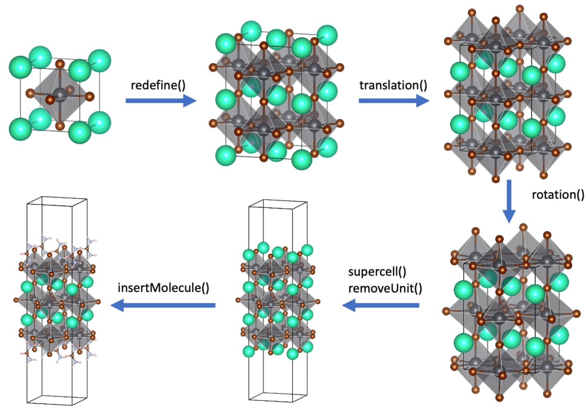

<details>
<summary>flowchart</summary>

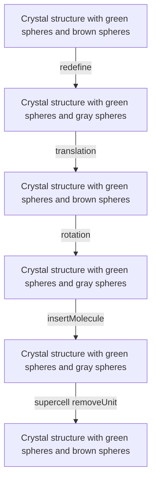
```mermaid
graph TD
  A["Crystal structure with green spheres and brown spheres"] -->|redefine| B["Crystal structure with green spheres and gray spheres"]
  B -->|translation| C["Crystal structure with green spheres and brown spheres"]
  C -->|rotation| D["Crystal structure with green spheres and gray spheres"]
  D -->|insertMolecule| E["Crystal structure with green spheres and gray spheres"]
  E -->|supercell removeUnit| F["Crystal structure with green spheres and brown spheres"]
```
</details>

## 3.5 结构原型数据库

JAMIP集成了本课题组开发的无机晶体结构原型数据库(ICSPD: Inorganic Crystal Structure

Prototype Database)，用户可在线下载。用户可以根据研究需求，通过查询ICSPD数据库中对应的结构原型并结合JAMIP的结构操作模块，批量生成高通量计算所需的材料结构集。

ICSPD是基于已知无机晶体结构的局域原子环境开发，利用无监督学习中的分层聚类算法构建结构原型。

一般的结构原型数据库会根据晶体结构的空间群进行分类，而ICSPD会无偏见的基于原子环境差异聚类，实现根据材料微观结构信息、跨越空间群限制的结构原型划分。

使用晶体结构原型数据库有利于用户高效建立大批量材料结构，扩大结构搜索空间，为高通量材料计算提供极大便利。

目前，正处在最后的测试阶段，近期推出。

## 4. 高通量计算流程

本章将介绍JAMIP如何实现高通量计算任务的创建和流程管理。通过本章节的阅读，您可以了解以下内容：

- 高通量计算的任务流程  
- 计算任务的流程细节

## 4.1 任务流程简介

任务(task)是JAMIP进行DFT计算的基本单元，每个任务对应特定的计算需求，通过一次或多次计算实现。下面将简单介绍JAMIP目前已经实现的计算任务流程。

## 4.1.1 参数设置

JAMIP的运行配置文件包含以下四个文件，用户可以通过修改提交目录下的这些文件，动态地设置本次计算的参数：

<table><tr><td>filename</td><td>function</td></tr><tr><td>input.py</td><td>任务控制文件</td></tr><tr><td>.incar</td><td>计算参数文件</td></tr><tr><td>.cluster</td><td>集群参数文件</td></tr><tr><td>.extra</td><td>结构参数文件</td></tr></table>

其中 input.py 可通过 jp -i [software] 命令生成模板，如：

```txt
jp -i vasp # 用于VASP计算任务的提交
jp -i qe # 用于Quantum Espresso计算任务的提交
```

其他三个文件将在用户第一次执行 jp -r prepare 后，生成模板。

## 第一性原理计算参数

任务控制文件中的通用设置

## 1. program

使用程序的路径，如

```javascript
vasp.program = '/share/apps/vasp/vasp5.4.1/bin/vasp_std'
```

\# 如果用户使用vasp计算，希望在计算中切换vasp程序，可以设置：

```python
> vasp.program = {'std': '/share/vasp6/bin/vasp_std',
> 'ncl': '/share/vasp6/bin/vasp_ncl'}
```

\# 对于类似于QE，计算中涉及大量可执行程序的软件，输入bin即可：

```txt
>qe.program = '/share/apps/qe-6.6/bin'
```

## 2. potential

赝势库目录，如

```python
vasp.potential = '/share/apps/vasp/paw_pbe'
```

\# 赝势库的形式与不同软件所采用的命名规则有关，如vasp的赝势库是以元素命名的文件夹，

\# QE则直接是全部赝势文件，通过文件命名确定元素和赝势类型

\# 针对VASP赝势库中，一种元素对应多种赝势的情况，如果用户希望选用元素的指定赝势，可以在路径后添加映射字典，如：

```txt
> vasp.potential = '/share/apps/vasp/paw', {'Si':'Si_d','Mg':'Mg_pv'}
```

## 3. external\_files

计算所需的额外文件。每次计算开始时，将自动地复制这些文件到计算目录中，如

```txt
vasp.external_files = '~/.jamip/utils/vdw_kernel.bindat'
```

\# 如果需要复制多个路径，用逗号隔开即可

## 4. tasks

计算任务，任务名之间使用空格分隔，例如

```txt
vasp.tasks = 'relax scf band dos optics'
```

\# 关于当前软件支持的任务，请参阅：控制文件实例或继续阅读后续内容

## 5. xc\_func

计算使用的交换关联泛函与自旋轨道耦合，例如：在VASP计算中，如果采用PBE交换关联泛函，参数如下：

```txt
vasp.xc_func = 'pbe'
```

\# 如果用户输入soc，hse，gw等类型参数，则JAMIP将在计算参数文件(.incar)中添加对应计算任务所需的特有计算参数

\# 同时设置多种计算类型时以"+"连接，例如计算HSE+SOC计算：

```txt
vasp.xc_func = 'hse+soc'
```

\# 注意：上述参数修改对全部计算生效

## 6. vdw

计算使用的vdw泛函类型，例如

```txt
vasp.vdw = 'b86'
```

\# 如无特殊设置，vdw参数仅加入在结构优化阶段

\# 如果使用的vdw泛函，需要用户提供额外的核文件（vdw\_kernel.bindat），请在extrenal\_files内指定对应路径

## 7. energy

设置能量的收敛值，例如

```txt
vasp.energy = 1e-5
```

\# 在VASP程序中对应：EDIFF=1e-5，单位为：eV

\# 在QE程序中对应：etot\_conv\_thr，单位为：Ry

## 8. force

设置力的收敛值，例如

```hcl
vasp.force = 1e-2
```

\# 在VASP程序中对应：EDIFFG=-1e-2，单位为：eV

\# 在QE程序中对应：forc\_conv\_thr，单位为：Ry

## 9. kpoints

设置计算使用的K点。k点支持多种设置方法，例如

\# 1. kspacing模式，根据倒空间大小进行插点，输入值为K点在倒空间中的间隔

> vasp.kpoints = 0.25

\# 2. Gamma模式或 Monkhorst模式，声明模式时提供首字母即可

> vasp.kpoints = 'Gamma', '6 6 6' # 插点数 6,6,6 无偏移

> vasp.kpoints = 'M', '6 6 6 0.5 0.5 0.5' # 插点数 6,6,6 偏移量 0.5,0.5,0.5

\# 3. Line Model, 线性插点，根据元组长度不同对应以下三种模式：

> vasp.kpoints = 'Line Model', (\# "Line" + K点 + 插点数(可选，默认为30)

"0.0000 0.0000 0.0000 \Gamma",

"0.5000 0.0000 0.5000 X",

"0.5000 0.2500 0.7500 W",

"0.0000 0.0000 0.0000 \Gamma",

"0.5000 0.5000 0.5000 L"), 20

> vasp.kpoints = 'Line Model', (\# "line" + 包含插点数的 K 点，参考QE

"0.0000 0.0000 0.0000 \Gamma 20",

"0.5000 0.0000 0.5000 X 20",

"0.5000 0.2500 0.7500 W 20",

"0.0000 0.0000 0.0000 \Gamma 1",

"0.5000 0.5000 0.5000 L 20")

\# 4. Reciprocal模式，直接给出倒空间的全部 K 点，可参考IBZKPT

\# 如果不输入权值(第4个数字)，默认所有K点权重为 1

```python
vasp.kpoints = "Reciprocal", (\
    "0.0000 0.0000 0.0000 1",
    "0.3333 0.0000 0.0000 6",
    "0.3333 0.3333 0.0000 2",
    "0.0000 0.0000 0.5000 1",
    "0.3333 0.0000 0.5000 6",
    "0.3333 0.3333 0.5000 2")
```

10. kpath

为特定任务独立设置K点，一般用于能带计算，设置方法与上节相同，例如

```python
vasp.kpath.band = 'Line Model', (\
    "0.0000 0.0000 0.0000 \Gamma",
    "0.5000 0.0000 0.5000 X",
    "0.5000 0.2500 0.7500 W",
    "0.0000 0.0000 0.0000 \Gamma",
    "0.5000 0.5000 0.5000 L"), 20
```

11. nbands

设置能带数或能带倍数，基准值来自自洽计算（SCF）。例如

\# 1. 直接设置nbands值

> vasp.nbands = 300

\# 2. 设置相对scf的倍数，最大为3（默认值为1.2）

> vasp.bands = 1.5

\# 在进行能带、光吸收等计算时，通常需要添加空带才能比较准确的计算导带的情况。

\# VASP的推荐值为1.2倍scf(能带计算)，QE为scf+4，请根据计算体系大小，设置合理的值。

\# 注意：该参数仅在电子结构计算和光学性质计算中有效

针对计算软件特殊的相关设置，请参阅：4.2，4.3章节。

任务控制文件（input.py）中，用于文件准备的相关函数

> set\_structure(input, output)  
- input: 输入结构文件目录  
- output: 输出计算文件目录  
> 读取结构文件，生成任务池中的计算实例

> set\_extra()  
> 根据结构生成.extra模板文件

> save(path)  
- path: 任务池保存路径  
> 保存任务池文件

> Prepare.cluster(name)  
- name: 作业管理系统的名称，如\`pbs\`, \`lsf\`, \`sbatch\`  
> 生成或检查集群参数文件\`.cluster\`

> \`Prepare.incar(tasks)\`  
- tasks: 在上文参数类定义的任务字典  
> 生成或检查计算参数文件\`.incar\`

## 集群管理参数

尽管，在JAMIP中，集群参数设置主要依靠.cluster文件，

用户也可以在提交任务时通过命令行设置集群参数，详见 jp 命令。例如:

jp -r qsub -f [pool] --cores 15 (使用15核进行计算)

通用的集群参数

<table><tr><td>属性</td><td></td></tr><tr><td>manager</td><td>集群的作业管理系统</td></tr><tr><td>queue</td><td>使用队列名</td></tr><tr><td>cores</td><td>单节点使用核数</td></tr><tr><td>nodes</td><td>使用节点数</td></tr><tr><td>project</td><td>设置项目名</td></tr><tr><td>maximum</td><td>队列中的最大任务数</td></tr><tr><td>cmd</td><td>提交任务使用的命令</td></tr><tr><td>del</td><td>删除任务使用的命令</td></tr><tr><td>mpi</td><td>并行计算程序使用的并行命令</td></tr><tr><td>envrestart</td><td>用于声明环境变量,如:编译器和pyhton3等设置是否清除可能存在的计算记录</td></tr><tr><td>overwrite</td><td>设置是否重新计算非自洽任务</td></tr><tr><td>user</td><td>提交任务的用户名,自动生成</td></tr><tr><td>host</td><td>提交任务所在的主机,自动生成</td></tr></table>

## 4.1.2 任务池管理机制及任务批量提交

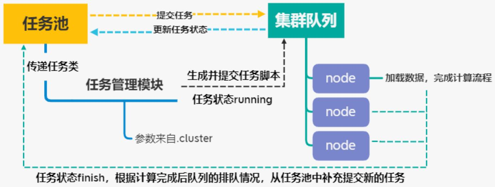

<details>
<summary>flowchart</summary>

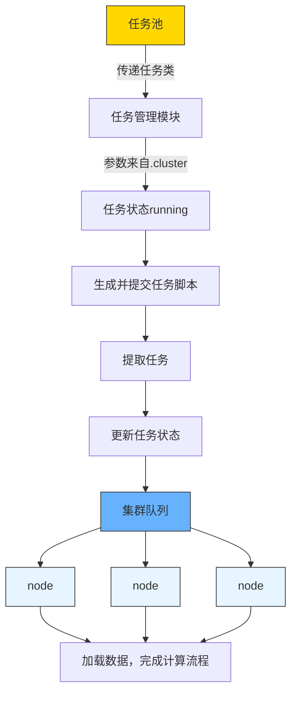
```mermaid
graph TD
  A["任务池"] -->|传递任务类| B["任务管理模块"]
  B -->|参数来自.cluster| C["任务状态running"]
  C --> D["生成并提交任务脚本"]
  D --> E["提取任务"]
  E --> F["更新任务状态"]
  F --> G["集群队列"]
  G --> H["node"]
  G --> I["node"]
  G --> J["node"]
  H --> K["加载数据，完成计算流程"]
  I --> K
  J --> K
    style A fill:#FFD700,stroke:#333
    style G fill:#66B2FF,stroke:#333
    style H fill:#E6F5FF,stroke:#333
    style I fill:#E6F5FF,stroke:#333
    style J fill:#E6F5FF,stroke:#333
```
</details>

## 任务池提交说明

单次任务提交的任务数由 .cluster 内的 maximum 决定，该参数表示正常情况下队列中的任务数（运行中+排队）

任务提交后，任务池中的任务状态将由 wait 变为 running。在不更新任务池的情况下，每个任务只能被提交一次；

每次队列中的任务计算完成后，JAMIP将检查当前队列中的任务情况，并按以下两种模式补充新的任务：

- prior模式：保证当前任务池中的JAMIP任务数等于maximum，保证JAMIP任务优先完成  
- mini模式：保证用户使用队列中的总任务数等于maximum，允许JAMIP任务减少(至少保留1个)待其他任务计算完成后，再全力计算JAMIP的任务

当用户计算资源充足时，可以修改 maximum 动态调节当前任务池允许提交的最大任务数

JAMIP的任务提交仅依赖于任务池和提交目录下的配置文件。相同账户下，进行多组批量计算，它们之间不会相互影响

为了避免计算覆盖，在任务开始计算时，JAMIP会检查是否有其他节点也在计算当前目录的任务。如果存在，后提交的计算将自动跳过该计算目录下的任务，并提交任务池中的其他任务

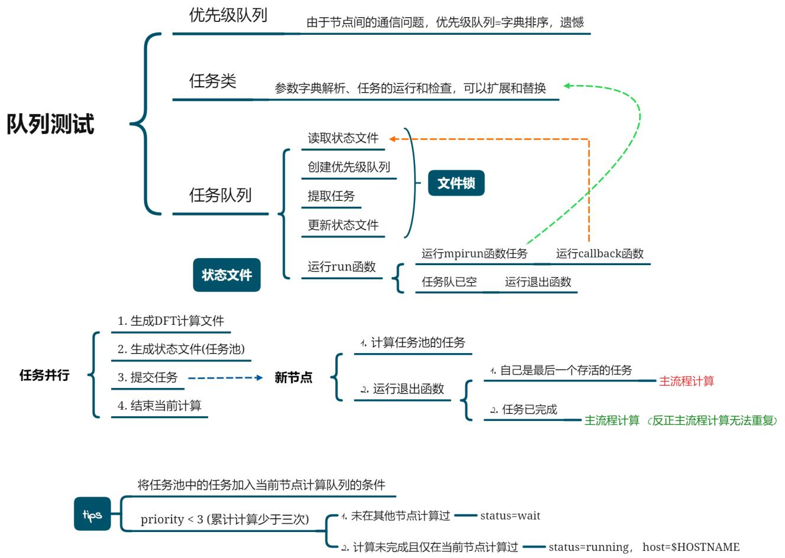

<details>
<summary>flowchart</summary>

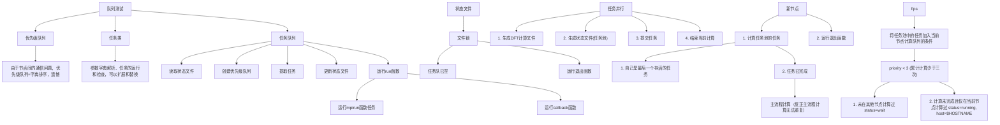
```mermaid
graph TD
  A["队列测试"] --> B["优先级队列"]
  B --> C["由于节点间的通信问题，优先级队列=字典排序，遗憾"]
  A --> D["任务类"]
  D --> E["参数字典解析、任务的运行和检查，可以扩展和替换"]
  A --> F["任务队列"]
  F --> G["读取状态文件"]
  F --> H["创建优先级队列"]
  F --> I["提取任务"]
  F --> J["更新状态文件"]
  F --> K["运行run函数"]
  K --> L["运行mpirun函数任务"]
  K --> M["运行callback函数"]
  N["状态文件"] --> O["文件锁"]
  O --> P["任务队已空"]
  O --> Q["运行退出函数"]
  R["任务并行"] --> S["1. 生成DFT计算文件"]
  R --> T["2. 生成状态文件(任务池)"]
  R --> U["3. 提交任务"]
  R --> V["4. 结束当前计算"]
  W["新节点"] --> X["1. 计算任务池的任务"]
  W --> Y["2. 运行退出函数"]
  X --> Z["1. 自己是最后一个存活的任务"]
  X --> AA["2. 任务已完成"]
  AA --> AB["主流程计算（反正主流程计算无法重复）"]
  AC["fips"] --> AD["将任务池中的任务加入当前节点计算队列的条件"]
  AD --> AE["priority < 3 (累计计算少于三次)"]
  AE --> AF["1. 未在其他节点计算过 status=wait"]
  AE --> AG["2. 计算未完成且仅在当前节点计算过 status=running, host=$HOSTNAME"]
```
</details>

在计算声子力常数、力学性质等时，这类任务需要开展一系列的子计算任务，JAMIP将通过拆分计算任务到多个计算节点上，来加速该任务的计算。

目前，程序支持子任务提交的任务有：force softmode gruneisen poisson

## 子任务提交流程：

- 用户可以在 .incar 中修改对应任务的 parallel，控制计算子任务功能的开启和使用的节点数。计算时，parallel 参数的实际取值为：输入的 parallel 值与子任务数两者之间的最小值。例如，如果 parallel = 1，程序将不提交子任务而是在当前节点上连续完成。  
- 对于支持子任务计算的计算任务，无论并行数是否大于1，JAMIP都将在计算开始前生成全部任务的计算文件  
- 在进行子任务计算时，将释放主任务所在的节点，重新请求节点对子任务进行批量计算；当子任务全部完成后，再恢复主任务的计算(再次提交当前任务)。

## 4.1.3 任务执行流程

本节将介绍在计算节点上，DFT程序的一般运行流程。

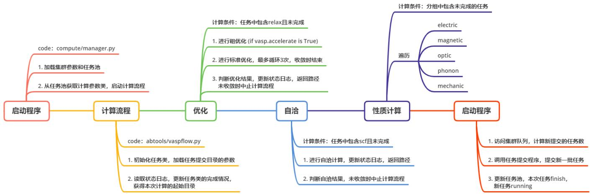

<details>
<summary>flowchart</summary>

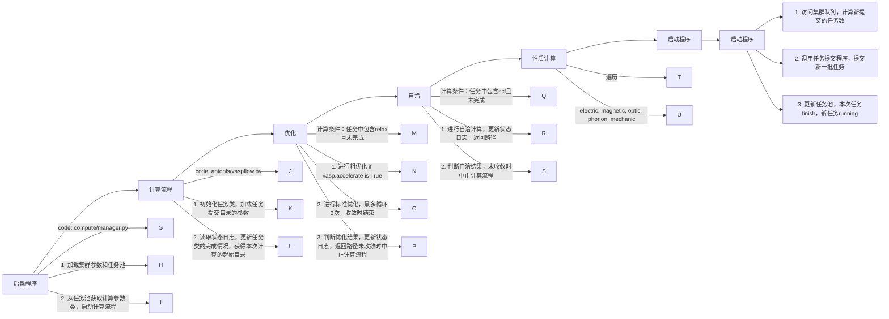
```mermaid
graph LR
  A["启动程序"] --> B["计算流程"]
  B --> C["优化"]
  C --> D["自洽"]
  D --> E["性质计算"]
  E --> F["启动程序"]

  A -->|code: compute/manager.py| G
  A -->|1. 加载集群参数和任务池| H
  A -->|2. 从任务池获取计算参数类，启动计算流程| I

  B -->|code: abtools/vaspflow.py| J
  B -->|1. 初始化任务类，加载任务提交目录的参数| K
  B -->|2. 读取状态日志，更新任务类的完成情况，获得本次计算的起始目录| L

  C -->|计算条件：任务中包含relax且未完成| M
  C -->|1. 进行粗优化 if vasp.accelerate is True| N
  C -->|2. 进行标准优化，最多循环3次，收敛时结束| O
  C -->|3. 判断优化结果，更新状态日志，返回路径未收敛时中止计算流程| P

  D -->|计算条件：任务中包含scf且未完成| Q
  D -->|1. 进行自洽计算，更新状态日志，返回路径| R
  D -->|2. 判断自洽结果，未收敛时中止计算流程| S

  E -->|遍历| T
  E -->|electric, magnetic, optic, phonon, mechanic| U
  F --> V["启动程序"]
  V --> W["1. 访问集群队列，计算新提交的任务数"]
  V --> X["2. 调用任务提交程序，提交新一批任务"]
  V --> Y["3. 更新任务池，本次任务finish，新任务running"]
```
</details>

## 1. 任务执行顺序

基本的计算顺序：结构优化 -> 自洽 -> 性质计算 -> DIY任务

其中，性质计算顺序：电子结构 -> 光学 -> 声学 -> 力学 -> ...

如果计算是在已存在的目录进行，将在计算开始前检查.status文件，默认不会再次计算已完成的任务。

强制重新计算，用户需要在 .cluster 文件中添加：restart 或 overwrite。

- restart: true 重新计算设置的全部任务  
• overwrite: true 重新计算设置的全部性质计算任务

如果结构优化和自洽计算失败，任务将提前结束，不对后续任务进行计算。对于其他性质计算，如无特殊情况，计算失败不会影响后续其他性质计算任务的进行。

备注：如果结构优化未收敛，自洽场计算无论是否完成都将重新计算

## 2. 文件继承

在第一性原理计算时，通常需要拷贝之前自洽计算获得的结构、电荷密度、波函数文件进行性质计算。

如无特殊声明，JAMIP在进行性质计算时，都将使用自洽场计算目录作为程序输入目录

## VASP程序:

在进行结构优化和自洽场计算时，每步计算更新优化后的结构。对于波函数和赝势文件，将根据 WAVECAR 和 CHGCAR 文件是否为空，和任务参数中 ISTART 和 ICHARG 值，决定是否拷贝文件并修改参数。当 .incar 中未设置相关参数时，默认为：istart=1, icharg=1 (VASP默认参数)

如果计算参数设置为，只读取WAVECAR(或CHGCAR)但不输出该数据，JAMIP将以软链接的形式来复制这些文件。

## QE程序:

在进行结构优化时，输出目录均为：qesave/relax.save，QE程序将自动继承上一步的计算输出信息。同时，程序会基于xml文件来更新内存中的结构数据。

自洽场计算的输出目录为：qesave/scf.save，默认将不继承结构优化计算的波函数和电荷密度。

在进行性质计算时，JAMIP将复制 qesave/scf.save 目录下的文件到本次计算目录下，作为计算的初始信息，即默认将继承上步（SCF）输出的电荷密度与波函数

## 3. 单任务流程

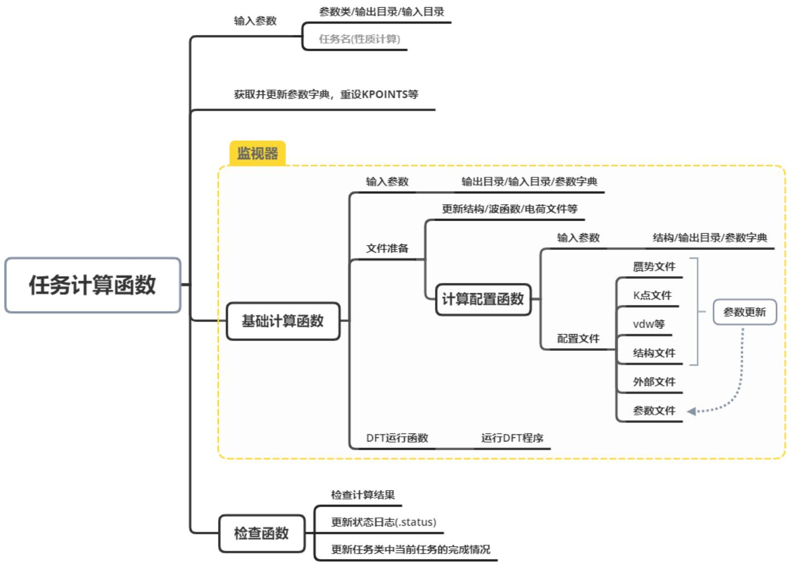

<details>
<summary>flowchart</summary>

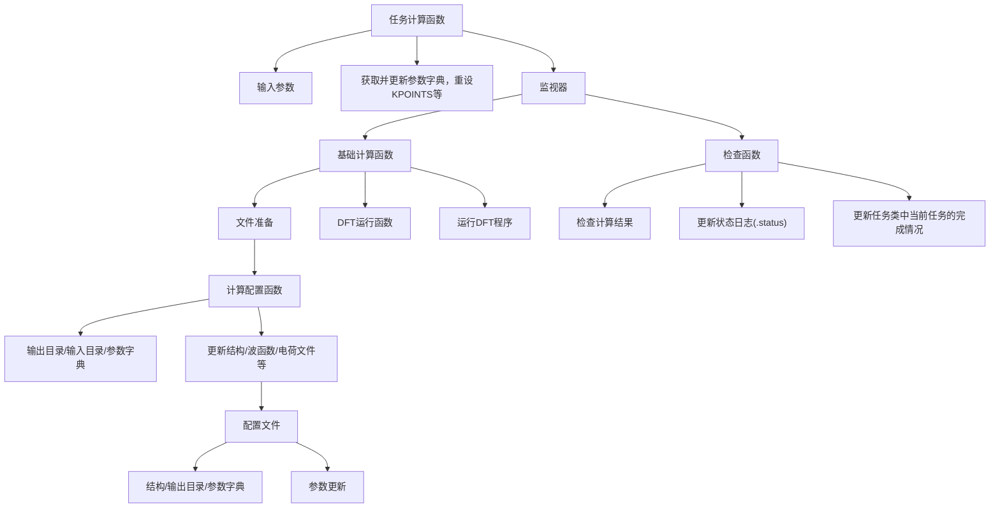
```mermaid
graph TD
  A["任务计算函数"] --> B["输入参数"]
  A --> C["获取并更新参数字典，重设KPOINTS等"]
  A --> D["监视器"]
  D --> E["基础计算函数"]
  E --> F["文件准备"]
  F --> G["计算配置函数"]
  G --> H["输出目录/输入目录/参数字典"]
  G --> I["更新结构/波函数/电荷文件等"]
  I --> J["配置文件"]
  J --> K["结构/输出目录/参数字典"]
  J --> L["参数更新"]
  E --> M["DFT运行函数"]
  E --> N["运行DFT程序"]
  D --> O["检查函数"]
  O --> P["检查计算结果"]
  O --> Q["更新状态日志(.status)"]
  O --> R["更新任务类中当前任务的完成情况"]
```
</details>

## 4. 计算参数更新

在自动生成计算任务参数时，JAMIP将按照以下顺序进行设置：

1. 从任务类加载base参数 (包含input.py的收敛参数)  
2. 从任务类加载当前任务的参数  
3. 添加任务流程所需参数，如：设置 nbands, iband 等  
4. 更新输入文件的相关参数，如：encut, kspacing, istart 等  
5. 添加其他可选参数，如：VDW参数，HSE参数，初始化磁矩等

备注：在计算程序开始时，JAMIP会将 input.py 中设置的收敛参数加入到 base 的字典中。

## 5. 计算结果检查


<details>
<summary>flowchart</summary>

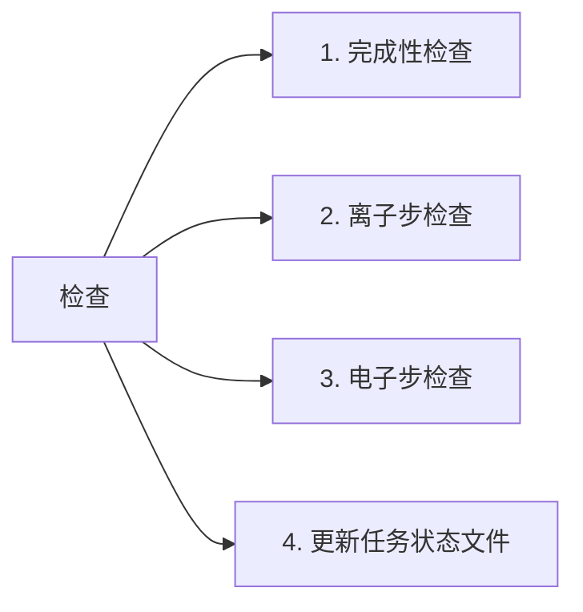
```mermaid
graph LR
  A["检查"] --> B["1. 完成性检查"]
  A --> C["2. 离子步检查"]
  A --> D["3. 电子步检查"]
  A --> E["4. 更新任务状态文件"]
```
</details>

通过读取计算任务的输出文件，JAMIP实现对计算结果的检查，如：VASP基于OUTCAR和pbs.log，而QE是基于prefix.out和prefix.xml

任务检查模块的更多介绍请跳转至：API 任务检查模块

## 4.1.4 任务监控与纠错

VASP程序在运行过程中，可能由于参数设置不合理、文件准备不足等原因，计算任务会异常中断。目前，JAMIP提供了VASP计算任务的纠错功能，能够根据JAMIP的输出日志内的错误信息，自动尝试调整计算参数等方案，纠正异常的计算任务。用户可以选择是否开启纠错功能，并且可以自由增添、修改错误集的内容。针对QE计算任务的纠错解决方案集，正在更新中。

## 监控模块

监控模块是计算流程中任务提交函数的一个装饰器，用户可以通过屏蔽该装饰器来关闭该监控功能

代码链接-装饰器：abtools/vasp/vaspflow.py

代码链接-监控模块：abtools/vasp/monitor.py

```python
@Monitor
def calculator(self, vasp, stdout=None, stdin=None, incar={}, **kwargs):
    from jamip.structure import read
    from os.path import join, exists, getsize
...
```

在计算过程中，JAMIP会采用：启动子线程来执行VASP程序，而主线程负责执行监视任务。程序会周期性地读取VASP程序的输出日志，检查文件中出现的错误关键词

正常情况下，子线程将在VASP计算完成后退出，主线程的监控器将在子线程停止活动后退出。当监控器发现错误时，将向并行计算程序（mpi）发出退出信号，子线程和监控器将依次退出，主线程将根据监控器返回的error属性，进行纠错计算

纠错计算过程中，程序同样会启动该监控模块。为了避免程序进入死循环，JAMIP默认设置为最多只执行一次纠错任务

## 集群检查

在计算程序启动前，JAMIP将检查计算节点的状态，确保高通量计算能够连续正常地进行

## 警告类:

1. CPU核数是否与并行设置相符  
2. 当前CPU占用是否超过90%  
3. 当前内存占用是否超过90%  
4. 节点上是否存在正在运行的并行程序

退出类：如果集群上存在VASP孤儿进程，将向这些进程发出退出信号

## 纠错计算和纠错集设置

纠错计算本质是：在修改部分INCAR参数后，重复进行之前的计算

代码链接：abtools/vasp/correcting.py

## 纠错流程

1. 读取上一步计算的输入与输出目录，确定本次计算的输入目录  
对于部分优化类的警告，如：更换更小的ediff值，其计算结果也是可用的  
2. JAMIP将根据错误名称来读取存储在 \~/.jamip/env/error.json 内的纠错方案，获取所需的纠错参数

## 纠错类型举例

## 移除参数

关键词：'Please remove the tag NPAR from the INCAR'

纠错参数：{'npar': ''}

## 变更参数

关键词：'VERY BAD NEWS! internal error in subroutine IBZKPT'

纠错参数：{'isym':0} # 常见错误，纠错未必适用于所有情况

## 迭代参数

关键词：'please rerun with smaller EDIFF'

纠错参数：{'ediff': "ediff\*0.1"} # 一般不需要添加此纠错，迭代优化即可

## 文件缺少或程序报错

关键词：'non collinear calculations require that VASP is compiled'

纠错参数：无 # 纠错程序将强制中止整个计算流程

## 4.1.5 计算结果提取与分析

使用jp命令可以实现简单的数据提取功能。目前，JAMIP支持批量提取计算数据/计算参数（复杂或特定的数据提取活动，需要用户编写脚本）

jp -o --output [输出格式] [输出性质] -f [计算目录]

- 输出格式: form sort csv plot  
- 输出性质：Finder模块的单返回值方法和部分计算性质

## 1. 路径输入判断

通过 .status(针对JAMIP) 和 OUTCAR(一般VASP计算) 来判断输入目录是否为计算目录如果输入目录不是计算目录，将继续判断输入目录的子目录是否为计算目录。

如果未给程序指定任何目录，将使用当前目录作为输入值

## 2. 输出格式说明

I. csv格式说明:

生成以逗号为分隔符的csv文件，保存标签；路径保存到最后一级对于出现无法正确读取数据的情况，程序将使用np.nan来进行补足

```txt
$ jp -o csv free_energy -f TEST
```

```csv
$ cat TEST.csv
path, free_energy
Si2.vasp, -43.40082825
Si.vasp, -43.40082825
```

II. sort格式说明：

适用于少量数据的处理，根据所选属性的值对计算目录进行排列操作

```txt
$ jp -o sort emass -f TEST
+----+
| Property: e-mass |
+----+
POSCAR2, 0.287
POSCAR, 0.224
+----+
| Property: H-mass |
+----+
POSCAR2, 1.005
POSCAR, 1.145
```

III. form格式说明

以表格形式输出属性值，方便用户直观地查看数据

当jp -o命令未选择输出格式时，以此格式输出

请适量控制输出属性的个数，以确保输出表格长度在单行字数限制以内，提高输出样式的可读性

```shell
$ jp -o emass -f TEST
+----+ ----+ ----+
| path | e-mass | H-mass |
+----+ ----+ ----+
| POSCAR2 | 0.287 | 1.005 |
| POSCAR | 0.224 | 1.145 |
+----+ ----+ ----+
```

IV. plot格式说明

对数据进行快速地分布统计/关联性分析，适用于处理大量数据

## 3. 支持输出性质

<table><tr><td>计算性质</td><td>数据输出</td></tr><tr><td>format</td><td>化学式(format)</td></tr><tr><td>bandgap</td><td>带隙值(bandgap),是否为直接带隙(isdirect)</td></tr><tr><td>emass</td><td>空穴有效质量(H-mass),电子有效质量(e-mass)(注:有效质量为取几何平均获得平均值)</td></tr><tr><td>dielectric</td><td>电子部分的介电常数(dielectric),离子部分的介电常数(dielectric-ion)</td></tr><tr><td>cbvb</td><td>带隙(bandgap),价带顶(vbm-kpoint),导带顶(cbm-kpoint)</td></tr><tr><td>boltztrap</td><td>空穴有效质量(H-mass),电子有效质量(e-mass)(注:调用boltztrap程序的计算结果)</td></tr></table>

<table><tr><td>数据类型</td><td>计算参数</td></tr><tr><td>int</td><td>nkdim, nedos, nbands, nkpts, istart, icharg, ispin, nelm, nsw, nfree</td></tr><tr><td></td><td>Imaxmix ,ibrion, isif, isym, pstress, nelect, ismear, ialgo, lorbit</td></tr><tr><td>float</td><td>encut, ediff, ediffg, cshift, potim, emin, emax, sigma, volume</td></tr><tr><td></td><td>free_energy,energy_without_entropy,fermi_energy,max_force</td></tr><tr><td>str</td><td>prec, gga, point_group, datetime,vasp_version,date</td></tr><tr><td>bool</td><td>Isorbit, lwave, lcharg, lvtot, lelf</td></tr></table>

## 4.1.6 计算结果存储

用户可参阅上一章节，将计算结果储存到csv文件或数据库中。

## 数据存储命令：

ip -o csv free\_energy fermi\_energy ... -f [path] 批量导出为csv文件

jp --db entry -f [path] 批量存储计算结果

jp --db structure -f [path] 批量存储结构文件

当未指定存储路径时，将使用当前目录作为输入目录

## 数据存储函数：

```python
from jamip.db.connect import Connect #初始化django连接
import os

# 将计算数据存储到数据库中
db = Connect()  # 实例化类
properties = ['calculated_parameters', 'energy', 'bandgap', 'boltztrap', 'born_effective_charge']
db.load_entry('TEST/Si.vasp', properties)  # 保存Si.vasp目录下的计算数据
# 输入路径可以是：任务池、计算根目录或计算父目录(包含多个根目录)

# 将结构文件存储到数据库中
db = Connect()
db.load_structure('test')  # 保存文件夹内的全部结构文件
# 通过文件名判断是否为结构文件及其数据类型，请确保文件名的合理命名。
```

## 4.2 基于VASP软件的高通量计算任务流程

任务(task)是JAMIP进行DFT计算的基本单元，每个任务对应特定的计算需求，通过一次或多次VASP计算实现。下面将介绍JAMIP目前所有已实现的计算任务流程。

## 4.2.1 自洽场计算与结构优化

## 自洽场计算

任务名：scf

自洽场计算是VASP计算的基础，主要提供以下功能：

1. 计算部分性质的准确值，如形成能、真空能级等  
2. 输出电荷密度(CHGCAR)，波函数(WAVECAR)文件，用于后续的非自洽计算。

```txt
# input设置参数
vasp.tasks = 'scf'
# 默认情况下，vdw参数只对优化计算生效。如需要在自洽或其他任务考虑vdw，可参考如下设置：
vasp.vdw_tasks = 'relax scf ...'
```

## 结构优化

任务名：relax

其他任务名：shape volume ions (用户可以根据需要，控制优化方案)

VASP通过ISIF参数控制结构优化的自由度(离子位置，单元体积和单元形状)。默认情况下，JAMIP将进行全放开优化。用户可以通过修改.incar内的参数字典，或修改任务名，指定结构优化的自由度。

在执行结构优化任务时，通常只执行一次VASP计算的任务，往往不能够到达预期的收敛标准，并且可能存在增加不必要的计算时间等问题。JAMIP默认采用下述优化方案：

1. 首先，开展若干步低精度的结构优化，使结构快速弛豫到平衡位置附近  
2. 然后，执行有限步数的正常精度优化。当结构优化未收敛时，目标结构将继续被迭代优化，直至结构到达收敛标准或优化步数到达设定的上限值。

根据我们我们长期的研究经验，采取分步优化、逐渐提高计算精度参数的方案，可以显著缩短结构优化的时间。

如果在三次标准精度计算后，结构优化仍未到达设定的收敛标准，JAMIP将中止结构优化计算任务。如果当前任务的后续计算依赖于结构优化的结果，程序将结束本次计算任务，执行任务池中的其他计算任务。

```txt
# input设置参数
vasp.tasks = 'shape volume ions'
# vasp.tasks = 'relax'  # 两种方法等价
vasp.accelerate = False  # 关闭粗优化步骤
vasp.accelerate = [{"kspacing":0.5,"ediff":1e-3,"istart":0,"nsw":20},
{"kspacing":0.3,"ediff":1e-4,"ediffg):-0.05,"nsw":20}]
```

\# 开启粗优化并设置粗优化参数，列表内的字典对应优化次数和每步参数

vasp.optcell = '1 0 0' # 生成OPTCELL，可以在结构优化过程中，固定指定方向的晶胞参数保持不变

\# 1 0 0 分别对应xyz三个方向，1代表该方向的晶胞参数固定，0代表不固定该方向的晶胞参数

## 分步优化简述：

在开展结构优化的实际操作中，不同结构优化至收敛所需的步数不同，部分结构的初态结构与平衡结构之间相差较大，如果只采用一次高精度的结构优化，可能需要非常长时间才能弛豫到平衡位置。采用分步优化的策略，逐渐提高计算精度，可以加速收敛过程。

通常情况下，用户可以通过降低k点密度、能量和力的收敛值，实现低精度优化。以VASP计算为例，默认的粗优化参数可设置为：

```python
step1 : (kspacing=0.5, ediff=1e-3, nsw=20)
step2 : (kspacing=0.4, ediff=1e-4, ediffg=-0.05, nsw=20)
```

如果用户开启并设置了粗优化参数，请确保其精度低于实际最后使用的计算精度，避免无意义的重复优化

如果用户确定计算结构非常接近平衡结构，可以考虑关闭粗优化功能。此时，由于粗精度优化设置了更大的原子移动步长等原因，有可能会导致优化结构在粗精度优化期间，更加偏离平衡结构，增加计算时间

## 补充说明：

- 在批量计算时，可能出现部分结构未收敛的情况，用户可以参考算例中的方案优化，制定计算流程  
- 使用JAMIP数据库的结构操作方法，可以实现批量设置结构中离子的优化自由度（Selective dynamics）

\- 添加 OPTCELL 可以在优化过程中固定指定方向的晶胞参数（注：仅适用于针对该方法进行预先特殊编译的VASP版本）。

## 收敛测试

任务名： cutoff\_conv (截断能测试)

任务名：kpoints\_conv (K点密度测试)

通过收敛测试计算，为选取合理的截断能和K点网格密度提供参考，确保计算结果的可靠性。建议用户在进行批量计算前，先选用代表性结构进行收敛测试计算。

用户可以在.incar内设置收敛测试范围或测试值，例如：

encut: '300 450 30' # 等价于 '300 330 360 390 420 450'

kspacing = '0.1 0.15 0.189 0.23 0.3'

在完成收敛测试任务后，任务将不会自动进行后续计算，需要用户手动从vasp.tasks中删除收敛测试任务，并根据收敛曲线设置合适的截断能和K点密度

## 4.2.2 热力学性质

## 分解焓

任务名: decomposition

批量计算该结构及其可能的分解产物的能量，给出其潜在分解路径及分解焓。当前，用户需要手动准备计算所需的所有晶体结构文件。后续更新将支持直接从JAMIP数据库中自动搜索获取相关的结构。

## Convex hull

任务名: convex

二元相图分析。JAMIP将计算不同元素组成配比相对应它们单质的形成焓，构建二元相图。当前，用户需要手动准备计算所需的所有晶体结构文件。后续更新将支持直接从JAMIP数据库中自动搜索获取相关的结构。

## Triangle zone

任务名: triangle

三元相分析。JAMIP将计算不同元素组成配比相对应它们单质的形成焓，构建三元相图。当前，用户需要手动准备计算所需的所有晶体结构文件。后续更新将支持直接从JAMIP数据库中自动搜索获取相关的结构。

## 4.2.3 电子结构

## 能带结构

## 任务名： band

计算沿指定高对称路径方向的能带结构。

在JAMIP计算任务中，HSE修正带隙、有效质量等计算，均需要根据能带计算结果来确定带边位置。选择正确的高对称路径是获取可信的能带计算结果的先决条件。JAMIP默认基于晶体结构的空间群和晶格常数，自动确定高对称路径，路径选择参考了seekpath。用户也可选择在input.py文件中手动指定高对称路径，如下所示：

# input设置参数  
```python
vasp.tasks = 'band'
vasp.kpath.band = 'Line Model', (\
    "0.0000 0.0000 0.0000 \Gamma",
    "0.5000 0.0000 0.5000 X",
    "0.5000 0.2500 0.7500 W",
    "0.0000 0.0000 0.0000 \Gamma",
    "0.5000 0.5000 0.5000 L",
    "0.5000 0.2500 0.7500 W"), 20
```

\# 手动设置高对称路径，对任务池中的全部任务都有效

```python
vasp.band_insert = 30 # 设置插点数，默认为30
```

```txt
vasp.band_split = True # 设置是否分段计算能带，默认为False
```

用户可以通过 jp -v kpath <file> 命令，在终端中快速查询指定晶体结构的空间群和推荐的高对称路径

当能带计算的总K点数较多时，可能导致内存不足的现象。JAMIP支持分段计算能带，用户可以根据计算实际情况选择是否启用该功能。

## 电子态密度

## 任务名：dos

电子态密度计算，获取各轨道电子的能量分布区间。

在VASP中，lorbit设置DOSCAR文件的输出内容及是否生成PROCAR文件；NEDOS设置态密度计算时的能量插值。

如果计算获得的DOS图曲线不够光滑，可以尝试：设置 ISMEAR=-5 、增大NEDOS或缩小态密度计算的能量区间（EMIN和EMAX的值）。

## 总电荷密度及部分电荷密度

## 任务名：partchg

计算价带与导带边处，电子在空间中的分布。计算分两步进行：

1. 从能带计算中提取带边位置，将其添加到自洽的IBZKPT后，执行一次含带边的自洽计算  
2. 根据自洽计算中带边K点位置和能带数，分别计算VBM和CBM处的部分电荷密度

目录结构:

```txt
-- electric
    -- partchg
    |-- scf
    |-- cbm
    -- vbm
```

带边位置由能带计算结果来确定，当计算的晶体结构中不存在带隙时，该计算不会执行

## STM图模拟计算

任务名：stm

模拟扫描电镜图。其本质是：计算带边附近一定能量区间内的部分电荷密度

## 形变势

任务名: deformation

正处在测试阶段，近期将提供支持

## 杂化泛函相关计算

任务名：hse\_gap

使用HSE泛函计算带隙。程序执行过程中，会将能带计算（如，PBE等）获得的带边位置添加到自洽计算输出的IBZKPT中，合并构成HSE带隙计算所需的KPOINTS文件。

带边位置由能带计算结果来确定，当计算的晶体结构不存在带隙时，该计算不会执行

任务名：hse\_band

使用HSE泛函计算能带结构，将低网格密度的K点，添加到自洽计算输出的IBZKPT中，合并构成HSE能带计算所需的KPOINTS文件。

在.incar文件中，用户可以设置hse\_band能带的K点密度：

```txt
hse_band:
```

```txt
mesh: 0.01 # K点的插值密度，插点数 = 倒格矢长度 / mesh
```

带边位置由能带计算结果来确定，当计算的晶体结构不存在带隙时，计算不会执行

## 成键轨道分析

任务名：cohp

使用lobster程序计算原子轨道耦合态密度

在计算时，需要先使用VASP进行一步态密度计算，再使用 lobster 计算轨道重叠布局COHP

COHP项目首页：http://www.cohp.de/

如果您在科学出版物中使用了相关计算结果，请引用以下内容：

Crystal Orbital Hamilton Populations (COHP). Energy-Resolved Visualization of Chemical Bonding in Solids based on Density-Functional Calculations.
R. Dronskowski, P. E. Blöchl, J. Phys. Chem. 1993, 97, 8617–8624.

Crystal Orbital Hamilton Population (COHP) Analysis as Projected from Plane-Wave Basis Sets. V. L. Deringer, A. L. Tchougreeff, R. Dronskowski, J. Phys. Chem. A 2011, 115, 5461–5466.

LOBSTER: A tool to extract chemical bonding from plane-wave based DFT.
S. Maintz, V. L. Deringer, A. L. Tchougreeff, R. Dronskowski, J. Comput. Chem. 2016, 37, 1030–1035.

Efficient Rotation of Local Basis Functions Using Real Spherical Harmonics. S. Maintz, M. Esser, R. Dronskowski, Acta Phys. Pol. B 2016, 47, 1165–1175.

在.incar文件中，用户可以设置cohp程序的输入参数：

```txt
cohp:
nedos: 3001 # DOS计算中，使用的vasp参数，可酌情添加
basisSet: pbeVaspFit2015 # 使用的元素基集
COHPstartEnergy: -20 # cohp计算的起始能量
COHPendEnergy: 10 # cohp计算的终点能量
orbitalwise: true # 计算轨道耦合的PCOOP和PCOHP(默认为原子耦合)
basisfunctions: # 需要计算的元素及其轨道，不同元素需要分行添加
- Si 3s 3p
AtomsIndex: 1 5 # 计算cohp键合的原子序号
# 以上的能量范围、原子序号，可以自由修改
```

## COHP的输入文件lobsterin

```txt
basisfunctions Si 3s 3p
basisSet pbeVaspFit2015
COHPstartEnergy -20
COHPendEnergy 10
```

cohpbetween atom 1 and atom 5 orbitalwise

## 电荷布局分析

任务名：bader

利用bader程序计算原子的布局电荷，计算分两步进行:

1. 进行\`LAECHG=True\`的自洽计算，输出\`AECCHG0 AECCHG2\`，合并为总的电荷密度文件，  
2. 使用bader程序计算布局电荷

bader项目首页：http://theory.cm.utexas.edu/henkelman/research/bader/如果您在科学出版物中使用了相关计算结果，请引用以下内容：

W. Tang, E. Sanville, and G. Henkelman  
A grid-based Bader analysis algorithm without lattice bias,  
J. Phys.: Condens. Matter 21, 084204 (2009).  
E. Sanville, S. D. Kenny, R. Smith, and G. Henkelman  
An improved grid-based algorithm for Bader charge allocation,  
J. Comp. Chem. 28, 899-908 (2007).  
G. Henkelman, A. Arnaldsson, and H. Jónsson,  
A fast and robust algorithm for Bader decomposition of charge density,  
Comput. Mater. Sci. 36, 354-360 (2006).  
M. Yu and D. R. Trinkle,  
Accurate and efficient algorithm for Bader charge integration,  
J. Chem. Phys. 134, 064111 (2011).

## 能带反折叠

## 任务名： unfolding

基于原胞结构生成能带路径，程序将根据原胞与超胞之间的映射关系，将原胞中的K点映射到超胞中(注：原胞的倒空间体积大于超胞)，待计算完成后，再将这些超胞能带点反折叠生成原胞能带，根据波函数基组间的相似度确定置信度。计算流程如下：

1. 读取超胞结构，使用spglib计算其原胞和转换矩阵，(或读取输入参数中的原胞和转换矩阵)  
2. 按原胞结构确定高对称路径，将高对称路径上的K点通过转换矩阵投影到超胞，  
输出KPOINTS，GPOINTS(每个K点的G格矢偏移量)，KPATH.in(高对称路径信息)  
3. 对超胞进行能带计算  
4. 使用后处理脚本绘制反折叠能带图

.incar内的unfolding参数：

unfolding:

kmesh: 0.01 # 高对称路径在倒空间的插点间隔，0.01已足够进行分析

dim: 2 2 2 # 可选参数，不使用spglib自动搜索晶胞，而是手动指定超胞大小

primcell: /home/icsd/Si.vasp # 可选参数，与上一个参数共同使用。

\# 指定原胞结构文件的路径（需要输入绝对路径）

## 4.2.4 力学性质

## 弹性模量及弹性常数

任务名: elastic

使用VASP自动计算弹性矩阵的功能(仅适用于三维结构)，可计算材料的弹性模量、体积模量和剪切模量

## 泊松比

## 任务名：poisson

通过改变初始结构的晶格常数，固定优化方向(若存在真空层则固定原子)，模拟单轴应变下，横截面方向上的晶格常数变化

计算时将自动设置optcell来固定选中方向的晶格常数。如果需要计算材料的泊松比方向等于3（即，分别计算沿晶胞参数a、b和c方向的泊松比），优化时程序会分别沿着三个方向进行缩放，并固定该方向的晶胞的晶胞参数，同时放开其他方向的晶胞参数，进行结构优化

如果计算的泊松比方向等于2，程序默认为该结构是二维材料。因此，程序会分别沿着指定的方向进行缩放，同时该方向和真空层方向的晶胞参数将被固定住，只放开优化另一个方向的晶胞参数，进行结构优化

(axis内未出现的方向)

.incar内的poisson参数：

```txt
poisson
scale: 0.98 0.99 1.00 1.01 1.02 # 缩放系数
axis: x y z # 需要计算的晶格方向
parallel: 4 # 并行计算节点数
```

## 4.2.5 光学性质

## 光吸收谱相关计算

## 任务名: optics

光学性质计算。如果设置NPAR=1，VASP程序可以同时输出介电函数，可用于计算吸收谱和跃迁强度

## 介电常数

任务名：dielectric

计算电子和离子的介电函数

## 激子结合能及波尔半径

任务名：binding

利用类氢Wannier-Mott模型，首先计算电子和空穴的平均有效质量以及材料的介电常数，代入公式可求得激子束缚能（ $E_{B}$ ）：

$$
E _ {B} = \mu^ {*} R _ {y} / m _ {0} \epsilon_ {\alpha} ^ {2} \tag {1}
$$

其中， $\mu^{*}$ 为约化激子质量(即 $1/\mu^{*}=1/m_{e}^{*}+1/m_{h}^{*}$ )， $R_{y}$ 为原子Rydberg能量， $\epsilon_{r}$ 为相对介电常数(晶格介电常数与电子介电常数之和)。

激子波尔半径 $a_{ex}$ 可由如下公式计算：

$$
\alpha_ {e x} = \alpha_ {H} \epsilon_ {r} m _ {0} / \mu^ {*} \tag {2}
$$

其中 $a_{H}$ 是波尔半径。

## 自陷态激子

任务名： singlet

计算单重态激子能量（注：该激子的激发电子和空穴的自旋方向相同）：

- singlet计算需要读取scf计算的能带结果。需要先开展scf计算，然后才能执行singlet计算。  
- singlet计算前的scf计算，需要打开ispin = 2

任务名： triplet

计算三重态激子能量（注：该激子的激发电子和空穴的自旋方向相反）

\- 三重态激子的结构优化需要在激发态下进行

## 非线性二次谐波成像

任务名：shg

计算材料的非线性二次谐波

正处在测试阶段，近期将提供支持

## 太阳能电池理论转换效率

任务名：slme

计算在黑体辐射条件下太阳能光伏材料的最大太阳能电池理论转换效率

正处在测试阶段，近期将提供支持

## GW计算

任务名：gw

计算多体系统中的自能。需要先进行光学计算并输出波函数（WAVEDER）

正处在测试阶段，近期将提供支持

## 4.2.6 电输运性质

## 载流子有效质量

任务名： emass

采用拟合沿着笛卡尔坐标系的xyz三个方向上带边附近的曲率，来计算带边处电子和空隙的有效质量（即能量对k点波矢量的二阶导的倒数）。

注意：如果带边附近严重偏离抛物线型能带，该计算方法将不适用。

带边位置由能带计算结果确定，当计算的晶体结构不存在带隙时，计算不会执行

## 任务名： boltztrap

计算电导有效质量。JAMIP需要调用Boltztrap程序，进行相关计算，计算中考虑了能带非抛物线特征、多带耦合等效应。

Boltztrap是由Georg Madsen和David J. Singh共同开发，程序中采用了玻尔兹曼半经典输运理论，通过对能带结构进行插值得到较密K点下的能带结构，进行材料相关输运性质的计算。

项目主页：http://www.icams.de/content/research/software-development/boltztrap/

本任务通过调用Boltztrap程序，计算材料的电导有效质量，如果您在科学出版物中使用了相关计算结果，请考虑引用以下内容：

```txt
Madsen, G. K. H., and Singh, D. J. (2006).
BoltzTraP. A code for calculating band-structure dependent quantities.
Computer Physics Communications, 175, 67-71
```

## 载流子迁移率计算(二维材料)

## 任务名：mobility

采用形变势方法计算二维材料的载流子迁移率。首先，计算初始结构的能带结构获取带边位置；其次，对材料的晶格常数沿着需要计算载流子迁移率的方向，进行晶格缩放

(0.98, 0.99, 1.00, 1.01, 1.02)，计算缩放后结构的VBM/CBM能级位置（注：需要采用真空能级，进行能带对齐）、以及带边处的有效质量；最后，通过形变势公式计算得到材料的迁移率。

.incar文件中的mobility参数：

```txt
mobility:
scale: 0.98 0.99 1.00 1.01 1.02 # 晶胞缩放系数
axis: x y z # 需要计算的载流子迁移率的方向
```

## 4.2.7 声子及热学性质

声子及热学计算基于Phonopy和Phono3py实现，在进行计算前请确保相关程序已正确安装：

```batch
pip install phonopy phono3py
```

Phonopy项目首页：http://phonopy.github.io/phonopy/index.html

如果您在科学出版物中使用了相关计算结果，请引用以下内容：

```txt
First principles phonon calculations in materials science, Atsushi Togo and Isao Tanaka, Scr. Mater., 108, 1-5 (2015)
```

## 声子谱及声子态密度

## 任务名: force

力常数文件(FORCE\_SETS)是Phonopy进行性质计算的基础。

使用Phonopy生成一系列微扰后的超胞结构，提取超胞结构中的原子受力，构建出原子间的二阶力常数。

## 任务流程：

1. 使用自洽计算的结构和dim建立Phonopy类，生成超胞结构  
2. 生成子任务池，准备计算输入文件，提交子任务池计算  
3. 检查子任务池中的任务是否计算完成。如果完成，更新.status文件

在 .incar 文件的phonopy参数中，除设置VASP参数外，用户还需要设置以下参数：

force:  
```txt
dim: 2 2 2 # 力常数计算所需的扩胞大小，也用于Gruneisen常数计算时指定扩胞大小（共用计算）
symprec: 1e-3 # Phonopy寻找结构对称性的精度，对全部 Phonopy计算有效。
# 注：Phonopy中默认为1e-6。大多数情况下，此精度过高，在一些低对称体系中，
# 会产生大量需要计算的超胞结构，默认精度设定为1e-3，可以加快这些体系的声子计算。
parallel: 1 # 并行节点数
```

如果后续计算需要获取结构的力常数，程序将自动在计算根目录下生成FORCES\_SETS文件的备份

## 软模相变

任务名：softmode

沿着声子谱中虚频的方向移动原子，寻找体系能量最低点，通过消除所有的虚频，可以实现找到声子谱稳定的结构

注意：移动的软模需要保证在位于声子q点的布里渊区以内。所以，如果移动的软模声子为布里渊区边界上，需要沿着该方向扩胞，使软模声子的q点折叠到第一布里渊区以内。如果软模声子在Gamma点上，做软膜相变时，无需对结构进行扩胞。

## 任务流程：

1. 使用自洽计算的结构和dim，建立Phonopy类，读取FORCE\_SETS，生成软模结构  
2. 生成子任务池，准备计算输入文件，提交子任务池计算  
3. 检查子任务池中的任务是否计算完成。如果完成，更新.status文件

softmode:  
```yaml
dimension: 1 1 1 # 软模相变的扩胞大小
q: 0 0 0 # 原点位置
band_index: 0 # 能带序数
amplitude: 0.0 15.0 0.5 # 软膜相变范围
argument: 0 # 相位因子
parallel: 1 # 并行节点数
```

## gruneisen常数

## 任务名： gruneisen

通过改变初始结构的晶格常数（缩放晶胞参数），模拟温度效应导致的晶格体积膨胀/收缩现象（来自于晶格动力学的非谐效应），计算该结构的声子频率随体积的变化率，求得gruneisen常数

## 任务流程：

1. 使用自洽计算的结构和缩放系数建立plus和minus两组结构，使用isif=4进行优化。  
2. 使用优化后的结构和dim，建立Phonopy类，生成超胞结构  
3. 检查子任务池中的任务是否计算完成。如果完成，更新.status文件

```yaml
nsw: 50
isif: 4
ibrion: 2
scale: 0.05 # 计算Gruneisen常数时晶胞的缩放系数
parallel: 1 # 并行节点数
```

计算完成后，所有计算文件均保存在 phonon/gruneisen 目录下，文件夹结构如下：

```txt
phonon
| -- force    # 力常数计算目录
| -- softmode    # 软模相变计算目录
` -- gruneisen    # Gruneisen计算目录
| -- plus
| | -- relax    # 优化目录
| ` -- force    # 位移结构
` -- minus
| -- relax    # 优化目录
` -- force    # 位移结构
```

## 零点能

任务名：zpe

材料在0K下所有声子的基态能量的求和。

## IR光谱

任务名：ir\_spectrum

正处在测试阶段，近期将提供支持

## Raman光谱

任务名：raman\_spectrum

正处在测试阶段，近期将提供支持

## 热导率

任务名： thermal\_conductivity

正处在测试阶段，近期将提供支持

## 4.2.8 其他性质

## XRD图谱

正处在测试阶段，近期将提供支持

## Packing factor

正处在测试阶段，近期将提供支持

## 径向分布函数

正处在测试阶段，近期将提供支持

## 容差因子及八面体因子（钙钛矿结构）

正处在测试阶段，近期将提供支持

## 4.2.9 人工智能算法引导

在探索特定材料体系时，施加不同物性调控手段会引起材料组分及结构上的变化，具有非常复杂的自由度。如何高效探索由这些自由度变化构成的庞大搜索空间，仍然是当前高通量材料计算面临的挑战。

为了实现材料空间的全局采样，或以最小的努力实现最佳的材料性能，我们发展了人工智能算法引导的材料性质计算。

我们的方法与晶体结构搜索方法类似，晶体结构搜索通过探索材料势能面的最低点发现稳定的晶体结构，而人工智能算法引导的目标是探索材料性能调控相空间的极值点。

目前实现的人工智能优化方法包括基因遗传算法和粒子群优化算法。该算法允许用户在指定的材料配置空间中优化材料的目标属性，对于探索所研究材料能够达到的性能极限，或研究实验上可合成的亚稳态材料体系有重要价值。当然，材料稳定性仍然是一个重要的指标，决定了实验上能否合成制备。即，在性质优化过程中，也需要把自由能作为同等重要的判据给予考虑。

正处在测试阶段，近期将提供支持

## 4.3 基于Quantum ESPRESSO软件的高通量计算任务流程

在本节中，将介绍使用QE进行DFT计算的流程。

在使用QE软件计算时，JAMIP将根据任务固定输出文件名(prefix)和输入/输出目录(outdir)。

由于QE软件在计算开始时会自动继承当前输出目录的信息，在进行QE任务流程时，JAMIP将自动复

制上步自洽计算的输出目录作为新计算的输入目录。

JAMIP使用的文件结构如下：

```txt
TEST/
`-- Si.vasp
| -- pbsscript    # 提交脚本
| -- qerun    # 程序运行目录，包含输入、输出与结果文件
|    | -- dos.in    # dos计算输入文件
|    | -- dos.out    # dos计算输出文件
|    | -- dos.plt.in    # dos绘图输入文件
|    | -- dos.plt.out    # dos绘图输出文件
|    | -- dos.xml    # dos计算结果文件
|    | -- scf.in
|    | -- scf.out
|    `-- scf.xml
` -- qesave    # 计算临时文件目录，储存赝势、波函数、电荷密度等文件
| -- dos.save    # dos临时目录
` -- scf.save    # scf临时目录
```

需要注意的是，在QE版本的input.py文件中，输入能量的单位均为里德堡常数（RH，Rydberg），单位换算关系如下：

```txt
1 Hartree = 2 Rydberg = 27.2114 eV = 4.3597e-18 J
```

## 4.3.1 自洽场计算与结构优化

## 自洽场计算

任务名：scf

通过自洽场计算获得基态电荷密度与波函数。

## 结构优化

任务名：vc-relax 或 relax

结构优化的任务名继承自QE。其中，relax 表示仅优化原子位置，晶胞形状保持固定；vc-relax 表示优化离子位置和晶胞参数同时可变。

## 4.3.2 电子结构

## 能带结构

任务名： band

能带结构计算（直接使用计算输出的xml文件，绘制能带图）。

## 电子态密度

任务名：dos

QE的电子态密度计算需要分两步完成:

1. 加密K点的非自洽计算  
2. 绘图计算

## 5. 机器学习

本章将介绍JAMIP机器学习模块在材料研究中对计算或实验数据进行学习, 挖掘出描述符与材料性质之间的联系, 机器学习模块中的数据存储采用pandas.DataFrame数据格式, 方便与各种独立机器学习库和工具交换数据。主要包括以下四个环节:

- 数据预处理  
- 特征工程  
- 模型处理及评估  
- 数据可视化

在结构描述符构建时，JAMIP需要使用了DScribe库，其集成了库仑矩阵、SOAP、MBTR等常用的结构表征方法。

```batch
pip install DScribe
```

如果您在科学出版物中使用了相关程序，请引用以下内容：

```txt
Himanen L, Jger Marc O.J., Morooka Eiaki V, et al.
DScribe: Library of descriptors for machine learning in materials science.
Computer Physics Communications, 2019, 247:106949.
```

## 5.1 数据预处理

由于初始数据集可能会存在数据缺失、数据异常、字符串数字混用等情况。低质量的数据会影响模型对材料数据的学习。因此，在输入模型前，需对数据进行预处理来提高数据的质量。该环节包括两部分：

- 数据清洗  
- 类别特征转码

## 5.1.1 数据清洗

以pandas.DataFrame形式，载入由JAMIP数据库构建的初始数据集

```python
# 导入JAMIP输出的相关数据，构建初始描述符集
>>> import pandas as pd
>>> df = pd.read_csv('load_dataset.csv', index_col = 0)
```

## 预览原始DataFrame数据形式

<table><tr><td colspan="5">&gt;&gt;&gt; df</td></tr><tr><td></td><td>electron_affinity_b</td><td>tolerance_factor</td><td>formation_energy</td><td>thermodynamic_stability</td></tr><tr><td>0</td><td>NaN</td><td>0.989949</td><td>0.919740</td><td>unstable</td></tr><tr><td>1</td><td>0.04800</td><td>0.867293</td><td>-0.224744</td><td>stable</td></tr><tr><td>2</td><td>NaN</td><td>0.940275</td><td>0.035255</td><td>unstable</td></tr><tr><td>3</td><td>NaN</td><td>0.968603</td><td>0.094429</td><td>unstable</td></tr><tr><td>...</td><td>...</td><td>...</td><td>...</td><td>...</td></tr><tr><td>1364</td><td>NaN</td><td>1.025031</td><td>-0.139099</td><td>stable</td></tr><tr><td>1365</td><td>NaN</td><td>0.916519</td><td>0.002041</td><td>unstable</td></tr><tr><td>1366</td><td>NaN</td><td>0.999300</td><td>0.312758</td><td>unstable</td></tr><tr><td>1367</td><td>0.04800</td><td>0.850117</td><td>1.015147</td><td>unstable</td></tr></table>

[1368 rows x 4 columns]

## 预检查数据集：检查根本性错误，判断是否存在空值(NAN)

```python
>>> from jamip_ml.preprocessing import DataCleaning
>>> dc = DataCleaning(dataset_df = df,  # 包含材料特征和目标性质的数据集
target = 'formation_energy')  # 材料目标性质
# 查阅数据集中数值型特征与类别型特征
# 数值型特征
>>> dc.number_object_cols().number_feature
['electron_affinity_b', 'tolerance_factor']
# 类别型特征
>>> dc.number_object_cols().object_feature
['thermodynamic_stability']
# 预检查dataframe，返回字典{keys = [存在空值特征], values = [空值所在列]}
>>> dc.precheck_dataframe()
{'electron_affinity_b': [0, 2, 3, 4, 11, 15, 17, 19, 20, 25, 28, 30, ..., 1361, 1364, 1365, 1366], 'formation_energy': [12, 85, 1245]}
```

## 处理缺失值

\# 处理目标性质缺失值，直接删除空值样本

```txt
>>> dc.drop_nan_target().transform_dataframe() # transform_dataframe() 用于生成完成处理后的新数据集
electron_affinity_b tolerance_factor formation_energy thermodynamic_stability
0 NaN 0.989949 0.919740 unstable
1 0.04800 0.867293 -0.224744 stable
2 NaN 0.940275 0.035255 unstable
3 NaN 0.968603 0.094429 unstable
... ... ... ... ...
1364 NaN 1.025031 -0.139099 stable
1365 NaN 0.916519 0.002041 unstable
1366 NaN 0.999300 0.312758 unstable
1367 0.04800 0.850117 1.015147 unstable
```

[1365 rows x 4 columns]

# 处理特征缺失值  
```txt
>>> dc.process_nan_datafrme(nan_method = 'fill', # 处理特征缺失值方法: {'ignore','del','fill','mean'}
    fill_value = 0.0 # 若nan_method = 'fill', 用该值替换缺失值
).transform_dataframe()
electron_affinity_b tolerance_factor formation_energy thermodynamic_stability
0 0.00000 0.989949 0.919740 unstable
1 0.04800 0.867293 -0.224744 stable
2 0.00000 0.940275 0.035255 unstable
3 0.00000 0.968603 0.094429 unstable
... ... ... ...
1364 0.00000 1.025031 -0.139099 stable
1365 0.00000 0.916519 0.002041 unstable
1366 0.00000 0.999300 0.312758 unstable
1367 0.04800 0.850117 1.015147 unstable
```

```json
[1368 rows x 4 columns]
```

## 处理异常值

# JAMIP提供两种方式分析数据异常值方法：箱式图分析与3σ原则分析，并通过ignore/del/mean/fill\_value 四种方式进行异常
# 箱式图  
```python
>>> dc.process_outlier_dataframe(x = 'formation_energy', # 特征或目标性质的名称
    outlier_method = 'box', # 分析异常值方法 {'box', 'three_sigam'}
    process_outlier_method = 'del' # 处理异常值方法 {'ignore', 'fill', 'mean', 'del'
    lower_quantile_limit = 0.25, # 下分位值
    upper_quantile_limit = 0.75, # 上分位值
    fill_value = False # 用于替换异常值的数值，用于process_outlier_method = 'fill'
).transform_dataframe()

Lower limit:-1.9370249065 # 下限值
Upper limit:3.0789193215 # 上限值
electron_affinity_b tolerance_factor formation_energy thermodynamic_stability
0 NaN 0.989949 0.919740 unstable
1 0.04800 0.867293 -0.224744 stable
2 NaN 0.940275 0.035255 unstable
3 NaN 0.968603 0.094429 unstable
... ... ... ...
1364 NaN 1.025031 -0.139099 stable
1365 NaN 0.916519 0.002041 unstable
1366 NaN 0.999300 0.312758 unstable
1367 0.04800 0.850117 1.015147 unstable
```

```json
[1299 rows x 4 columns]
```

# 3σ原则  
```txt
>>> dc.process_outlier_dataframe('Of', 'three_sigam', 'del').transform_dataframe()
Mean value:0.8999507007558479 # 均值
Standard deviation:0.07564373221781526 # 标准差
electron_affinity_b tolerance_factor formation_energy thermodynamic_stability
0 NaN 0.989949 0.919740 unstable
1 0.04800 0.867293 -0.224744 stable
2 NaN 0.940275 0.035255 unstable
3 NaN 0.968603 0.094429 unstable
... ... ... ...
1364 NaN 1.025031 -0.139099 stable
1365 NaN 0.916519 0.002041 unstable
1366 NaN 0.999300 0.312758 unstable
1367 0.04800 0.850117 1.015147 unstable
```

```json
[1368 rows x 4 columns]
```

## 5.1.2 类别特征编码

类别型特征无法直接输入到模型，需要编码转化为数字型特征，再输入到模型。JAMIP提供三种常见的转码方法：

- 标签编码  
- 独热编码  
- 二进制编码

注：类别特征编码提供 category\_coding\_x 与 category\_coding\_dataframe 两种方式，分别针对单独类别特征与全部类别特征；

在输出特征时，默认按照数字特征-类别特征-目标性质形式输出

category\_coding\_x(x, encode\_method)

- x:str 字符串形式特征名称  
- encode\_method 编码方式

category\_coding\_dataframe(encode\_method)

\- encode\_method 编码方式

文档中以 category\_coding\_dataframe 示例  
```python
>>> from jamip.ml.preprocessing import CategoryCoding
>>> cc = CategoryCoding(dataset_df = df, # 包含材料特征和目标性质的数据集
target = 'formation_energy') # 材料目标性质
```

标签编码：字符串形式的特征值在特征序列中的位置，为其指定一个数字标签。

```python
# 'encode_method':编码方式
>>> cc.category_coding_dataframe(encoding_method='label').transform_dataframe().iloc[:, -2:-1]
Label encoding is used for columns ['thermodynamic_stability']
thermodynamic_stability
0    1
1    0
2    1
3    1
...    ...
1364    0
1365    1
1366    1
1367    1

[1368 rows x 1 columns]
```

独热编码：使用N位状态寄存器来对N个状态进行编码，每个状态都有它独立的寄存器位。并且，在每个编码中都只有一位是有效值（1），其余全为0。

```python
>>> cc.category_coding_dataframe(encoder_method = 'one-hot').transform_dataframe().iloc[:, -3:-1]
One-hot encoding is used for columns ['thermodynamic_stability']
thermodynamic_stability_stable thermodynamic_stability_unstable
0 0 1
1 1 0
2 0 1
3 0 1
... ... ...
1364 1 0
1365 0 1
1366 0 1
1367 0 1
[1368 rows x 2 columns]
```

二进制编码：对字符串形式特征值，按照特征序列中的位置，进行二进制形式编码。

>>> cc.category_coding_dataframe); $(encode\_method='binary').transform\_dataframe().iloc[:,-3:-1]$ Binary encoding is used for columns ['thermodynamic_stability']
    thermodynamic_stability_0    thermodynamic_stability_1
0    0    0
1    0    1
2    0    0
3    0    0
...    ...    ...
1364    0    1
1365    0    0
1366    0    0
1367    0    0

[1368 rows x 2 columns]

## 5.2 特征工程

特征工程是把原始特征转变为模型训练所需特征的过程，目标是获取更好的训练特征，使机器学习模型逼近可达到拟合的上限。特征工程能够提升模型的性能，有时在简单的模型上也能取得不错的效果。因此，特征工程可以有效地辅助机器学习模型挖掘出与材料目标性质关联的重要物理描述符。特征工程主要包括三个部分：

- 特征缩放  
- 特征构造  
- 特征选择

## 5.2.1 特征缩放

特征放缩：一种用于规范特征数据范围的手段，在数据处理过程中也叫做数据规范化操作。由于原始数据值的范围(量纲)差异很大，在机器学习算法中，若没有对原始数据进行规范化，目标函数将无法正确地工作。因此，需要对特征数据进行范围规范化，使每个特征对材料目标性质的贡献大致成比例。JAMIP提供了四种特征缩放方法：

- 线性归一化  
- 非线性归一化  
- 标准化  
- 正则化

\*\*注：\*\*转换完成特征缩放输出新数据集提供 transform\_x 和 transform\_dataframe 两种方式,分别为仅输出完成特征缩放特征与输出完成特征缩放后的所有特征。

文档中均以'transform\_x'示例。  
```txt
>>> from jamip.ml.feature_engineering import FeatureScaling
>>> df[['volume']]
    volume
0    109.709072
1    208.479475
2    167.970727
3    141.257625
...    ...
1364   143.773962
1365   109.936242
1366   101.697635
1367   105.106526

[1368 rows x 1 columns]
```

线性归一化：将特征缩放到[0,1]或[-1,1]区间。经过归一化处理后，不同类型的特征数据将处于同一数量级，可以消除特征间量纲单位的相互影响。

提供三种方式：极差归一化、极大值归一化、平均值归一化。

\# 极差归一化：Max-Min区间放缩，将数据缩放到[0,1]区间

```python
>>> FeatureScaling(dataset_df = df,    # 包含材料特征和目标性质的数据集
target = 'formation_energy'  # 材料目标性质
).normalization(feature = 'volume',    # 待缩放特征
normalization_method = 'min-max'  # 极差归一化
).transform_x()
tolerance_factor_normalization_min_max
0    0.657443
1    0.299170
2    0.512345
3    0.595091
...    ...
1364    0.759913
1365    0.442957
1366    0.684754
1367    0.249001
[1368 rows x 1 columns]
```

\# 极大值归一化：归一化后数值最大的元素为1，其余元素均小于1，将数据缩放到[0,1]区间

```txt
>>> FeatureScaling(dataset_df = df,
    target = 'formation_energy'
).normalization(feature = 'volume',
    normalization_method = 'max_abs' # 极大值归一化
).transform_x()
volume_normalization_max_abs
0 0.360745
1 0.685522
2 0.552321
3 0.464483
... ...
1364 0.472757
1365 0.361492
1366 0.334402
1367 0.345611
[1368 rows x 1 columns]
```

\# 平均值归一化：均值元素视为0，其他元素做均值差，将数据缩放到[-1,1]区间

```txt
>>> FeatureScaling(dataset_df = df,
    target = 'formation_energy'
).normalization(feature = 'volume',
    normalization_method = 'mean' # 平均值归一化
).transform_x()
    volume_normalization_mean
0 -0.163726
1 0.250124
2 0.080391
3 -0.031537
... ...
1364 -0.020994
1365 -0.162774
1366 -0.197294
1367 -0.183011
[1368 rows x 1 columns]
```

非线性归一化：对于数据分布不满足正态分布的情况，线性归一化方法在这种情况下是不合理的。为了使数据映射到[0,1]或[-1,1]，需要采用非线性映射方法。

提供三种方法：sogmoid函数，log10函数，arctanx函数。

```python
>>> df[['tolerance_factor']]
    tolerance_factor
0    0.989949
1    0.867293
2    0.940275
3    0.968603
...    ...
1364    1.025031
1365    0.916519
1366    0.999300
1367    0.850117

[1368 rows x 1 columns]
```

\# sogmoid函数：将原始范围内的数据，采用sigmoid函数，进行非线性映射，将数据缩放到[-1, 1]区间

```txt
>>> FeatureScaling(dataset_df = df,
    target = 'formation_energy'
).non_linear_normalization(feature = 'tolerance_factor', # 待缩放特征
non_linear_normalization_method = 'sigmoid' # sigmoid函数缩放
).transform_x()
1/1+e^(-tolerance_factor)
0 0.729078
1 0.704182
2 0.719155
3 0.724841
... ...
1364 0.735951
1365 0.714332
1366 0.730921
1367 0.700592
```  
[1368 rows x 1 columns]

\# log10函数：将原始范围数据，采用log10函数，进行非线性映射标准化：将数据转为均值为0、方差为1且接近于正态分布的数据集，消除量纲和数量级问题，帮助梯度下降算法更快地达到收敛。

```txt
>>> FeatureScaling(dataset_df = df,
    target = 'formation_energy'
).non_linear_normalization(feature = 'tolerance_factor',
    non_linear_normalization_method = 'log10'  # log10函数缩放
).transform_x()
    log10(tolerance_factor)/log10(max)
0 -0.099171
1 -1.397821
2 -0.604602
3 -0.313188
... ...
1364 0.242718
1365 -0.855825
1366 -0.006878
1367 -1.594198
```  
[1368 rows x 1 columns]

# arctanx函数：将原始范围数据，采用arctanx函数，进行非线性映射  
```txt
>>> FeatureScaling(dataset_df = df,
    target = 'formation_energy'
).non_linear_normalization(feature = 'tolerance_factor',
    non_linear_normalization_method='arctan' # arctan函数缩放
).transform_x()
arctan(tolerance_factor)*2/pai
0 0.496785
1 0.454832
2 0.480410
3 0.489847
... ...
1364 0.507869
1365 0.472287
1366 0.499777
1367 0.448538
[1368 rows x 1 columns]
```

```txt
>>> FeatureScaling(dataset_df = df,
    target = 'formation_energy'
).standardization(feature = 'tolerance_factor' # 待缩放特征
).transform_x()
tolerance_factor_standardization
0 15.740132
1 -5.711631
2 7.052357
3 12.006764
... ...
1364 21.875589
1365 2.897705
1366 17.375409
1367 -8.715526
[1368 rows x 1 columns]
```

正则化：首先，将每个样本缩放到单位范数，对每个特征其p-范数。然后，对该特征中每个元素除以该范数。该方法有助于改善过拟合情况的发生。

```python
>>> FeatureScaling(dataset_df = df,
    target = 'formation_energy'
).regularization(feature = 'tolerance_factor', # 待缩放特征
norm = 2  # 选择范数类型
).transform_x()
tolerance_factor_regularization
0    0.029636
1    0.025964
2    0.028149
3    0.028997
...    ...
1364    0.030687
1365    0.027438
1366    0.029916
1367    0.025450

[1368 rows x 1 columns]
```

## 5.2.2 特征构造

特征构造：主要用于产生衍生特征，所谓衍生特征是指对原始特征进行函数变换、特征交叉，有助于帮助机器学习模型挖掘出与材料目标性质间新的物理规律，提高模型的预测能力。

```python
>>> from jamip.ml.feature_engineering import FeatureConstruction

# 单特征转换方法，提供几种常见的函数变换形式
>>> FeatureConstruction(dataset_df = df,    # 包含材料特征和目标性质的数据集
target = 'formation_energy'    # 材料目标性质
).function_transformation(
feature = 'Of',    # 待处理特征
transformation_method = 'exp'  # 可选择的单特征函数变换方式
).transform_x()
    exp(0f)
0    1.498545
1    1.854845
2    1.415986
3    1.473197
...    ...
1364    1.472699
1365    1.778477
1366    1.527343
1367    2.207689

[1368 rows x 1 columns]
```

\# 自定义设置单特征函数变换或特征间组合等变换操作，构建新特征

```python
>>> FeatureConstruction(dataset_df = df,
    target = 'formation_energy'
).feature_crosses(
    expression_of_feature = 'exp(5*0f)/log(volume) + tolerance_factor'  # 自定义公式
).transform_x()
exp(5*0f)/log(volume)+tolerance_factor
0    1.498545
1    1.854845
2    1.415986
3    1.473197
...    ...
1364    1.472699
1365    1.778477
1366    1.527343
1367    2.207689

[1368 rows x 1 columns]
```

## 5.2.3 特征选择

特征选择：用于剔除不相关或者冗余的特征，通过映射或者变换的方式，将高维空间的特征降维成低维空间，减少无效特征，有助于帮助机器学习模型挖掘出与材料目标性质最为紧密的特征，找出背后的物理机制，减少模型训练时间，提高模型的预测精度。JAMIP提供了三种的方法：

- 过滤法：FilterFeatureSelection  
- 嵌入法：TreeBasedFeatureSelection、RegularizationFeatureSelection  
- 封装法：RecursiveFeatureSelection

过滤法：基于各个特征间的互信息、相关系数、卡方信息进行筛选，获取所需要的最小特征数（注：不考虑特征与材料目标性质之间的关系）。

```python
>>> from jamip.ml.feature_engineering import FilterFeatureSelection
>>> df_fs = pd.read_csv('load_dataset_fs.csv', index_col = 0)    # 载入由数据库导入的数据集

>>> FFS = FilterFeatureSelection(dataset_df = df_fs,    # 包含材料特征和目标性质的数据集
target = 'formation_energy',    # 待拟合材料目标性质
learning_task = 'regression',    # 设置学习任务：分类/回归
selected_threshold = 20    # 选择特征阈值
).set_filter_function(    # set_filter_function: 设置过滤器参数
filter_function = 'F',    # 过滤器函数选择{mutual_information,F',chi}, 其中chi
).fit()
```

>>> FFS.get\_selected\_features # 返回选择后的特征集（注：返回值为列表格式）

```python
['Of', 'packing_factor', 'volume', 'mean_bx', 'fusion_heat_b', 'period_b', 'heat_of_formation_x3', 'old_tolerance_factor', 'heat_of_formation_x1', 'heat_of_formation_x2', 'atomic_weight_b', 'atomic_number_‘covalent_radius_pyykko_b', 'atomic_radius_rahm_b', 'ionenergy2_x3', 'ionenergy3_x3', 'atomic_volume_b', 'ionenergy2_x2', 'ionenergy3_x2', 'dipole_polarizability_b']
```

>>> FFS.features\_rank # 返回pandas.DataFrame形式的特征排序

```txt
F score
0 Of 409.189154
1 packing_factor 340.608266
2 volume 216.558064
3 mean_bx 212.615501
4 fusion_heat_b 198.257212
.. ... ...
81 period_a 0.002285
82 ionenergy2_a 0.001802
83 ionenergy3_a 0.001512
84 electron_affinity_a 0.001476
85 heat_of_formation_a 0.000319
```

```txt
[86 rows x 2 columns]
```

嵌入法：基于一种既定模型，学习出对提高模型准确性最好的特征，挑选出对材料目标性质预测最有意义的特征。JAMIP提供树基模型、正则线性模型两种方式。

## 树基模型嵌入法

```python
>>> from jamip.ml.feature_engineering import TreeBasedFeatureSelection # 树基模型
>>> TFS = TreeBasedFeatureSelection(dataset_df = df_fs,    # 包含材料特征和目标性质的数据集
target = 'formation_energy',    # 待拟合材料目标性质
learning_task = 'regression',    # 设置学习任务：分类/回归
model = 'rfr',    # 树模型选择 分类/回归任务均提供随即森林、极度森林、梯度提升决策树三种模型
importance_percentile_threshold = 0.9    # 选择阈值，按照百分比阈值进行选择
).set_model_hyper().fit()    # set_model_hyper 设置模型参数
```

>>> TFS.get\_selected\_features # 返回选择后的特征集（注：返回值为列表形式）

['packing\_factor', 'Of', 'new\_tolerance\_factor', 'old\_tolerance\_factor', 'volume', 'mean\_bx', 'electronega'
'evaporation\_heat\_b', 'heat\_of\_formation\_b', 'fusion\_heat\_b']

>>> TFS.features\_rank # 返回pandas.DataFrame形式的特征排序

```csv
RandomForestRegressor weight_score
0 packing_factor 0.461421
1 Of 0.400793
2 old_tolerance_factor 0.015770
3 new_tolerance_factor 0.015166
4 volume 0.014952
.. ... ...
81 ionenergy3_x3 0.000010
82 fusion_heat_x3 0.000009
83 evaporation_heat_x1 0.000009
84 atomic_radius_rahm_x2 0.000007
85 atomic_weight_x2 0.000005
```

[86 rows x 2 columns]

## 正则线性模型嵌入法

>>> from jamip.ml.feature\_engineering import RegularizationFeatureSelection # 正则线性模型：L1/L2（注：仅用于

```python
>>> RFS = RegularizationFeatureSelection(dataset_df = df_fs,
    target = 'formation_energy',    # 待拟合材料目标性质
    model = 'l2',    # 正则线性模型 l1 or l2
    coef_selection_threshold = 0.4    # 选择绝对阈值，.coef_的绝对值
).set_model_hyper().fit()    # set_model_hyper 设置模型参数
```

>>> RFS.get\_selected\_features # 返回选择后的特征集（注：返回值为列表形式）

['packing\_factor', 'Of', 'new\_tolerance\_factor', 'old\_tolerance\_factor', 'mean\_bx']

>>> RFS.get\_selected\_dataframe

<table><tr><td></td><td>packing_factor</td><td>Of</td><td>new_tolerance_factor</td><td>old_tolerance_factor</td><td>mean_bx</td></tr><tr><td>0</td><td>0.931311</td><td>0.404494</td><td>4.215460</td><td>0.989949</td><td>2.406018</td></tr><tr><td>1</td><td>0.798252</td><td>0.347826</td><td>4.641979</td><td>0.940275</td><td>2.768099</td></tr><tr><td>2</td><td>0.785300</td><td>0.387435</td><td>4.336883</td><td>0.968603</td><td>2.604781</td></tr><tr><td>3</td><td>0.865188</td><td>0.497382</td><td>3.909806</td><td>0.937040</td><td>2.677943</td></tr><tr><td>...</td><td>...</td><td>...</td><td>...</td><td>...</td><td>...</td></tr><tr><td>1364</td><td>0.769354</td><td>0.387097</td><td>4.303876</td><td>1.025031</td><td>2.620376</td></tr><tr><td>1365</td><td>0.768058</td><td>0.575758</td><td>3.786830</td><td>0.916519</td><td>2.398585</td></tr><tr><td>1366</td><td>0.876232</td><td>0.423529</td><td>4.104348</td><td>0.999300</td><td>2.344178</td></tr><tr><td>1367</td><td>0.692104</td><td>0.791946</td><td>4.131048</td><td>0.850117</td><td>2.363158</td></tr></table>

[1368 rows x 5 columns]

>>> RFS.features\_rank # 返回pandas.DataFrame形式的特征排序

```txt
Ridge weight_score
0 packing_factor 3.620543
1 Of 1.177131
2 new_tolerance_factor 0.453277
3 evaporation_heat_b 0.009337
... ... ...
82 volume -0.011006
83 fusion_heat_b -0.031901
84 old_tolerance_factor -0.469268
85 mean_bx -1.909515
```

[86 rows x 2 columns]

封装法：将最佳子集的选择看作是一个搜索最优化问题，使用基本模型来迭代训练数据，挑选出对材料目标性质预测最有意义的特征集。JAMIP提供递归消除特征方法。

```python
>>> from jamip.ml.feature_engineering import RecursiveFeatureSelection
>>> RFSCV = RecursiveFeatureSelection(model = 'gbrt',  # 设置基本模型
    dataset_df = df_fs,  # 数据集
    target = 'formation_energy',  # 待拟合材料目标性质
    learning_task = 'regression',  # 设置学习任务 分类or回归
    selected_min_features = 1,  # 选择考虑的剩余特征数
    scoring = 'neg_root_mean_squared_error',  # 交叉验证评估标准
    cv = 10,  # 交叉验证数
    step=2  # 每次迭代消除特征数
).set_model_hyper(
max_features = 'sqrt',n_estimators = 200  # 设置模型参数
).set_selector().fit()
```

>>> RFSCV.features\_rank # 返回pandas.DataFrame形式的特征排序  
```txt
gbrt rank
0 atomic_radius_rahm_b 1
1 atomic_weight_b 1
2 evaporation_heat_b 1
3 electronegativity_b 1
4 old_tolerance_factor 1
.. ... ...
81 covalent_radius_pyykko_x3 37
82 atomic_volume_a 38
83 atomic_weight_a 38
84 electronegativity_a 39
85 covalent_radius_pyykko_x1 39
```

[86 rows x 2 columns]  
```txt
>>> RFSCV.get_scores # 返回迭代过程的评估标准值
score Iterations number
0 -0.574071 1
1 -0.248331 2
2 -0.173901 3
3 -0.151607 4
... ... ..
39 -0.186062 40
40 -0.196714 41
41 -0.192223 42
42 -0.192839 43
43 -0.196823 44
```

# 输出迭代过程图像  
```python
>>> RFSCV.plot_rfe_cv(file_name = 'rfscv', # 定义文件名
    linewidth = 1.5,    # 图像边框宽度
    dpi = 600)    # 设置分辨率
```

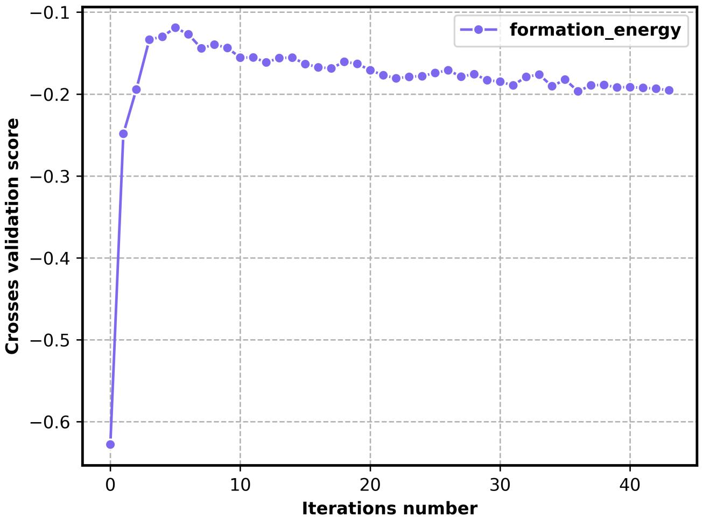

<details>
<summary>line chart</summary>

| Iterations number | Crosses validation score |
| ----------------- | ------------------------ |
| 0                 | -0.65                    |
| 1                 | -0.25                    |
| 2                 | -0.18                    |
| 3                 | -0.14                    |
| 4                 | -0.13                    |
| 5                 | -0.14                    |
| 6                 | -0.15                    |
| 7                 | -0.16                    |
| 8                 | -0.17                    |
| 9                 | -0.18                    |
| 10                | -0.19                    |
| 11                | -0.19                    |
| 12                | -0.19                    |
| 13                | -0.19                    |
| 14                | -0.19                    |
| 15                | -0.19                    |
| 16                | -0.19                    |
| 17                | -0.19                    |
| 18                | -0.19                    |
| 19                | -0.19                    |
| 20                | -0.19                    |
| 21                | -0.19                    |
| 22                | -0.19                    |
| 23                | -0.19                    |
| 24                | -0.19                    |
| 25                | -0.19                    |
| 26                | -0.19                    |
| 27                | -0.19                    |
| 28                | -0.19                    |
| 29                | -0.19                    |
| 30                | -0.19                    |
| 31                | -0.19                    |
| 32                | -0.18                    |
| 33                | -0.19                    |
| 34                | -0.20                    |
| 35                | -0.20                    |
| 36                | -0.20                    |
| 37                | -0.20                    |
| 38                | -0.20                    |
| 39                | -0.20                    |
| 40                | -0.20                    |
| 41                | -0.20                    |
| 42                | -0.20                    |
| 43                | -0.20                    |
</details>

从图上可以看出,最后10个特征对材料目标性质的贡献最为重要。

## 5.3 模型处理与评估

模型构建及后处理：用于搭建机器学习模型，依托于sklearn机器学习软件。JAMIP提供四种基类机器学习算法：线性模型、近邻模型、支持向量机模型、树基模型，共28种算法。并且，程序提供不同算法的拟合后处理功能。

model\_name: 用户可在RegressionModelbuilder/ClassificationModelbuilder类内中设置。

<table><tr><td>算法分类</td><td>回归</td><td>分类</td></tr><tr><td>线性模型</td><td>'LinearRegression or lr' 'Lasso or lasso' 'Ridge or rr'</td><td></td></tr><tr><td>近邻模型</td><td>'KNeighborsRegressor or knnr' 'RadiusNeighborsRegressor or rnnr'</td><td>'KNeighborsClassifier or knnc' 'RadiusNeighborsClassifier or rnc'</td></tr><tr><td>树基模型</td><td>'DecisionTreeRegressor or dtr' 'ExtraTreeRegressor or etr' 'RandomForestRegressor or rfr' 'AdaBoostRegressor or abr' 'ExtraTreesRegressor or etsr' 'GradientBoostingRegressor or gbrt'</td><td>'DecisionTreeClassifier or dtc' 'ExtraTreeClassifier or etc' 'RandomForestClassifier or rfc' 'AdaBoostClassifier or abc' 'ExtraTreesClassifier or etsc' 'GradientBoostingClassifier or gbct'</td></tr><tr><td>支持向量机模型</td><td>'svr or SVR' 'nusvr or NuSVR' 'LinearSVR or lsvr'</td><td>'SVC or svc' 'NuSVC or nusvc' 'LinearSVC or lsvc'</td></tr><tr><td>其他</td><td>'BayesianRidge or bayesian'</td><td>LogisticRegression or logis'</td></tr></table>

模型评估模块对于不同学习任务（分类or回归），JAMIP分别提供相应的评估方法，并提供去随机化和画图功能。

## 5.3.1 模型构建及后处理

```python
python
>>> from jamip.ml.model import ClassificationModelbuilder, RegressionModelbuilder
>>> from jamip.ml.model import ClassificationModelfitProcessing, RegressionModelfitProcessing
>>> X_train_regression = pd.read_csv('load_features_train.csv')  # 载入训练特征集
>>> y_train_regression = pd.read_csv('load_target_train.csv')  # 载入训练目标性质集
>>> X_test_regression = pd.read_csv('load_features_test.csv')  # 载入测试特征集
>>> y_test_regression = pd.read_csv('load_target_test.csv')  # 载入测试目标性质集
>>> X_train_classification = pd.read_csv('load_features_train_classification.csv')  # 载入分类训练特征集
>>> y_train_classification = pd.read_csv('load_target_train_classification.csv')  # 载入分类训练目标性质集
>>> X_test_classification = pd.read_csv('load_features_test_classification.csv')  # 载入分类测试特征集
>>> y_test_classification = pd.read_csv('load_target_test_classification.csv')  # 载入分类测试目标性质集
```

# 模型构建  
```python
>>> regression_model = RegressionModelbuilder(model_name = 'gbrt' # 输入回归模型名
).model_set.hyper_set(max_features = 'sqrt', # 设置回归模型超参数
n_estimators = 200,
loss = 'ls')
>>> classification_model = ClassificationModelbuilder(model_name = 'gbct' # 输入分类模型名
).model_set.hyper_set(max_features = 'sqrt', # 设置分类模型超参数
n_estimators = 200)
```

# 模型后处理  
```txt
>>> R = RegressionModelfitProcessing(regression_model)
>>> R.model_fit(X_train_regression, y_train_regression)
>>> C = ClassificationModelfitProcessing(classification_model)
>>> C.model_fit(X_train_classification, y_train_classification)
```

\# 具有.feature\_importance\_和.coef\_两个属性的模型

>>> R.get\_feature\_importaces(feature\_name = list(X\_train\_regression.columns.values))

```csv
GradientBoostingRegressor weight_score
0 packing_factor 0.459350
1 Of 0.392758
2 old_tolerance_factor 0.027601
3 new_tolerance_factor 0.020551
4 evaporation_heat_b 0.016978
.. ... ...
81 vdw_radius_x3 0.000000
82 covalent_radius_pyykko_x3 0.000000
83 ionenergy1_x3 0.000000
84 ionenergy2_x3 0.000000
85 electronegativity_x3 0.000000
```  
[86 rows x 2 columns]

```txt
>>> C.get_feature_importaces(feature_name = list(X_train_classification.columns.values))
    GradientBoostingClassifier weight_score
0 d1 0.308117
1 d3 0.293130
2 atomic_weight_b 0.063328
3 electronegativity_b 0.062469
4 d2 0.057117
.. ... ...
71 covalent_radius_cordero_x3 0.000000
72 ip_1_x3 0.000000
73 ip_2_x3 0.000000
74 ip_3_x3 0.000000
75 electronegativity_x3 0.000000

[76 rows x 2 columns]
```

```python
# 模型拟合信息整合，输出：模型名+'_feature_importance_rank'.csv，模型名+'_info'.csv 文件
>>> R.model_fit_info(feature_name = list(X_train_regression.columns.values))
# 例：GradientBoostingRegressor_feature_importances_rank.csv
GradientBoostingRegressor_info.csv
```

\# 模型预测

```python
>>> R_predictive_value = R.model_predict(X_test = X_test_regression)
>>> C_predictive_value = C.model_predict(X_test = X_test_classification)
```

## 5.3.2 模型评估

针对回归模型，JAMIP提供MAE/MSE/RMSE/R2/MSLE/RMSLE评估标准，并提供去随机化功能和画图功能；针对分类模型，JAMIP提供Accuracy score/Confusion matrix/Precision score/Recall score/F1 score/ROC\_AUC，并提供去随机化功能和画图功能。

from jamip.ml.evaluation import RegressionMetrics, DerandomizationRegressionMetrics
from jamip.ml.evaluation import ClassificationMetrics, DerandomizationClassificationMetrics  
```python
# 初始化回归评估，{'mae','mse','rmse','r2','msle','rmsle'}
>>> R_Metrics = RegressionMetrics(True_value = y_test_regression,    # 实际值
Predicted_value = R_predictive_value)  # 预测值

>>> R_Metrics.mae
0.09904596206810677

>>> R_Metrics.rmse
0.13307524051468395

# 初始化分类评估，{'accuracy_number','accuracy_score','confusion_matrix',
# 'precision_score','recall_score','f1_score','roc_auc'}
>>> C_Metrics = ClassificationMetrics(True_value = y_test_classification,
Predictive_value = C_predictive_value,
label = {'Non-Bipolar conductivity':[0],  # dict, 分类标签设置
'Bipolar conductivity':[1]})

>>> C_Metrics.accuracy_score
{'accuracy_score':0.9653179190751445}
>>> C_Metrics.f1_score
{'f1_score_binary':0.955223880597015}  # 二分类
>>> C_Metrics.confusion_matrix(normalize = None,    # 是否进行归一化处理
color = 'coral',    # 设置颜色
plot = True,    # 是否输出混淆矩阵图片
dpi = 600)    # 分辨率
```

Confusion Matrix  
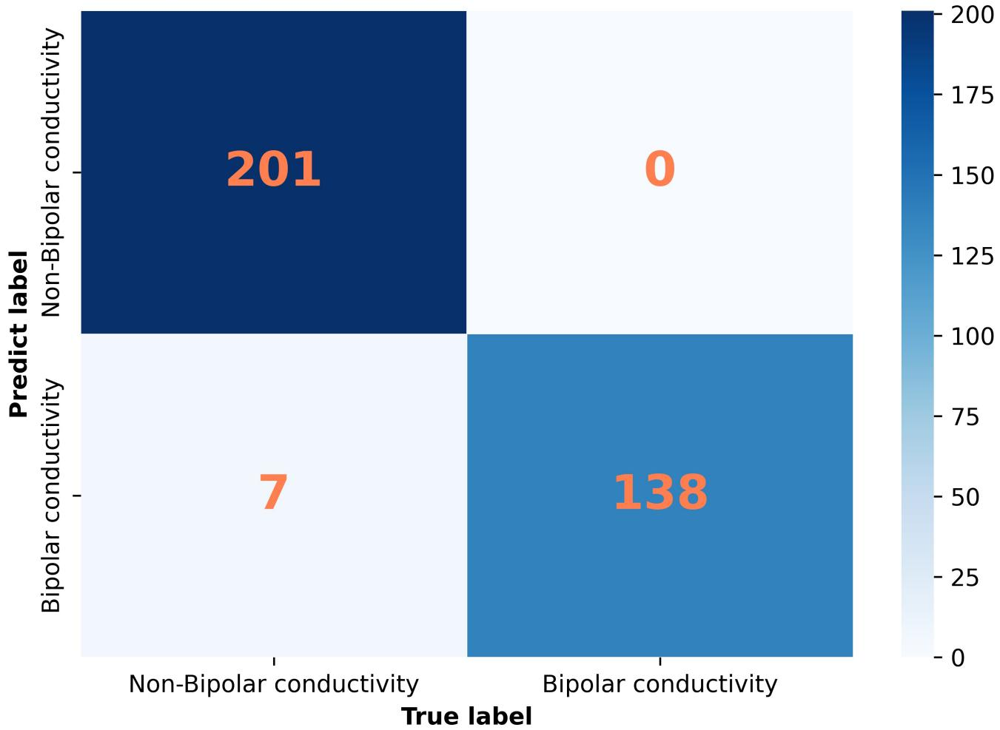

<details>
<summary>heatmap</summary>

| Predict label           | Non-Bipolar conductivity | Bipolar conductivity |
| ----------------------- | ------------------------ | -------------------- |
| Non-Bipolar conductivity | 201                      | 0                    |
| Bipolar conductivity    | 7                        | 138                  |
</details>

回归评估去随机化：集成模型存在random state超参数，每次拟合后，结果会存在一定的差异。因此，需采用平均化方法，消除随机化现象。

```python
>>> DRM = DerandomizationRegressionMetrics(
    fixed_model = regression_model,    # 完成超参设置的模型
    evaluation_index = ['mae', 'rmse'],  # 回归评估指标：list或str
    iteration_number = 5)    # 迭代次数

>>> DRM.derandomization(X_train = X_train_regression,
    y_train = y_train_regression,
    X_test = X_test_regression,
    y_test = y_test_regression)
{'mae':0.09904240362635257, 'rmse':0.1330312977403091}
```

分类评估去随机化：集成模型 存在random state超参数，每次拟合后，结果会存在一定的差异。因此，需要采用平均化方法，消除随机化现象。

```python
>>> DCM = DerandomizationClassificationMetrics(
    fixed_model = classification_model,    # 完成超参设置的模型
    evaluation_index = ['accuracy_number', 'recall_score',
    'accuracy_score', 'precision_score'],    # 分类评估指标
    label = {'Non-Bipolar conductivity': [0],
    'Bipolar conductivity': [1]},    # dict 分类标签设置
    iteration_number = 5)    # 迭代次数

>>> DCM.derandomization(X_train = X_train_classification,
    y_train = y_train_classification,
    X_test = X_test_classification,
    y_test = y_test_classification)
{'accuracy_number': 335.0, 'recall_binary': 0.9276315789473685, 'accuracy_score': 0.9682080924855491, 'precision_binary': 1.0}
```

## 回归模型-实际vs预测图

```python
>>> from jamip.ml.evaluation import PlotRegression
>>> PR = PlotRegression(model = 'GBRT', # 模型简称
    fixed_model = regression_model) # 已经完成了超参数设置的模型
```

\# 散点图

```python
>>> PR.plot_actuality_predict_scatter(target = 'formation_energy', # 材料预测目标性质
X_train = regression_feature_X_train, # 特征训练集
y_train = regression_feature_y_train, # 目标训练集
X_test = regression_feature_X_test, # 特征测试集
y_test = regression_feature_y_test, # 目标测试集
evaluation_index = ['mae', 'rmse'], # 回归评估指标
derandomization = True, # 是否进行去随机化
iteration_number = 10, # 迭代次数
color = 'mediumspringgreen, # 散点颜色
size = 25, # 散点尺寸
marker = 'o', # 散点形状
linewidth = 1.5, # 图像边框宽
grid = True, # 是否增加网格
grid_linestyle = '--', # 网格类型
file_name = 'ActualityPredict', # 输出图像名
file_format = 'jpg', # 输出图像格式
text_x = 2.5, # 注释位置X
text_y = 0.5, # 注释位置Y
dpi = 600) # 分辨率
```

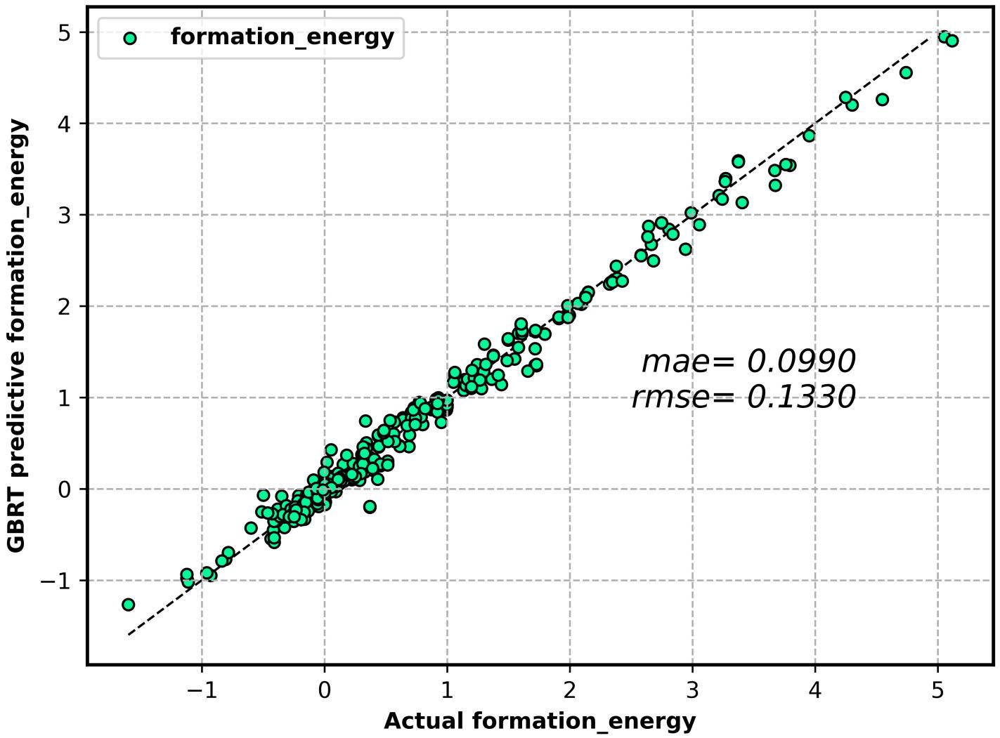

<details>
<summary>scatterplot</summary>

| Actual formation_energy | GBRT predictive formation_energy |
| ----------------------- | --------------------------------- |
| -1.5                    | -1.2                              |
| -1.2                    | -1.0                              |
| -0.8                    | -0.7                              |
| -0.5                    | -0.4                              |
| -0.2                    | -0.1                              |
| 0.0                     | 0.0                               |
| 0.3                     | 0.3                               |
| 0.6                     | 0.6                               |
| 0.9                     | 0.9                               |
| 1.2                     | 1.2                               |
| 1.5                     | 1.5                               |
| 1.8                     | 1.8                               |
| 2.1                     | 2.1                               |
| 2.4                     | 2.4                               |
| 2.7                     | 2.7                               |
| 3.0                     | 3.0                               |
| 3.3                     | 3.3                               |
| 3.6                     | 3.6                               |
| 3.9                     | 3.9                               |
| 4.2                     | 4.2                               |
| 4.5                     | 4.5                               |
| 4.8                     | 4.8                               |
| 5.1                     | 5.0                               |
</details>

# 柱状图  
```python
>>> R.plot_data_distribution(X_train = regression_feature_X_train, # 特征训练集
    y_train = regression_feature_y_train, # 目标训练集
    X_test = regression_feature_X_test, # 特征测试集
    y_test = regression_feature_y_test, # 目标测试集
    Gaussian = True # 是否画出高斯曲线
    color_up = 'mediumspringgreen', # 第一幅图颜色
    color_down = 'mediumorchid', # 第二幅图颜色
    bins = 40, # 柱个数
    linewidth = 1.5, # 图像边框宽
    grid = True, # 是否增加网格
    grid_linestyle = '--', # 网格类型
    file_name = 'Actuality_Predict', # 输出图像名
    file_format = 'jpg', # 输出图像格式
    text_x = 2.5, # 注释位置X
    text_y = 0.5, # 注释位置Y
    dpi = 600) # 分辨率
```

Data distribution comparison  
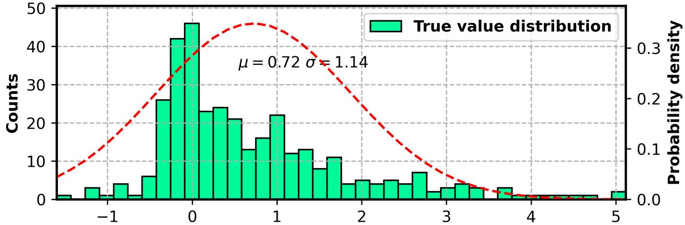

<details>
<summary>bar-line hybrid chart</summary>

| Bin Range | Counts | Probability Density |
| --------- | ------ | ------------------- |
| -1.5 to -1 | 1 | 0.01 |
| -1 to -0.5 | 3 | 0.03 |
| -0.5 to 0 | 26 | 0.18 |
| 0 to 0.5 | 42 | 0.28 |
| 0.5 to 1 | 46 | 0.32 |
| 1 to 1.5 | 23 | 0.25 |
| 1.5 to 2 | 24 | 0.19 |
| 2 to 2.5 | 21 | 0.14 |
| 2.5 to 3 | 13 | 0.08 |
| 3 to 3.5 | 16 | 0.05 |
| 3.5 to 4 | 22 | 0.03 |
| 4 to 4.5 | 12 | 0.01 |
| 4.5 to 5 | 13 | 0.01 |
| 5 to 5.5 | 8 | 0.01 |
| 5.5 to 6 | 11 | 0.02 |
| 6 to 6.5 | 4 | 0.01 |
| 6.5 to 7 | 5 | 0.01 |
| 7 to 7.5 | 4 | 0.01 |
| 7.5 to 8 | 7 | 0.02 |
| 8 to 8.5 | 3 | 0.01 |
| 8.5 to 9 | 4 | 0.01 |
| 9 to 9.5 | 2 | 0.01 |
| 9.5 to 10 | 1 | 0.01 |
| 10 to 10.5 | 1 | 0.01 |
| 10.5 to 11 | 1 | 0.01 |
| 11 to 11.5 | 1 | 0.01 |
| 11.5 to 12 | 1 | 0.01 |
| 12 to 12.5 | 1 | 0.01 |
| 12.5 to 13 | 1 | 0.01 |
| 13 to 13.5 | 1 | 0.01 |
| 13.5 to 14 | 1 | 0.01 |
| 14 to 14.5 | 1 | 0.01 |
| 14.5 to 15 | 1 | 0.01 |
| 15 to 15.5 | 1 | 0.01 |
| 15.5 to 16 | 1 | 0.01 |
| 16 to 16.5 | 1 | 0.01 |
| 16.5 to 17 | 1 | 0.01 |
| 17 to 17.5 | 1 | 0.01 |
| 17.5 to 18 | 1 | 0.01 |
| 18 to 18.5 | 1 | 0.01 |
| 18.5 to 19 | 1 | 0.01 |
| 19 to 19.5 | 1 | 0.01 |
| 19.5 to 20 | 1 | 0.01 |
| 20 to 20.5 | 1 | 0.01 |
| 20.5 to 21 | 1 | 0.01 |
| 21 to 21.5 | 1 | 0.01 |
| 21.5 to 22 | 1 | 0.01 |
| 22 to 22.5 | 1 | 0.01 |
| 22.5 to 23 | 1 | 0.01 |
| 23 to 23.5 | 1 | 0.01 |
| 23.5 to 24 | 1 | 0.01 |
| 24 to 24.5 | 1 | 0.01 |
| 24.5 to 25 | 1 | 0.01 |
| 25 to 25.5 | 1 | 0.01 |
| Note: The actual counts and probabilities density are not explicitly provided in the code; they are estimated based on the given code and are not explicitly provided in the original data frame (e.g., “True value distribution” has only one data point). The chart type is “True value distribution”.
</details>

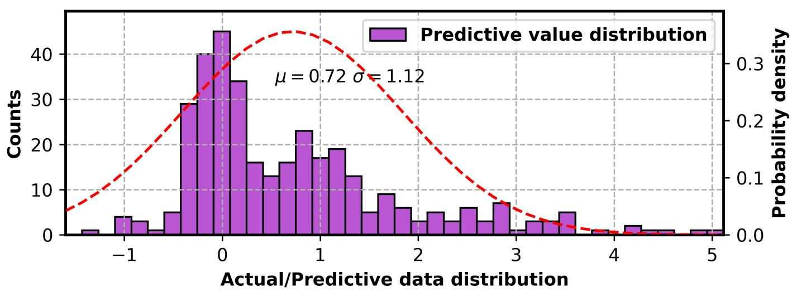

<details>
<summary>bar-line hybrid chart</summary>

| Actual/Predictive data distribution | Counts | Probability density |
| ------------------------------------ | ------ | ------------------- |
| -1.5                                 | 1      | 0.01                |
| -1.0                                 | 4      | 0.03                |
| -0.5                                 | 5      | 0.08                |
| 0.0                                  | 45     | 0.3                 |
| 0.5                                  | 34     | 0.25                |
| 1.0                                  | 23     | 0.2                 |
| 1.5                                  | 19     | 0.15                |
| 2.0                                  | 9      | 0.1                 |
| 2.5                                  | 6      | 0.07                |
| 3.0                                  | 7      | 0.05                |
| 3.5                                  | 5      | 0.03                |
| 4.0                                  | 2      | 0.01                |
| 4.5                                  | 1      | 0.005               |
| 5.0                                  | 1      | 0.002               |
</details>

## 5.4 数据可视化

JAMIP提供对特征-目标关系图、箱式图、小提琴图画图功能，让数据可以更简单且直观地展示，方便分析样本数据。

```txt
>>> from jamip.ml.plot import Plot
```

# 单特征-目标性质图  
```python
>>> Plot(df = regression_train, # 数据集
    linewidth = 1.5, # 图像边框线宽
    dpi = 600, # 图像分辨率
    grid = True, # 是否添加网络
    grid_lifestyle = '--' # 网络类型
).feature_target_relationship(feature = 'mean_bx', # 特征名称
    target = 'formation_energy', # 目标性质名称
    file_name = 'feature_target_relationship', # 输出图像名
    file_format = 'jpg', # 输出图像格式
    size = 25, # 散点尺寸大小
    color = 'mediumorchid', # 散点颜色
    marker = 'o', # 散点形状
    fontsize = 10, # 注释字体大小
    fontweight = 'semibold', # 注释字体粗细
    edgecolors = None, # 散点边缘颜色
    linewidths = 0.5) # 散点边缘粗细
```

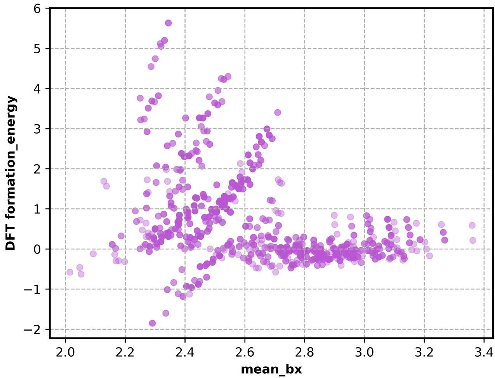

<details>
<summary>scatterplot</summary>

| mean_bx | DFT formation_energy |
| ------- | -------------------- |
| 2.0     | -0.5                 |
| 2.1     | 1.7                  |
| 2.2     | 0.3                  |
| 2.3     | 5.6                  |
| 2.4     | -1.8                 |
| 2.5     | 4.3                  |
| 2.6     | 2.9                  |
| 2.7     | 3.4                  |
| 2.8     | 0.1                  |
| 2.9     | -0.2                 |
| 3.0     | 0.8                  |
| 3.1     | 0.6                  |
| 3.2     | 0.3                  |
| 3.3     | 0.5                  |
| 3.4     | 0.6                  |
</details>

# 双特征-目标性质图  
```python
>>> Plot(df = regression_train,  # 数据集
    linewidth = 1.5,    # 图像边框线宽
    dpi = 600,    # 图像分辨率
    grid = True,    # 是否添加网络
    grid_linestyle = '--'    # 网络类型
).feature_pair_target_relationship(features = ['mean_bx', 'packing_factor'],    # 特征对名称
    target = 'formation_energy',    # 目标性质名称
    file_name = 'feature_pair_target',    # 输出图像名
    file_format = 'jpg',    # 输出图像格式
    size = 25,    # 散点尺寸
    cmap = 'coolwarm',    # 颜色条颜色
    marker = 'o',    # 散点形状
    fontsize = 10,    # 字体大小
    fontweight = 'semibold',    # 字体粗细
    edgecolors = None,    # 散点边缘颜色
    linewidths = 0.5)    # 散点边缘粗细
```

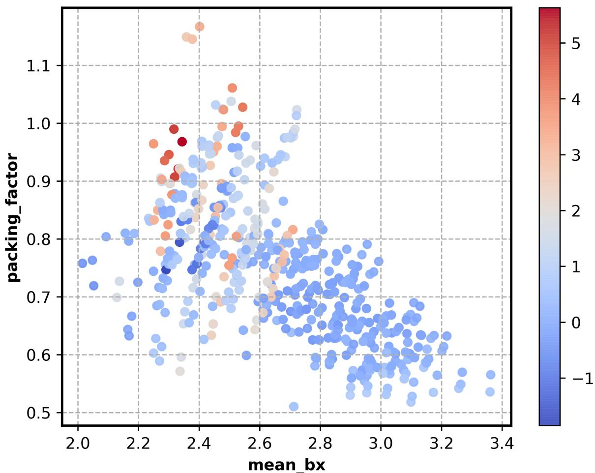

<details>
<summary>scatterplot</summary>

| mean_bx | packing_factor | value |
| ------- | -------------- | ----- |
| 2.0     | 0.75           | 0     |
| 2.1     | 0.80           | 1     |
| 2.2     | 0.85           | 2     |
| 2.3     | 0.90           | 3     |
| 2.4     | 0.95           | 4     |
| 2.5     | 1.00           | 5     |
| 2.6     | 0.95           | 3     |
| 2.7     | 0.90           | 2     |
| 2.8     | 0.85           | 1     |
| 2.9     | 0.80           | 0     |
| 3.0     | 0.75           | -1    |
| 3.1     | 0.70           | -2    |
| 3.2     | 0.65           | -3    |
| 3.3     | 0.60           | -4    |
| 3.4     | 0.55           | -5    |
</details>

# 箱式图  
```python
>>> Plot(df = regression_train,  # 数据集
    linewidth = 1.5,  # 图像边框线宽
    dpi = 600,  # 图像分辨率
    grid = True,  # 是否添加网络
    grid_linestyle = '--'  # 网络类型
).plot_violin(features = ['mean_bx', 'packing_factor'],  # 特征名称
    file_name = 'box',  # 输出图像名
    file_format = 'jpg',  # 输出图像格式
    sym = 'o',  # 异常值形状
    patch_artist = False,  # 是否填充箱体颜色
    y_label = None,  # y轴标签
    fontsize = 10,  # 字体大小
    fontweight = 'semibold')  # 字体粗细
```

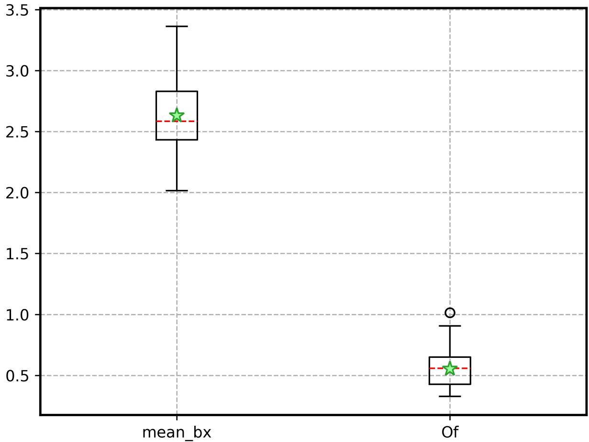

<details>
<summary>box plot</summary>

| Category   | Value |
| ---------- | ----- |
| mean_bx    | 2.6   |
| Of         | 0.5   |
</details>

小提琴图  
```python
>>> Plot(df = regression_train).plot_violin(features = ['mean_bx', 'packing_factor'], # 特征名称
target = 'formation_energy', # 目标性质名称
file_name = 'violin', # 输出图像名
file_format = 'jpg', # 输出图像格式
color = 'mediumspringgreen', # 小提琴图颜色
linewidths = 1, # 小提琴图边宽
scale = 'count', # 小提琴宽度 {'area', 'count', 'width'}
inner = 'box', # 内部数据点标注
saturation = 0.8, # 饱和度
fontsize = 10, # 注释字体大小
fontweight = 'semibold') # 注释字体粗细
```

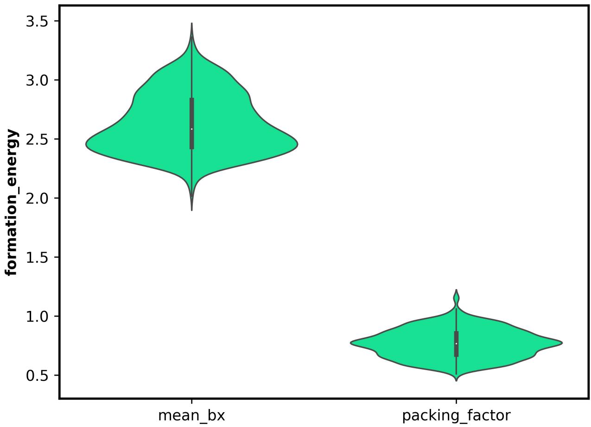

<details>
<summary>violin chart</summary>

| category       | mean_bx | packing_factor |
| -------------- | ------- | -------------- |
| formation_energy | 2.5     | 0.7            |
</details>

## 6. 开发者文档

本章节讲进一步介绍程序核心功能的运行机制，以及可供外部调用的程序接口。

## 6.1 任务检查

JAMIP内部使用一套检查模块，在执行jp命令时会调用计算模块的功能，确保用户使用jp命令或python程序调用任务检查功能的结果与在集群上计算的结果一致。

## 任务检查模块包含以下部分：

1. 任务状态基类： jamip.abtools.base.check.BaseStatus  
2. 计算模块的任务检

查：jamip.abtools.vasp.check.CheckStatus，jamip.abtools.vasp.check.CheckStatus

3. jp命令的任务检查功能: jamip.cui.check.\_\_CheckStatus

## class BaseStatus:

\- 检查模块的基类，包含.status文件的操作函数

```python
from jamip.abtools.base.check import BaseStatus
```

```python
__load__()
```

> 以字典形式返回当前.status文件内保存的任务状态

```python
__save__(data:dict)
```

> 将任务状态字典以yaml格式存入当前.status文件中

```txt
write_status(status:dict, path:str)
```

- status: 新增任务的状态字典  
- path: 新增任务的计算目录  
> 添加任务状态至当前.status文件中

```python
error_status(error:str, path:str)
```

- error: 任务的错误信息  
- path: 任务的计算目录  
> 添加任务状态(错误信息)至当前.status文件

```python
right_status(task: str)
```

- task: 需要更新的任务  
> 将.status文件中的task对应的任务状态更新为成功

```python
remove_status(tasks: Optional[str, list])
```

- task: 需要移除的任务或任务列表  
> 删除.status文件中的对应任务

## class CheckStatus(rootdir:str)

\- DFT计算任务的检查模块，根据程序输出文件判断完成情况，并确定续算中需要完成的任务

from jamip.abtools.vasp.check import CheckStatus

\# VASP部分的检查函数

get\_status(path:str, task:str)  
- path：需要提取任务状态对应的计算输出文件，一般为OUTCAR
- task：计算任务名
> 获取任务状态，返回状态字典
> 依次进行完成检查：离子步迭代情况检查和电子步迭代情况检查

success(path:str, task:str)  
- path：需要提取任务状态对应的计算输出文件，一般为OUTCAR
- task：计算任务名
> 用于计算流程调用。当计算目录存在时，调用get_status函数；目录不存在时，返回计算失败的任务字典

finish\_check(status:dict, path:str)  
- status: 状态字典
- path: 需要提取任务状态对应的计算输出文件
> 检查任务的完成情况，以下三类关键词的出现，程序将视为任务已经正常完成：

1. Total CPU time used：正常计算中OUTCAR的完成标志
2. vasp will stop now：部分电荷密度等无电子步计算中OUTCAR的完成标志
3. to POSCAR and continue：结构优化时pbs.log内的提示信息(此时无标志1)

ions\_check(status:dict, path:str)  
- status: 状态字典
- path: 需要提取任务状态对应的计算输出文件
> 当计算包含离子步优化时(nsw>0, ibrion>-1, isif>1)，检查其收敛情况：

1. reached required accuracy: 存在标志时能量收敛  
2. 判断最大晶格力是否大于收敛标准，仅当开启力收敛时检查

electrons\_check(status:dict, path:str)  
- status：状态字典
- path：需要提取任务状态对应的计算输出文件
> 提取最后一个离子步内的电子步数，当步数等于NELM时认为未收敛

\_continue(task:Task, root:str, overwrite:both=False) @classmethod  
- task：任务类，本函数将直接更新输入Task类的参数
- root：计算的根目录
- overwrite：是否重新计算非自洽任务
> 读取当前计算的.status文件并更新任务类，用于续算任务
> 如果.status中显示任务已完成，更新task中对应任务的完成属性，主流程计算将不再计算该任务
> 返回最后一步完成的自洽计算路径，本次计算将以该目录作为起始目录(继承CONTCAR、CHGCAR、WAVECAR)

rebuild\_status(tasks:Task) @classmethod  
- tasks：任务类，用于提供本次计算需要完成的任务(新生成.status将仅包含Task内设置的任务)
> 重新生成.status文件(基于对所有计算文件的检查)
> 一般用于.status缺失或过期时使用

load\_status(root:str) @classmethod  
- root: 计算的根目录
> 提取root目录下.status文件，返回包含任务完成信息的Task类

load\_converge(root:str) @classmethod  
- root: 计算的根目录
> 提取root目录下.status文件。当中自洽计算(relax、scf)的任务状态未收敛时，检查其详细的收敛信息

> 收敛信息：计算目录+完成状态+离子步数+能量差值+最后十步的能量变化趋势

```txt
is_converge(path:str, conv:float=1e-4)
```

\- path: 计算目录

\- conv: 能量收敛值

> 判断VASP计算的离子步优化是否达到能量收敛标准

## 6.2 绘图模块

本章节将介绍绘图模块的基本使用方法

## 任务检查模块包含以下部分：

1. 图像缓存类：jamip.utils.plot.Figure  
2. 主题绘图程

序：jamip.utils.plot.Plot，jamip.utils.qeplot.QEPlot，jamip.utils.phonoplot.PhononPlot

3. 链接绘图程序：jamip.abtools.diyflow 内的各diy模块

## class Plot(path: str, soft: Optional[str])

\- 绘图模块主体，根据输入路径和任务批量绘图

from jamip.utils.plot import Plot  
plots(jobs:Union[list,str])
- jobs: 需要进行绘图的任务
> 绘图函数的通用接口，根据输入的任务列表初始化Figure类，调用子绘图函数执行各绘图任务

# 各子绘图函数不自带图片保存或输出功能，如果希望执行以下函数，需要调用Figure类以访问图片对象
> plot_fat_band(path)
- path: 计算目录，参考Finder类
> 绘制投影能带图，能带上点的颜色代表不同原子的态密度/轨道态密度的贡献

> plot_band(path)
- path: 计算目录，参考Finder类
> 绘制一般能带图

> plot_dos(path, job)
- path: 计算目录，参考Finder类
- job: 绘图类型，“tdos”或“pdos”
> 绘制总的态密度图或投影态密度图

> plot_absorb(path, job)
- path: 计算目录，参考Finder类
- job: 绘图类型，“absorb”或“reflex”
> 绘制光吸收谱(或反射谱)（注：Y轴使用log坐标）

> plot_tdm(path)
- path: 计算目录，参考Finder类
> 绘制跃迁偶极矩图(价带->导带)
> 在能带计算时，需要输出WAVECAR

> plot_dielectric(path, job)
- path: 计算目录，参考Finder类
> 绘制介电函数的实部和虚部（注：默认只绘制沿z方向的情况）

> plot_unfolding(path:str, dim=None, primcell=None, smear=False)
- path: 计算目录，参考Finder类
- dim: 超胞矩阵，(3,)或(3,3)的矩阵
- primcell: 原胞结构文件路径
- smear: 是否对反折叠点绘制展宽图
> 绘制能带反折叠图

> plot_hseband(path:str)
- path: 计算目录，参考Finder类
> 绘制HSE能带

## class QEPlot(path:str, soft:Optional[str])

\- QE绘图模块，目前仅支持能带结构和TDOS图，在后续版本会支持更多绘图功能

from jamip.utils.qeplot import QEPlot

> plot\_band(path:str)

\- path: 计算目录，参考Finder类

> 绘制能带图（注：目前仅支持无自旋体系）

> plot\_dos(path:str, job:str)

\- path: 计算目录，参考Finder类

\- job: 绘图类型，pdos或tdos

> 绘制态密度图（注：目前仅支持无自旋体系的tdos）

## class PhononPlot (path:str, soft:Optional[str])

\- 基于Phonopy的绘图模块（注：目前仅支持基于VASP的计算）

from jamip.utils.phonoplot import PhononPlot

> softmode(path:str)

\- path: 计算目录，参考Finder类

> 绘制软模相变随位移量的能量变化

> band(path:str)

\- path: 计算目录，参考Finder类

> 绘制声子谱（注：高对称路径根据结构自动生成）

> dos(path:str)

\- path：计算目录，参考Finder类

> 绘制声子态密度

> gruneisen(path:str)

\- path：计算目录，参考Finder类

> 绘制Grunesien常数

## 6.3 自定义任务流程

JAMIP支持用户自建任务流程，以下类型的流程适合创建自建流程：

1. 针对特定目标开展的系列计算，如计算载流子迁移率，计算泊松比

2. 需要使用第三方软件包，如bader, boltztrap, cohp

下面给出diyflow的开发建议：

## 任务命名规则

在input.py文件中设置执行任务类型时，tasks模块会检测当前diyflow目录下'.py'后缀的文件，将这些文件作为可供选择的任务名。以Boltztrap为例：

\- 流程代码：abtools/diyflow/boltztrap.py

\- 类名：Boltztrap

- 任务名: vasp.tasks = '... scf boltztrap'  
添加至 input.py 中即可计算，注意避免diy任务名与已有任务名冲突  
- 用户可以在diy类内自由设置计算输出目录，如\~/electric/boltztrap  
- 计算参数模板储存在diy类中，执行 jp -r prepare 命令后添加至 .incar 中

boltztrap:

lwave: false

## 流程设计框架

import os

import numpy as np

from .miniflow import MiniFlow

class Boltztrap(MiniFlow):  
yaml = {} # 计算参数模板  
```python
def __init__(self,func,stdin=None,rootdir=None,*args,**kwargs):
    MiniFlow.__init__(self,func,stdin,rootdir)
    stdout = os.path.join(self.rootdir,'electric','boltztrap')
    self.diy_calculator(func,stdout=stdout,stdin=stdin)
```

# 计算主流程 %  
```python
def diy_calculator(self, func, stdout, stdin=None):
    from os.path import join, exists, getsize
    from jamip.abtools.vasp.check import CheckStatus

# 具体的计算流程
self.scf_calculation(stdout)
self.boltz_calculation(stdout)

# 更新任务状态
if self.check(self.rootdir):
    check.write_status(status, stdout)
    func.tasks.diy.boltztrap.finish = True
```

# 计算子流程  
```python
def scf_calculation(self,vasp,stdout,stdin=None):
    pass
def boltz_calculation(self,stdout):
    pass
```

# 创建计算参数字典  
```python
@classmethod
def create(self,params):
    from jamip.abtools.base.tasks import Incar
    data = Incar('boltztrap',params)
    return data
```

# 额外的计算完成检查方法  
```python
@classmethod
def check(self, path):
    from os.path import join, exists, getsize, basename
    file = join(path, 'electric', 'boltztrap', 'mass.dat')
    if exists(file) and getsize(file):
    print('Boltztrap calculation finish.')
    return True
    else:
    return False
```

# 画图功能(可选)  
```txt
@classmethod
def plot(self, path):
```

## 程序运行流程

计算程序启动：在主流程计算中，diy计算将在其他计算任务完成后执行

代码位置：abtools/vaspflow.py  
```python
from ..diyflow import import_diy_moudle
    diy_class = import_diy_moudle(name)    # 调用字符串对应的diy类
    diyflow = diy_class(func=deepcopy(vasp),stdin=stdin,rootdir=self.rootdir)
    # diy计算类的输入参数
> func: vasp参数类(deepcopy),
> stdin: 计算输入目录（收敛的自洽计算目录，一般为scf）
> rootdir: 计算根目录
```

## 计算任务检查：

在检查计算任务的完成状态时，除检查 .status 文件外，还会调用对应模块的 check 方法，对计算任务的完整性进行额外检查

## 绘图：

建议：将绘图函数添加至对应的diy类中，方便绘图脚本的分发。后续更新中，我们将会添加plot脚本对diy计算的支持

```python
from jamip.abtools.diyflow.unfolding import Unfolding # 调用 DIY类
```

```javascript
Unfolding.plot('TEST/Si.vasp')
```

```txt
# 输出目录可以是计算根目录或任务目录，其他输入参数视设计的函数而定
```

## 6.4 数据库接口类

用于从计算目录中提取必要数据，创建计算实例并存入数据库中 (注：目前仅限VASP相关的计算)

1. 启动django程序: jamip.db.connect.Connect  
2. 计算类创建类： jamip.db.connect.EntryBuilder

## class Connect:

\- 数据库连接类，需要先import此类，激活django运行环境

```python
from jamip.db.connect import Connect
conn = Connect()
```  
load\_structure(path:str=None)

- path: 结构文件或结构文件所在的目录  
> 将结构文件存入JAMIP数据库  
1. path=None，存入当前目录的全部结构文件  
2. isfile(path)，存入path指定的结构文件  
3. isdir(path)，存入path指定目录内的结构文件

load\_entry(path:str=None, properties:list=None)

- path：计算目录，JAMIP批计算目录，或JAMIP任务池文件  
- properties：需要数据库的计算属性。若未指定，尝试存入全部属性  
> 将一个或一组计算数据存入数据库  
> 调用EntryBuilder类实现

## class EntryBuilder:

## 数据库导入计算目录数据的简易模块

from jamip.db.connect import EntryBuilder  
```txt
# 默认存入的计算参数
EntryBuilder.cal_params = ['date', 'datetime', 'vasp_version', 'prec', 'ediff', 'ediffg']
```  
load(root:str, properties:list=None, isPersist:both=False)

- root: 生成Entry类的计算目录  
- properties: 需要存入的计算数据  
- isPersist: 是否存入数据库  
> 将计算数据存入数据库

set\_born\_charge(root:str) # 待测试

- root: 计算目录  
> 设置Entry.born\_effective\_charge (波恩电荷)

set\_boltztrap(root:str)

- root: 计算目录  
> 设置Entry.effective\_mass\_of\_bandside（有效质量）  
- root: 计算目录  
> 设置Entry.effective\_mass\_of\_bandside（有效质量。注：与Boltztrap重名）

set\_emass(root:str)

set\_bandgap(root:str)

- root: 计算目录  
> 设置Entry.bandgap（直接与间接带隙）

set\_energy(path:str)

- path: 自洽计算目录(能够提取自由能的目录)  
> 设置Entry.energy（自由能，每组分化学能，每原子自由能）

## 7. 命令行工具

在shell环境下，JAMIP通过jp命令与用户进行交互，执行任务提交、任务检查、数据提取和绘图等各项功能。

在终端下，执行 jp -h 或 jp --help ，获得jp命令的支持信息

## 7.1 任务提交

jp -i --input [soft]

生成任务的提交脚本副本

- 可选参数：vasp, qe, win2k, abinit, pwscf, gaussian, plot  
- 代码链接：jamip/cui/create.py  
- 使用示例：  
jp -i vasp 生成vasp计算的提交脚本
jp -i plot 生成绘图脚本

jp -r --run [command]

任务提交命令

- 可选参数： prepare, qsub, single  
- 代码链接：jamip/compute/launch.py  
- 使用示例：  
jp -r prepare 运行input.py，生成任务池文件
jp -r qsub -f [pool] 将任务池中的任务提交至集群
jp -r single -f [pool] 使用本地机串行计算任务池中的任务

jp -f --file [file]

指定当前命令使用的任务池文件或输出目录

jp --[cluster]

集群参数设置命令，参数信息会保存在集群配置文件 .cluster 内

\- 可选参数:

jp --cores [int] 设置单节点使用核数  
jp --queue [string] 设置使用的集群队列  
jp --num [int] 设置最大提交任务数  
jp --nodes [int] 设置单任务使用节点数  
jp --restart 添加restart参数  
jp --overwrite 添加overwrite参数

\- 使用示例：

jp -r qsub -f [pool] --queue=host3 --num=5 --overwrite

## - 补充说明：

默认情况下，JAMIP程序不会计算.status文件中已完成的任务。

添加restart参数后，任务将在计算开始前删除.status文件，重新计算全部计算任务

添加overwrite参数后，任务将继承自洽场计算的结构和文件，重新计算全部非自洽任务

当用户不需要overwrite/restart参数时，需要及时修改.cluster文件

## 7.2 任务检查

```txt
jp -c --check [comments]
```

- 可选参数：show, load, status, prepare, qstat, bjobs  
- 使用示例：

jp -c qstat: 查询当前用户队列中运行的计算目录

jp -c qstat -f [jobid] 打印任务号为jobid的任务的计算目录

jp -c show -f [pool]: 以表格形式输出任务池完成状态

jp -c load -f [pool] 调用程序的续算检查功能，查看目录下的任务是否全部计算完成。当任务完成情况与任务池不一致时，更新任务池

jp -c status -f [pool] 检查本次需要计算的任务是否已完成(基于计算目录而非.status文件)，重新生成一份.status状态文件

jp -c prepare -f [pool]: 将任务池中任务状态 "running" 变更为 "wait"

\- 补充说明：

任务池的状态更新流程为：wait > running > finished >，即如果计算任务在运行过程中意外中止，其状态将停留在 running。

jp -c load 使用情景：基于 .status 文件更新任务池，可用于任务的完成状态统计与再次提交。

jp -c status 使用情景：1. .status 被删除或格式不正确无法读取。2. .status 与实际计算目录不一致，如用户手动添加或删除了部分计算目录

## 7.3 数据处理

```batch
jp -o --output
```

- 输入参数：检索属性与文件路径  
- 命令简介：JAMIP的数据检索工具，支持以表格/排序/csv等多种格式输出计算数据

```shell
jp -v --vasp -f [files]
```

\- 输入参数：操作命令与文件路径

\- 命令简介：JAMIP的对vasp的支持程序

\- 代码链接：jamip/cui/vasptools.py

```txt
jp --db
```

\- 可选参数: structure, entry, history

\- 命令简介：将指定的计算数据存入数据库，或查看存入数据库的历史数据

\- 代码链接：jamip/db/connect.py

```ruby
# history命令使用实例
$ jp --db history
    name format natoms SG
0 Si.vasp Si8 8 216
([fileds]/all/none):bandgap
    name format natoms SG indirect direct
0 Si.vasp Si8 8 216 0.6829 0.7021
([fileds]/all/none):energy
    name format natoms SG indirect direct energy
0 Si.vasp Si8 8 216 0.6829 0.7021 -43.381044
([fileds]/all/none):all
['structure_id', 'name', 'calculated_parameters', 'path', 'energy', 'energy_per_formula',
'energy_per_atom', 'bandgap', 'bandgap_img', 'corrected_bandgap', 'effective_mass_of_bandside',
'optical_bandgap', 'dielectric_constant', 'born_effective_charge', 'exciton_binding_energy',
'pressure', 'stress_tensor', 'elastic_constants', 'bulk_modulus', 'Raman_frequencies',
'IR_frequencies']
([fileds]/all/none):
```

## 7.4 辅助工具

jp -V --version

查看JAMIP程序版本号

jp --mysql

- 可选参数: initialize, start, shutdown  
- 命令简介：自动化完成mysql的初始化，启动和关闭  
- 代码链接：jamip/cui/softmanage.py  
- 使用示例：  
jp --mysql initialize MySQL 初始化 (需要按提示，手动登陆并修改密码)  
jp --mysql start 启动MySQL程序  
jp --mysql shutdown 关闭MySQL程序

jp --django

自动化完成Django的配置和数据库迁移

- 代码链接：jamip/cui/softmanage.py  
- 使用示例：  
jp --django mysql 配置MySQL参数，交互式输入数据库名称、登陆等信息  
jp --django sqlite 配置Sqlite3参数  
jp --django makemigrations 根据数据库结构生成迁移文件  
jp --django migrate 根据迁移文件将数据库结构导入数据库  
jp --django dumpdata 数据库导出，生成jamip.json文件  
jp --django loaddata 数据库导入，将选择的json文件导入数据库

## - 使用说明：

使用数据库相关功能必须先完成数据库初始化，用户根据自身使用的数据库，执行以下命令：

1. 执行 jp --django mysql 或 jp --django sqlite 生成数据库连接文件(\$HOME/env/django.json)  
2. 执行 jp --django makemigrations 生成数据库迁移文件  
3. 执行 jp --django migrate 生成数据库结构，数据库保存位置为(\$HOME/bin/jamipdb)  
完成数据库配置后，可执行 jp --db history，显示以下信息表示数据库初始化正常：

Query failed in table entry. Exit!

如果用户希望使用其他数据库，可根据Django语法修改数据库连接文件