## Tutorials

Caution

Disclaimer: The following tutorials are meant to provide some guides for the users of VASPKIT to facilitate a complete employment of the available features. The content is NOT guaranteed to be scientifically accurate and certified/peer-reviewed and the researchers should use the suggestions at their own responsibility.

## Quick Start

## Ways to Run vaspkit

There are at lease five ways to run vaspkit under either the interactive user interface or command line mode. We take the generation of KPOINTS (task 102) as an example to illustrate the usage of vaspkit.

1. Just type vaspkit in the terminal to launch the interactive user interface mode;  
2. vaskit -task 102 -kpr 0.04 to generate KPOINTS file with a reciprocal space resolution of $2\pi \times 0.04\AA^{-1}$ . More details can be get by run vaspkit -help. Note that part of the functions have not been implemented yet!;  
3. echo -e "102\n2\n0.04\n" | vaspkit;  
4. (echo 102; echo 2; echo 0.04)|vaspkt;  
5. vi cmd.in (any file name if you want) including the following content:

```txt
102
2
0.04
```

and then run vaspkit <cmd.in.

## Run vaspkit in Batch Mode

if one wants to run vaspkit in batch mode, for example, to generate KPOINTS file in several sub-olders:

```shell
for i in `ls`
do echo ${i}
    cd ${i}
    vaspkit -task 102 -file POSCAR -kpr 0.04
    cd ..
done
```

Or use echo -e command to input for VASPKIT:

```batch
echo -e "102\n2\n0.04" | vaspkit
```

means input 102, 2, 0.04 in turn in VASPKIT.

if one wants to extract the specified physical quantity, for example, to read band gap in several sub-olders:

```shell
for i in `ls`
do echo ${i}
    cd ${i}
    echo -e "911\n" | vaspkit | sed -n '40p' | awk '{print $4}'
    cd ..
done
```

## Generate Input Files

In order to perform a VASP calculation, usually one needs 4 files, INCAR, POSCAR, POTCAR and KPOINTS.

1. INCAR contains all keywords and tells VASP what to calculate;  
2. POSCAR contains lattice parameters, atomic coordinates information, and atomic velocity information (for MD);  
3. POTCAR is a pseudo potential file, which is USPP or PAW type;  
4. KPOINTS, which can be included in INCAR, but not recommended for omitting. It contains K-points information in the reciprocal space at which the wave function integrates to obtain the charge density.

```txt
101) Customize INCAR File  
102) Generate KPOINTS File for SCF Calculation  
103) Generate POTCAR File with Default Setting  
104) Generate POTCAR File with User Specified Potential  
105) Generate POSCAR File from cif (no fractional occupations)  
106) Generate POSCAR File from Material Studio xsd (retain fixes)  
107) Reformat POSCAR File in Specified Order of Elements  
108) Successive Procedure to Generate VASP Files and Check  
109) Check All VASP Files
```

Run VASPKIT in the directory containing POSCAR. Enter 1 to select the function VASP Input Files Generator, and then enter 101 to select customize INCAR File, you will get the following display information:

```txt
101
+----Warm Tips ----+
You MUST Know What You Are Doing
Some Parameters in INCAR File Neet To Be Set/Adjusted Manually
+----+
==================== INCAR Options ====================
ST) Static-Calculation    SR) Standard Relaxation
MG) Magnetic Properties    SO) Spin-Orbit Coupling
D3) DFT-D3 no-damping Correction  H6) HSE06 Calculation
PU) DFT+U Calculation    MD) Molecular Dynamics
GW) GW0 Calculation    BS) BSE Calculation
DC) Elastic Constant    EL) ELF Calculation
BD) Bader Charge Analysis    OP) Optical Properties
EC) Static Dielectric Constant    PC) Decomposed Charge Density
FD) Phonon-Finite-Displacement    DT) Phonon-DFPT
NE) Nudged Elastic Band (NEB)    DM) The Dimer Method
FQ) Frequency Calculations    LR) Lattice Relaxation
```

```diff
0) Quit
9) Back
---->>
Input Key-Parameters (STH6D3 means HSE06-D3 Static-Calcualtion)
```

Enter the words for specific task. The generated INCAR file will contain corresponding keywords that are required for this task.

For example, to do a single-point calculation (ST) with hybrid functional HSE06 (H6) and DFT-D3 (D3) vdW correction, enter STH6D3.

If enter LR, one will get a INCAR for lattice relaxation task with detail comments:

```txt
Global Parameters
    ISTART = 1 (Read existing wavefunction; if there)
    # ISPIN = 2 (Spin polarised DFT)
    # ICHARG = 11 (Non-self-consistent: GGA/LDA band structures)
    LREAL = Auto (Projection operators: automatic)
    # ENCUT = 400 (Cut-off energy for plane wave basis set, in eV)
    PREC = Normal (Precision level)
    LWAVE = .TRUE. (Write WAVECAR or not)
    LCHARG = .TRUE. (Write CHGCAR or not)
    ADDGRID= .TRUE. (Increase grid; helps GGA convergence)
    # LVTOT = .TRUE. (Write total electrostatic potential into LOCPOT or not)
    # LVHAR = .TRUE. (Write ionic+Hartree electrostatic potential into LOCPOT or not)
    # NELECT = (No. of electrons: charged cells; be careful)
    # LPLANE = .TRUE. (Real space distribution; supercells)
    # NPAR = 4 (Max is no. nodes; don't set for hybrids)
    # NWRITE = 2 (Medium-level output)
    # KPAR = 2 (Divides k-grid into separate groups)
    # NGX = 500 (FFT grid mesh density for nice charge/potential plots)
    # NGY = 500 (FFT grid mesh density for nice charge/potential plots)
    # NGZ = 500 (FFT grid mesh density for nice charge/potential plots)

Lattice Relaxation
    NSW = 300 (number of ionic steps)
    ISMEAR = 0 (gaussian smearing method )
    SIGMA = 0.05 (please check the width of the smearing)
    IBRION = 2 (Algorithm: 0-MD; 1-Quasi-New; 2-CG)
    ISIF = 3 (optimize atomic coordinates and lattice parameters)
    EDIFFG = -1.5E-02 (Ionic convergence; eV/AA)
    PREC = Accurate (Precision level)
```

If one want a cleaner INCAR without comments, set the \~/.vaspkit file with:

```txt
MINI_INCAR .TRUE.
```

The automatic generated INCAR for lattice relaxation task will be:

```txt
Global Parameters
ISTART = 1
LREAL = Auto
PREC = Normal
LWAVE = .TRUE.
LCHARG = .TRUE.
ADDGRID = .TRUE.
```

```txt
Lattice Relaxation
NSW = 300
ISMEAR = 0
SIGMA = 0.05
IBRION = 2
ISIF = 3
EDIFFG = -1.5E-02
PREC = Accurate
```

Users can also modify some parameters as they want from these INCAR file.

If there is already an INCAR file, the original INCAR will be overwritten as default. Edit the \~/.vaspkt to change the INCAR output settings. Simply change the SET\_INCAR\_WRITE\_MODE line.

```sql
SET_INCAR_WRITE_MODE OVERRIDE # OVERRIDE, APPEND, BACK-UP-OLD, BACK-UP-NEW;
```

<table><tr><td>OVERRIDE</td><td>New content added to the tail of original INCAR</td></tr><tr><td>APPEND</td><td>New content added to the tail of old INCAR</td></tr><tr><td>BACK-UP-OLD</td><td>back up the new INCAR</td></tr><tr><td>BACK-UP-NEW</td><td>the new INCAR to INCAR,new</td></tr></table>

## Generate KPOINTS

For self-consistent calculation, users need to prepare a KPOINTS file to specify density of K-points and the method for automatic k-mesh generation.

VASPKIT can generate KPOINTS file automatically with pre-exist POSCAR file. Run VASPKIT option 1) VASP Input Files Generator, then enter option 102 to generate KPOINTS file for SCF calculation. Then input the K-mesh scheme according to the following display information:

```txt
102
==================== K-Mesh Scheme ====================
1) Monkhorst-Pack Scheme
2) Gamma Scheme

0) Quit
9) Back
----------------><
```

Enter 1 to select the original Monkhorst-Pack scheme,

Enter 2 to select the Gamma centered Monkhorst-Pack scheme.

Then, VASPKIT will ask us to input KPT-Resolved Value between K-points in reciprocal cell in units of $2\pi \times 0.04\mathring{A}^{-1}$ .

```diff
2
--> (01) Reading Structural Parameters from POSCAR File...
+---- Warm Tips ----+
```

```diff
* Accuracy Levels: Gamma-Only: 0;
Low: 0.06~0.04;
Medium: 0.04~0.03;
Fine: 0.02~0.01.
* 0.03~0.04 is Generally Precise Enough!
+----+
Input KPT-Resolved Value (e.g., 0.04, in unit of 2*PI/Angstrom):  
---->>
```

Number of K-points increases when the KPT-resolved value (kpr) decreases. Number of K-points decreases when the kpr value increase. For each direction, the number is determined by

$$
N = \max \left(1, \left| \vec {b} _ {i} \right| / \mathrm{kpr}\right)
$$

where $\vec{b}_i$ are the reciprocal lattice vectors. These values are rounded to the next integer greater than or equal to $\mathbf{N}$ . The recommend value $\sim 0.04$ ( $2\pi \times 0.04\AA^{-1}$ ) is enough for most system. This parameter is similar as the parameter KSPACING in INCAR. But the unit is different. Unit of KSPACING is $\AA^{-1}$ , and the unit of VASPKIT is $2\pi \times 0.04\AA^{-1}$ .

The first line of output KPOINTS file show the users' defined KPT-Resolved Value.

```txt
K-Mesh Generated with KP-Resolved Value (...): 0.020
0
Gamma
14 14 14
0.0 0.0 0.0
```

## Generate POTCAR

When generating KPOINTS, POTCAR will also be generate automatically. Or run VASPKIT 103 to generate POTCAR.

```txt
103
---> (01) Reading Structural Parameters from POSCAR File...
---> (02) Written POTCAR File with the Standard Potential!
```

It reads the elements information from POSCAR and combines the corresponding POTCAR from the pseudo potential folders that you set in \~/.vaspkit.

```txt
GGA_PATH    '~/POTCAR/GGA'  # Path of GGA potential.
PBE_PATH    '~/POTCAR/PBE'  # Path of PBE potential.
LDA_PATH    '~/POTCAR/LDA'  # Path of LDA potential.
POTCAR_TYPE    PBE    # PBE, GGA or LDA;
RECOMMENDED_POTCAR .TRUE.  # .TRUE. or .FALSE.;
```

Set POTCAR\_TYPE to PBE, GGA, or LDA as you want. The RECOMMENDED\_POTCAR tag control whether to use recommended potentials from VASP manual (Page. 195, 2018.10.29, http://cms.mpi.univie.ac.at/vasp/vasp/Recommended\_PAW\_potentials\_DFT\_calculations\_using\_vasp\_5\_2.html). If RECOMMENDED\_POTCAR is FALSE, POTCAR with no extensions will be used. If RECOMMENDED\_POTCAR is TRUE, official recommended POTCAR will be used.

POTCAR types:

1. No extensions “\_”

2. \_d. An extension d, treat the d semi core states as valence state.  
3. \_pv or \_sv. The extensions \_pv and \_sv imply that the p and s semi-core states are treated as valence states.  
4. \_h and \_s. An extension \_h or \_s implies that the potential is harder or softer than the standard potential and hence requires a higher or lower energy cutoff.  
5. Pseudo hydrogen. ex: H.5  
6. \_GW. Used for GW calculation.

If one want to generate POTCAR for GW calculation, Set the GW\_POTCAR to .TRUE. in \~/.vaspkit.

```txt
GW_POTCAR
```

```txt
.TRUE.
```

```txt
#.TRUE. or .FALSE.;
```

VASPKIT also provide 104 option to generate POTCAR manually by selecting the type of potential for each element.

104  
```txt
--> (1) Reading Structural Parameters from POSCAR File...
Auto detected POTCAR_TYPE is 0, please type the one you want!
O_h
Auto detected POTCAR_TYPE is Ti, please type the one you want!
Ti_sv
--> (2) Written POTCAR File with user specified Potential!
```

In this example, enter the customized type of potentials O and Ti. Ti\_sv was chosen for Ti and o\_h was chosen for O. If there is no user defined potential type in the list of potentials, VASPKIT will ask user re-enter.

## Generate POSCAR

VASPKIT can transform .cif and .xsd (Materials Studio format) files to POSCAR format by option 105 and 106.

```txt
105 will call /vaspkit.1.00/utilities/cif2pos.py script.
```

105  
```txt
Please type in the filename of cif->
also3.cif
Pleas input the order of element, `ENTER` for default!
Example: 'Al O' in this CIF
--> (01) POSCAR has been generated...
```

```txt
106 will call /vaspkit.1.00/utilities/xsd2pos.py script automatically. Note that the atom fix information in .xsd file is kept when transform.
```

106  
```txt
Build->Symmetry->Make P1, then select atoms to be fixed, Modify->Constraints->fix fractional position->
Please type in the filename of xsd->
CONTCAR-n2-3.xsd
--> (01) POSCAR has been generated...
```

```txt
107 can reorder the elements in POSCAR file.
```

107  
```txt
--> (01) Reading Structural Parameters from POSCAR File...
Please Type the New Order of Elements to Sort.
(Tip: The Initial Order of Elements in POSCAR File is: A1 0)
----
O A1
--> (02) Written POSCAR_REV File!
```

## Input File Self Check

VASPKIT can do format correction and pseudo potential check by option 109. VASPKIT will automatically correct the INCAR and POSCAR formats and check if the POTCAR and POSCAR are consistent.

## Band Structure

VASPKIT is very powerful at pre- and post- process VASP band structure calculation.

## Pre-process Band Structure (pure functional)

To do band structure calculation, one need to prepare a primitive cell and corresponding K points path (K-path) alone Irreducible Brillouin Zone. Irreducible Brillouin Zone is the first Brillouin zone reduced by all of the symmetries in the points group of the lattice (point group of the crystal). Recognize and select high symmetry points, and link them along edges of Irreducible Brillouin Zone.

For example, conventional FCC metal cell, Irreducible Brillouin Zone, and high symmetry points:

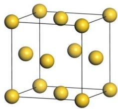

<details>
<summary>natural_image</summary>

3D cube structure with yellow spheres at vertices and face centers (no labels or text)
</details>

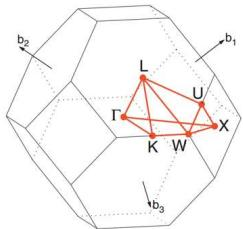

<details>
<summary>text_image</summary>

b₂
L
U
Γ
X
K
W
d₃
b₁
</details>

$\Gamma - X - U \mid K - \Gamma - L - W - X$

Table 3  
Symmetry k-points of FCC lattice.

<table><tr><td> $\times {\mathbf{b}}_{1}$ </td><td> $\times {\mathbf{b}}_{2}$ </td><td> $\times {\mathbf{b}}_{3}$ </td><td></td><td> $\times {\mathbf{b}}_{1}$ </td><td> $\times {\mathbf{b}}_{2}$ </td><td> $\times {\mathbf{b}}_{3}$ </td><td></td></tr><tr><td>0</td><td>0</td><td>0</td><td> $\Gamma$ </td><td>5/8</td><td>1/4</td><td>5/8</td><td>U</td></tr><tr><td>3/8</td><td>3/8</td><td>3/4</td><td>K</td><td>1/2</td><td>1/4</td><td>3/4</td><td>W</td></tr><tr><td>1/2</td><td>1/2</td><td>1/2</td><td>L</td><td>1/2</td><td>0</td><td>1/2</td><td>X</td></tr></table>

Conventional BCC metal cell, Irreducible Brillouin Zone, and high symmetry points:

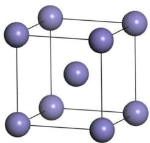

<details>
<summary>natural_image</summary>

3D cube structure with purple spheres at vertices and center (no text or labels)
</details>

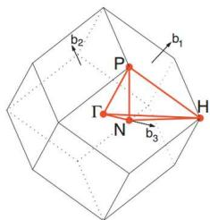

<details>
<summary>text_image</summary>

b₂
P
Γ
N
b₃
H
b₁
</details>

$\Gamma -H - N - \Gamma -P - H\mid P - N$

Table 4  
Symmetry k-points of BCC lattice.

<table><tr><td> $\times {\mathbf{b}}_{1}$ </td><td> $\times {\mathbf{b}}_{2}$ </td><td> $\times {\mathbf{b}}_{3}$ </td><td></td><td> $\times {\mathbf{b}}_{1}$ </td><td> $\times {\mathbf{b}}_{2}$ </td><td> $\times {\mathbf{b}}_{3}$ </td><td></td></tr><tr><td>0</td><td>0</td><td>0</td><td> $\Gamma$ </td><td>1/4</td><td>1/4</td><td>1/4</td><td>P</td></tr><tr><td>1/2</td><td>-1/2</td><td>1/2</td><td>H</td><td>0</td><td>0</td><td>1/2</td><td>N</td></tr></table>

K-path is not unique. Usually, It is unnecessary to select all lines between all the high symmetry points. Representative and important line are selected and written as line-mode in KPOINTS file. For large-scale and high-throughput calculation, there should be a rule to define the path from structural information. pymatgen and seeK-path provide some solutions but only can be used for 3D system. VASPKIT provide a tool to generate K-path for 1D (task 301), 2D (task 302), and 3D (task 303) materials based on a systematic rule:

Here are Brillouin zones for 2D materials (V. Wang, Y.-Y. Liang, Y. Kawazeo, W.-T. Geng, High-Throughput Computational Screening of Two-Dimensional Semiconductors, arXiv:1806.04285.)

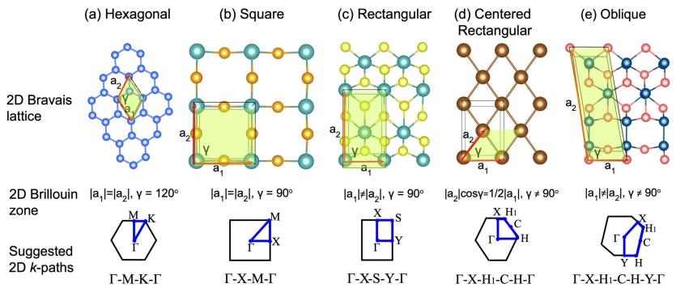

<details>
<summary>text_image</summary>

(a) Hexagonal
(b) Square
(c) Rectangular
(d) Centered Rectangular
(e) Oblique
2D Bravais lattice
2D Brillouin zone
Suggested 2D k-paths
|a₁|=|a₂|, γ = 120°
|a₁|=|a₂|, γ = 90°
|a₁≠|a₂|, γ = 90°
|a₂|cosγ=1/2|a₁|, γ ≠ 90°
|a₁≠|a₂|, γ ≠ 90°
Γ-M-K-Γ
Γ-X-M-Γ
Γ-X-S-Y-Γ
Γ-X-H1-C-H-Γ
Γ-X-H1-C-H-Y-Γ
</details>

Other ways to get K-path automatically by using pymatgen (https://pymatgen.org/ $^{✉}$ ) Computational Materials Science 49 (2010) 299–312. seek-path (https://www.materialscloud.org/work/tools/seekpath $^{✉}$ ) Computational Materials Science 128 (2017) 140–184.

For the suggested k-paths of bulk materials, VASPKIT uses the same algorithm as seek-path website (Y. Hinuma, G. Pizzi, Y. Kumagai, F. Oba, I. Tanaka, Band structure diagram paths based on crystallography, Comp. Mat. Sci. 128, 140 (2017).).

## Example: Single-layer MoS2

Band structure of single-layer MoS2 without spin polarization without spin-orbital coupling.

1. Prepare MoS2 POSCAR.

Because the K-path that generated by VASPKIT is based on standardized primitive cell, so please first standardize the POSCAR. For 2D material: Keep the center of z coordinates of 2D material at |c|/2. (i.e. fractional coordinate z = 0.5). This could be accomplished by VASPKIT 921 or 923. VASPKIT 923 standardizes 2D crystal cell, (i) put the vacuum layer at z direction, (ii) put the 2D material to the center of z coordination:

For 3D material, use VASPKIT 602 to generate a standardized primitive cell, PRIMCELL.vasp, and replace the original POSCAR.

Here the standardized POSCAR of MoS2 :

<table><tr><td colspan="4">MoS2</td></tr><tr><td colspan="4">1.0</td></tr><tr><td></td><td>3.1659998894</td><td>0.000000000</td><td>0.000000000</td></tr><tr><td></td><td>-1.5829999447</td><td>2.7418363326</td><td>0.000000000</td></tr><tr><td></td><td>0.000000000</td><td>0.000000000</td><td>18.4099998474</td></tr><tr><td>S</td><td>Mo</td><td></td><td></td></tr><tr><td>2</td><td>1</td><td></td><td></td></tr><tr><td colspan="4">Direct</td></tr><tr><td></td><td>0.00000000</td><td>0.00000000</td><td>0.413899988</td></tr><tr><td></td><td>0.00000000</td><td>0.00000000</td><td>0.586099982</td></tr><tr><td></td><td>0.666666687</td><td>0.333333343</td><td>0.500000000</td></tr></table>

<table><tr><td>92</td></tr><tr><td>+----Warm Tips ----+Please Use These Features with CAUTION!</td></tr><tr><td>+----+</td></tr><tr><td>----- 2D Materials Toolkit -----</td></tr><tr><td>921) Center Aomic-Layer along z direction</td></tr><tr><td>922) Resize Vacuum Thickness</td></tr><tr><td>923) Standardize 2D Crystal Cell</td></tr><tr><td>926) Elastic Constants for 2D Materials</td></tr><tr><td>927) Valence and Conduction Band Edges Referenced to Vacuum Level</td></tr><tr><td>929) Summary for Relaxed 2D Structure</td></tr><tr><td>0) Quit</td></tr><tr><td>9) Back</td></tr><tr><td>----- &gt;&gt;</td></tr><tr><td>923</td></tr><tr><td>--&gt; (1) Reading Structural Parameters from POSCAR File...</td></tr><tr><td>--&gt; (2) Written POSCAR_NEW File!</td></tr></table>

Do geometry optimization, and then do a single-point self-consistent calculation to get the CHGCAR.

In a new folder run VASPKIT 302, get 2D K-path files: (Note: please check the Space Group)

<table><tr><td colspan="4">302</td></tr><tr><td colspan="4">+----Warm Tips----+</td></tr><tr><td colspan="4">See An Example in vaspkit/examples/seek_kpath/graphene_2D.</td></tr><tr><td colspan="4">This feature is still experimental &amp; check the PRIMCELL.vasp file.</td></tr><tr><td colspan="4">+----+</td></tr><tr><td colspan="4">--&gt; (1) Reading Structural Parameters from POSCAR File...</td></tr><tr><td colspan="4">+----Summary----+</td></tr><tr><td colspan="4">The vacuum slab is supposed to be along c axis</td></tr><tr><td colspan="4">Prototype: AB2</td></tr><tr><td colspan="4">Total Atoms in Input Cell: 3</td></tr><tr><td colspan="4">Lattice Constants in Input Cell: 3.166 3.166 18.410</td></tr><tr><td colspan="4">Lattice Angles in Input Cell: 90.000 90.000 120.000</td></tr><tr><td colspan="4">Total Atoms in Primitive Cell: 3</td></tr><tr><td colspan="4">Lattice Constants in Primitive Cell: 3.166 3.166 18.410</td></tr><tr><td colspan="4">Lattice Angles in Primitive Cell: 90.000 90.000 120.000</td></tr><tr><td colspan="4">2D Bravais Lattice: Hexagonal</td></tr><tr><td colspan="4">Space Group: 187</td></tr><tr><td colspan="4">Point Group: 26 [ D3h ]</td></tr><tr><td colspan="4">International: P-6m2</td></tr><tr><td colspan="4">Symmetry Operations: 12</td></tr><tr><td colspan="4">Suggested K-Path: (shown in the next line)</td></tr><tr><td colspan="4">[ GAMMA-M-K-GAMMA ]</td></tr><tr><td colspan="4">+----+</td></tr><tr><td colspan="4">--&gt; (2) Written PRIMCELL.vasp file.</td></tr><tr><td colspan="4">--&gt; (3) Written KPATH.in File for Band-Structure Calculation.</td></tr><tr><td colspan="4">--&gt; (4) Written HIGH_SYMMETRY_POINTS File for Reference.</td></tr></table>

KPATH.in file include line-mode K-path. Copy it to KPOINTS is OK. cp KPATH.in KPOINTS . The default intersections is 20.

<table><tr><td colspan="4">K-Path Generated by VASPKIT</td></tr><tr><td colspan="4">20</td></tr><tr><td colspan="4">Line-Mode</td></tr><tr><td colspan="4">Reciprocal</td></tr><tr><td>0.0000000000</td><td>0.0000000000</td><td>0.0000000000</td><td>GAMMA</td></tr><tr><td>0.5000000000</td><td>0.0000000000</td><td>0.0000000000</td><td>M</td></tr><tr><td>0.5000000000</td><td>0.0000000000</td><td>0.0000000000</td><td>M</td></tr><tr><td>0.3333333333</td><td>0.3333333333</td><td>0.0000000000</td><td>K</td></tr><tr><td>0.3333333333</td><td>0.3333333333</td><td>0.0000000000</td><td>K</td></tr><tr><td>0.0000000000</td><td>0.0000000000</td><td>0.0000000000</td><td>GAMMA</td></tr></table>

HIGH\_SYMMETRY\_POINTS include the information of all high symmetry points. VASPKIT do NOT promise the K-path is right, please compare the results from seeK-path website (https://www.materialscloud.org/work/tools/seekpath)

High-symmetry points (in fractional coordinates). You can check them with the seekpath database [https://www.materialscloud.org/work/tools/seekpath].

<table><tr><td>0.0000000000</td><td>0.0000000000</td><td>0.0000000000</td><td>GAMMA</td></tr><tr><td>0.3333333333</td><td>0.3333333333</td><td>0.0000000000</td><td>K</td></tr><tr><td>0.5000000000</td><td>0.0000000000</td><td>0.0000000000</td><td>M</td></tr></table>

If you use this module, please cite the following work:

[1] V. Wang, N. Xu, J.-C. Liu, G. Tang, W.-T. Geng, VASPKIT: A User-friendly Interface Facilitating High-throughput Computing and Analysis Using VASP Code, Computer Physics Communications 267, 108033 (2021).

[2] V. Wang, Y.-Y. Liang, Y. Kawazeo, W.-T. Geng, High-Throughput Computational Screening of Two-Dimensional Semiconductors, arXiv:1806.04285.

Read the CHGCAR from single-point calculation and submit VASP band structure job.

INCAR example

\###### initial I/O #####

SYSTEM = MoS2

ICHARG = 11

LWAVE = .TRUE.

LCHARG = .TRUE.

LVTOT = .FALSE.

LVHAR = .FALSE.

LELF = .FALSE.

LORBIT = 11

NEDOS = 1000

\###### SCF ######

ENCUT = 500

ISMEAR = 0

SIGMA = 0.05

EDIFF = 1E-6

NELMIN = 5

NELM = 300

GGA = PE

LREAL = .FALSE.

PREC = Accurate

## Post-process Band Structure (pure functional)

After calculation, do band structure post-process by VASPKIT option 21

Use 211 get the basic band structure. If there are python environment with matplotlib module, VASPKIT can output a band.png figure automatically. By default, the Fermi energy will be shifted to the 0 eV.

211

```txt
--> (01) Reading Input Parameters From INCAR File...
--> (02) Reading Fermi-Energy from DOSCAR File...
ooooooo The Fermi Energy will be set to zero eV ooooooooooo
--> (03) Reading Energy-Levels From EIGENVAL File...
--> (04) Reading Structural Parameters from POSCAR File...
--> (05) Reading K-Paths From KPOINTS File...
--> (06) Written BAND.dat File!
--> (07) Written BAND_REFORMATTED.dat File!
--> (08) Written KLINEs.dat File!
--> (09) Written KLABELS File!
--> (10) Written BAND_GAP File!
If you want use the default setting, type 0, if modity type 1
0
/public1/home/pg2059/.local/lib/python2.7/site-packages/matplotlib/font_manager.py:1328: UserWarning: findfont: font family [u'arial'] not found. Falling back to DejaVu Sans
(prop.get_family(), self.defaultFamily[fontext]))
--> (11) Graph has been generated!
```

Output BAND.dat, BAND\_REFORMATTED.dat, K LINES.dat, K LABELS, BAND\_GAP files,

BAND.dat, BAND\_REFORMATTED.dat files save the band information, which can be open by ORIGIN directly.

BAND\_REFORMATTED.dat : First column is the length of K-path in unit of Å-1, and following columns are the energies of energy of each bands.

```txt
#K-Path Energy-Level
0.000 -14.278 -13.063 -5.798 -2.813 -2.813 -1.962 -1.693 ...
0.060 -14.268 -13.058 -5.787 -2.836 -2.802 -2.055 -1.710 ...
0.120 -14.239 -13.044 -5.752 -2.906 -2.769 -2.226 -1.761 ...
0.180 -14.190 -13.021 -5.695 -3.015 -2.716 -2.416 -1.840 ...
0.240 -14.123 -12.989 -5.619 -3.157 -2.642 -2.614 -1.943 ...
0.300 -14.039 -12.948 -5.528 -3.321 -2.817 -2.551 -2.064 ...
0.360 -13.938 -12.900 -5.428 -3.496 -3.023 -2.443 -2.195 ...
0.420 -13.823 -12.846 -5.329 -3.671 -3.232 -2.333 -2.322 ...
0.480 -13.696 -12.786 -5.244 -3.830 -3.441 -2.471 -2.190 ...
...
```

KLABELS file saves the positions of high symmetry points on band structure figures:

K-Label K-Coordinate in band-structure plots

GAMMA 0.000

M 1.140

K 1.798

GAMMA 3.114

\* Give the label for each high symmetry point in KPOINTS (KPATH.in) file. Otherwise, they will be identified as 'Undefined or XX' in KLABELS file

Note

Make sure you have given the label for each high symmetry points in KPOINTS file of VASP. Otherwise vaspkit will identify them as 'Undefined or XX' in KLABELS. (You can manually edit the KLABELS file also to include labels.)

The BAND\_GAP file save the information of band gap, VBM, CBM, and its locations at reciprocal lattice,

```txt
Summary
Band Character: Direct
Band Gap (eV): 1.6743
Eigenvalue of VBM (eV): -0.2257
Eigenvalue of CBM (eV): 1.4485
HOMO & LUMO Bands: 9 10
Location of VBM: 0.333333 0.333333 0.000000
Location of CBM: 0.333333 0.333333 0.000000
```

NOTE: The VBM and CBM are subtracted by the Fermi Energy.

If users have python environment with matplotlib module, VASPKIT can output a band.png figure automatically:

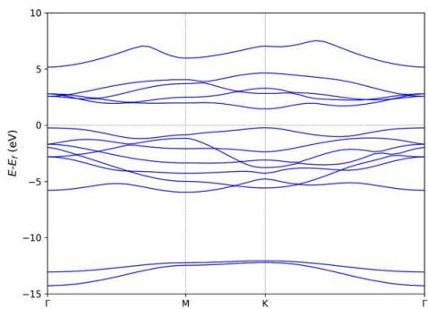

<details>
<summary>line chart</summary>

| k-point | Band 1 (eV) | Band 2 (eV) | Band 3 (eV) | Band 4 (eV) | Band 5 (eV) | Band 6 (eV) | Band 7 (eV) | Band 8 (eV) | Band 9 (eV) | Band 10 (eV) |
|---------|-------------|-------------|-------------|-------------|-------------|-------------|-------------|-------------|-------------|--------------|
| Γ       | ~0          | ~-5         | ~-10        | ~-15        | ~-5         | ~0          | ~5          | ~0          | ~5          | ~0           |
| M       | ~0          | ~-5         | ~-10        | ~-15        | ~-5         | ~0          | ~5          | ~0          | ~5          | ~0           |
| K       | ~0          | ~-5         | ~-10        | ~-15        | ~-5         | ~0          | ~5          | ~0          | ~5          | ~0           |
| Γ       | ~0          | ~-5         | ~-10        | ~-15        | ~-5         | ~0          | ~5          | ~0          | ~5          | ~0           |
</details>

## 212, 213, 214 get projected band structures:

Ensure the LORBIT = 10 or LORBIT = 11 parameter in INCAR to output projection information.

## 212) Projected Band-Structure for Selected Atoms. select projected atoms:

Input number of selected atoms: 1-4 7 8 24 or elements: C Fe H

For example if you want to draw projected band structure on atom 1 and 2, input 1-2:

```txt
212
---> (01) Reading Input Parameters From INCAR File...
---> (02) Reading Fermi-Energy from DOSCAR File...
oooooooo The Fermi Energy will be set to zero eV oooooooooooooo
---> (03) Reading Structural Parameters from POSCAR File...
---> (04) Reading Energy-Levels From EIGENVAL File...
---> (05) Reading Band-Weights From PROCAR File...
---> (06) Reading K-Paths From KPOINTS File...
|----|
Input the element-symbol and/or atom-index to SUM [Total-atom: 3]
(Free Format is OK, e.g., C Fe H 1-4 7 8 24)
---->
1-2
---> (07) Written SELECTED_ATOM_LIST File!
---> (08) Written PBAND_A1.dat File!
---> (09) Written PBAND_A2.dat File!
---> (10) Written K LINES.dat File!
---> (11) Written K LABELS File!
```

VASPKIT will output two files: PBAND\_A1.dat and PBAND\_A2.dat.

Each file include the projection information on select atoms, and there weight on each angular momentum,

s py pz px dxy dyz dz2 dxz x2-y2 tot. The first column is the length of K-path in unit of Å-1. Second column is the energy of band.

Following column are the projection of Im-orbitals on this band. Last column is the total projection of selected atom on this band.

<table><tr><td>#K-Path</td><td>Energy</td><td>s</td><td>py</td><td>pz</td><td>px</td><td>dxy</td><td>dyz</td><td>dz2</td><td>dxz</td><td>x2-y2</td><td>tot</td></tr><tr><td>#Band-index</td><td>1</td><td></td><td></td><td></td><td></td><td></td><td></td><td></td><td></td><td></td><td></td></tr><tr><td>0.000</td><td>-14.278</td><td>0.275</td><td>0.000</td><td>0.005</td><td>0.000</td><td>0.000</td><td>0.000</td><td>0.000</td><td>0.000</td><td>0.000</td><td>0.281</td></tr><tr><td>0.060</td><td>-14.268</td><td>0.276</td><td>0.000</td><td>0.005</td><td>0.000</td><td>0.000</td><td>0.000</td><td>0.000</td><td>0.000</td><td>0.000</td><td>0.281</td></tr><tr><td>0.120</td><td>-14.239</td><td>0.276</td><td>0.000</td><td>0.005</td><td>0.000</td><td>0.000</td><td>0.000</td><td>0.000</td><td>0.000</td><td>0.000</td><td>0.281</td></tr><tr><td>0.180</td><td>-14.190</td><td>0.277</td><td>0.000</td><td>0.005</td><td>0.000</td><td>0.000</td><td>0.000</td><td>0.000</td><td>0.000</td><td>0.000</td><td>0.282</td></tr><tr><td>0.240</td><td>-14.123</td><td>0.278</td><td>0.000</td><td>0.005</td><td>0.000</td><td>0.000</td><td>0.000</td><td>0.000</td><td>0.000</td><td>0.000</td><td>0.284</td></tr><tr><td>0.300</td><td>-14.039</td><td>0.280</td><td>0.000</td><td>0.005</td><td>0.001</td><td>0.000</td><td>0.000</td><td>0.000</td><td>0.000</td><td>0.000</td><td>0.285</td></tr><tr><td>0.360</td><td>-13.938</td><td>0.281</td><td>0.000</td><td>0.005</td><td>0.001</td><td>0.000</td><td>0.000</td><td>0.000</td><td>0.000</td><td>0.000</td><td>0.288</td></tr><tr><td>0.420</td><td>-13.823</td><td>0.283</td><td>0.000</td><td>0.005</td><td>0.001</td><td>0.000</td><td>0.000</td><td>0.000</td><td>0.000</td><td>0.000</td><td>0.290</td></tr><tr><td>...</td><td></td><td></td><td></td><td></td><td></td><td></td><td></td><td></td><td></td><td></td><td></td></tr><tr><td>#Band-index</td><td>2</td><td></td><td></td><td></td><td></td><td></td><td></td><td></td><td></td><td></td><td></td></tr><tr><td>3.114</td><td>-13.063</td><td>0.315</td><td>0.000</td><td>0.000</td><td>0.000</td><td>0.000</td><td>0.000</td><td>0.000</td><td>0.000</td><td>0.000</td><td>0.316</td></tr><tr><td>3.045</td><td>-13.056</td><td>0.315</td><td>0.000</td><td>0.000</td><td>0.000</td><td>0.000</td><td>0.000</td><td>0.000</td><td>0.000</td><td>0.000</td><td>0.316</td></tr><tr><td>...</td><td></td><td></td><td></td><td></td><td></td><td></td><td></td><td></td><td></td><td></td><td></td></tr><tr><td>#Band-index</td><td>3</td><td></td><td></td><td></td><td></td><td></td><td></td><td></td><td></td><td></td><td></td></tr><tr><td>0.000</td><td>-5.798</td><td>0.018</td><td>0.000</td><td>0.125</td><td>0.000</td><td>0.000</td><td>0.000</td><td>0.000</td><td>0.000</td><td>0.000</td><td>0.143</td></tr><tr><td>0.060</td><td>-5.787</td><td>0.018</td><td>0.000</td><td>0.125</td><td>0.000</td><td>0.000</td><td>0.000</td><td>0.000</td><td>0.000</td><td>0.000</td><td>0.143</td></tr><tr><td>...</td><td></td><td></td><td></td><td></td><td></td><td></td><td></td><td></td><td></td><td></td><td></td></tr></table>

## 213) Projected Band-Structure for Each Element, projection on each elements:

## 213

-->> (1) Reading Input Parameters From INCAR File...  
--> (2) Reading Fermi-Level From DOSCAR File...  
oooooooo The Fermi Energy will be set to zero eV oooooooooooooo  
--> (3) Reading Structural Parameters from POSCAR File...  
--> (4) Reading Energy-Levels From EIGENVAL File...  
--> (5) Reading Band-Weights From PROCAR File...  
--> (6) Reading K-Paths From KPOINTS File...  
-->> (7) Written PBAND\_S.dat File!  
-->>> (8) Written PBAND\_Mo.dat File!  
-->>> (9) Written K LINES.dat File!  
--> (\*) Written KLABELS File!

<table><tr><td></td><td>A(X)</td><td>B(Y)</td><td>C(Y)</td><td>D(Y)</td><td>E(Y)</td><td>F(Y)</td><td>G(Y)</td><td>H(Y)</td><td>I(Y)</td><td>J(Y)</td><td>K(Y)</td><td>L(Y)</td></tr><tr><td>Long Name</td><td>#K-Path</td><td>Energy</td><td>s</td><td>py</td><td>pz</td><td>px</td><td>dxy</td><td>dyz</td><td>dz2</td><td>dxz</td><td>x2-y2</td><td>tot</td></tr><tr><td>Units</td><td>#Band-index</td><td>1</td><td></td><td></td><td></td><td></td><td></td><td></td><td></td><td></td><td></td><td></td></tr><tr><td>Comments</td><td></td><td></td><td></td><td></td><td></td><td></td><td></td><td></td><td></td><td></td><td></td><td></td></tr><tr><td>F(x)=</td><td></td><td></td><td></td><td></td><td></td><td></td><td></td><td></td><td></td><td></td><td></td><td></td></tr><tr><td>Sparklines</td><td></td><td></td><td></td><td></td><td></td><td></td><td></td><td></td><td></td><td></td><td></td><td></td></tr><tr><td>1</td><td>0</td><td>-14.278</td><td>0.132</td><td>0</td><td>0</td><td>0</td><td>0</td><td>0</td><td>0</td><td>0</td><td>0</td><td>0.132</td></tr><tr><td>2</td><td>0.06</td><td>-14.268</td><td>0.131</td><td>0</td><td>0</td><td>0</td><td>0</td><td>0</td><td>0</td><td>0</td><td>0</td><td>0.132</td></tr><tr><td>3</td><td>0.12</td><td>-14.239</td><td>0.13</td><td>0</td><td>0</td><td>0.001</td><td>0</td><td>0</td><td>0</td><td>0</td><td>0</td><td>0.132</td></tr><tr><td>4</td><td>0.18</td><td>-14.19</td><td>0.127</td><td>0.001</td><td>0</td><td>0.002</td><td>0.001</td><td>0</td><td>0</td><td>0</td><td>0</td><td>0.131</td></tr><tr><td>5</td><td>0.24</td><td>-14.123</td><td>0.123</td><td>0.001</td><td>0</td><td>0.003</td><td>0.001</td><td>0</td><td>0</td><td>0</td><td>0</td><td>0.13</td></tr><tr><td>6</td><td>0.3</td><td>-14.039</td><td>0.119</td><td>0.002</td><td>0</td><td>0.005</td><td>0.002</td><td>0</td><td>0</td><td>0</td><td>0.001</td><td>0.129</td></tr><tr><td>7</td><td>0.36</td><td>-13.938</td><td>0.113</td><td>0.003</td><td>0</td><td>0.008</td><td>0.003</td><td>0</td><td>0.001</td><td>0</td><td>0.001</td><td>0.128</td></tr><tr><td>8</td><td>0.42</td><td>-13.823</td><td>0.107</td><td>0.003</td><td>0</td><td>0.01</td><td>0.005</td><td>0</td><td>0.001</td><td>0</td><td>0.002</td><td>0.127</td></tr><tr><td>9</td><td>0.48</td><td>-13.696</td><td>0.099</td><td>0.004</td><td>0</td><td>0.013</td><td>0.007</td><td>0</td><td>0.001</td><td>0</td><td>0.002</td><td>0.126</td></tr><tr><td>10</td><td>0.54</td><td>-13.558</td><td>0.091</td><td>0.005</td><td>0</td><td>0.015</td><td>0.009</td><td>0</td><td>0.001</td><td>0</td><td>0.003</td><td>0.124</td></tr><tr><td>11</td><td>0.6</td><td>-13.413</td><td>0.083</td><td>0.006</td><td>0</td><td>0.018</td><td>0.011</td><td>0</td><td>0.001</td><td>0</td><td>0.004</td><td>0.123</td></tr><tr><td>12</td><td>0.66</td><td>-13.264</td><td>0.074</td><td>0.007</td><td>0</td><td>0.021</td><td>0.014</td><td>0</td><td>0.001</td><td>0</td><td>0.005</td><td>0.122</td></tr><tr><td>13</td><td>0.72</td><td>-13.115</td><td>0.065</td><td>0.008</td><td>0</td><td>0.024</td><td>0.017</td><td>0</td><td>0.001</td><td>0</td><td>0.006</td><td>0.121</td></tr><tr><td>14</td><td>0.78</td><td>-12.97</td><td>0.055</td><td>0.009</td><td>0</td><td>0.027</td><td>0.021</td><td>0</td><td>0.001</td><td>0</td><td>0.007</td><td>0.12</td></tr><tr><td>15</td><td>0.84</td><td>-12.634</td><td>0.046</td><td>0.01</td><td>0</td><td>0.03</td><td>0.025</td><td>0</td><td>0.001</td><td>0</td><td>0.008</td><td>0.12</td></tr><tr><td>16</td><td>0.9</td><td>-12.712</td><td>0.038</td><td>0.011</td><td>0</td><td>0.032</td><td>0.028</td><td>0</td><td>0.001</td><td>0</td><td>0.009</td><td>0.119</td></tr><tr><td>17</td><td>0.96</td><td>-12.61</td><td>0.031</td><td>0.011</td><td>0</td><td>0.034</td><td>0.032</td><td>0</td><td>0</td><td>0</td><td>0.011</td><td>0.119</td></tr><tr><td>18</td><td>1.02</td><td>-12.533</td><td>0.025</td><td>0.012</td><td>0</td><td>0.036</td><td>0.035</td><td>0</td><td>0</td><td>0</td><td>0.012</td><td>0.119</td></tr><tr><td>19</td><td>1.08</td><td>-12.485</td><td>0.021</td><td>0.012</td><td>0</td><td>0.036</td><td>0.036</td><td>0</td><td>0</td><td>0</td><td>0.012</td><td>0.119</td></tr><tr><td>20</td><td>1.14</td><td>-12.468</td><td>0.02</td><td>0.012</td><td>0</td><td>0.037</td><td>0.037</td><td>0</td><td>0</td><td>0</td><td>0.012</td><td>0.119</td></tr><tr><td>21</td><td>1.14</td><td>-12.468</td><td>0.02</td><td>0.012</td><td>0</td><td>0.037</td><td>0.037</td><td>0</td><td>0</td><td>0</td><td>0.012</td><td>0.119</td></tr><tr><td>22</td><td>1.175</td><td>-12.467</td><td>0.02</td><td>0.012</td><td>0</td><td>0.037</td><td>0.037</td><td>0</td><td>0</td><td>0</td><td>0.012</td><td>0.119</td></tr><tr><td>23</td><td>1.209</td><td>-12.462</td><td>0.02</td><td>0.013</td><td>0</td><td>0.037</td><td>0.037</td><td>0</td><td>0</td><td>0</td><td>0.013</td><td>0.119</td></tr><tr><td>24</td><td>1.244</td><td>-12.455</td><td>0.019</td><td>0.013</td><td>0</td><td>0.037</td><td>0.037</td><td>0</td><td>0</td><td>0</td><td>0.013</td><td>0.119</td></tr><tr><td>25</td><td>1.279</td><td>-12.446</td><td>0.018</td><td>0.013</td><td>0</td><td>0.037</td><td>0.037</td><td>0</td><td>0</td><td>0</td><td>0.013</td><td>0.118</td></tr><tr><td>26</td><td>1.313</td><td>-12.433</td><td>0.017</td><td>0.014</td><td>0</td><td>0.037</td><td>0.036</td><td>0</td><td>0</td><td>0</td><td>0.014</td><td>0.118</td></tr><tr><td>27</td><td>1.348</td><td>-12.419</td><td>0.016</td><td>0.015</td><td>0</td><td>0.036</td><td>0.036</td><td>0</td><td>0</td><td>0</td><td>0.014</td><td>0.118</td></tr></table>

Select the first and second line, draw the original band structure first:

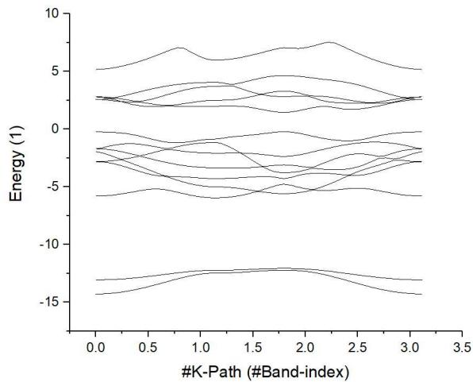

<details>
<summary>line chart</summary>

| #K-Path (#Band-index) | Energy (1) |
| --------------------- | ---------- |
| 0.0                   | -14.0      |
| 0.5                   | -12.0      |
| 1.0                   | -10.0      |
| 1.5                   | -8.0       |
| 2.0                   | -6.0       |
| 2.5                   | -4.0       |
| 3.0                   | -2.0       |
| 3.5                   | 0.0        |
</details>

Then find the position of high symmetry points from KLABELS :

<table><tr><td>GAMMA</td><td>0.000</td></tr><tr><td>M</td><td>1.139</td></tr><tr><td>K</td><td>1.797</td></tr><tr><td>GAMMA</td><td>3.113</td></tr></table>

Label those points:

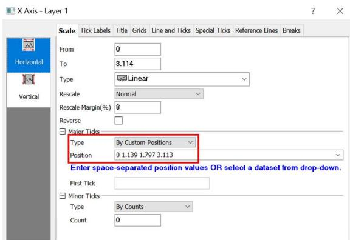

<details>
<summary>text_image</summary>

X Axis - Layer 1
Scale
Tick Labels
Title
Grids
Line and Ticks
Special Ticks
Reference Lines
Breaks
From
0
To
3.114
Type
Linear
Rescale
Normal
Rescale Margin(%)
8
Reverse
Major Ticks
Type
By Custom Positions
Position
0 1.139 1.797 3.113
Enter space-separated position values OR select a dataset from drop-down.
First Tick
Minor Ticks
Type
By Counts
Count
0
</details>

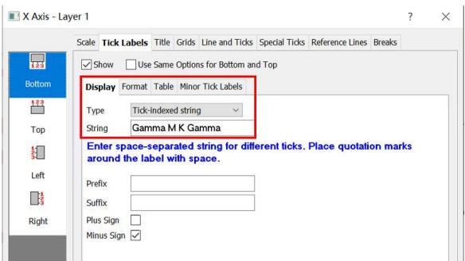

<details>
<summary>text_image</summary>

X Axis - Layer 1
Scale
Tick Labels
Title Grids Line and Ticks Special Ticks Reference Lines Breaks
Bottom
Show Use Same Options for Bottom and Top
Display Format Table Minor Tick Labels
Type Tick-indexed string
String Gamma M K Gamma
Enter space-separated string for different ticks. Place quotation marks around the label with space.
Prefix:
Suffix:
Plus Sign
Minus Sign
</details>

Then, adjust the energy range. The original band structure without projection information shows as follow.

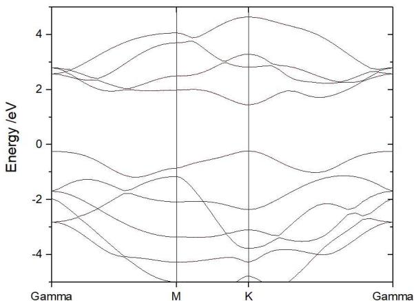

<details>
<summary>line chart</summary>

| Point | Energy (eV) |
|-------|-------------|
| M     | ~2.5        |
| K     | ~4.0        |
</details>

From ORIGIN plot setup tag, add the atoms, elements, or orbitals projections on band.

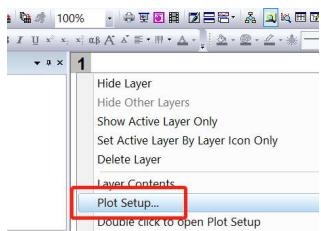

<details>
<summary>text_image</summary>

Hide Layer
Hide Other Layers
Show Active Layer Only
Set Active Layer By Layer Icon Only
Delete Layer
Layer Contents...
Plot Setup...
Double click to open Plot Setup
</details>

Select Bubble tag, and add the projection. click OK.

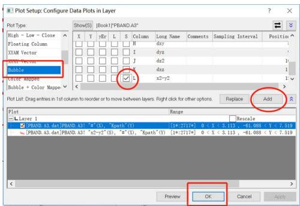

<details>
<summary>text_image</summary>

Plot Setup: Configure Data Plots in Layer
Plot Type:
High - Low - Close
Floating Column
XYAM Vector
Bubble
Bubble Mapper
Bubble + Color Mapping
Show(S) [Book]("PBAND.A3")
X Y yEr L S Column Long Name Comments Sampling Interval Position
□ □ □ □ □ M dxy
□ □ □ □ □ I dyz
□ □ □ □ □ J dx2
□ □ □ □ □ x2-y2
□ □ □ □ □
plot List: Drag entries in 1st column to recorder or to move between layers Right click for other options. Replace Add
Range
Rescale
■ PBAND.A3.dat:PBAND.A3" "x" (X), "Kpath" (Y)
[1#:271*] 0 < X < 3.113, -61.088 < Y < 7.519
■ PBAND.A3.dat:PBAND.A3" "x2-y2" (S), "m" (X), "Kpath" (Y)
[1#:271*] 0 < X < 3.113, -61.088 < Y < 7.519
Preview OK Cancel Apply
</details>

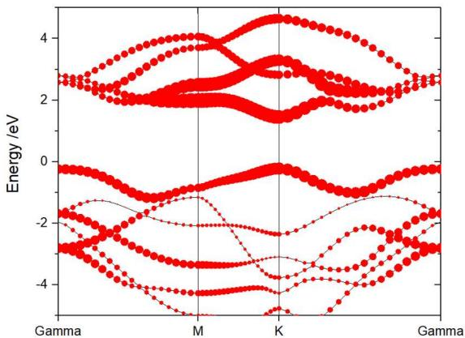

<details>
<summary>line chart</summary>

| k-point | Energy (eV) |
| ------- | ----------- |
| K       | ~2.5        |
| M       | ~-1.5       |
| M       | ~-3.0       |
| M       | ~-4.0       |
| M       | ~-2.0       |
| M       | ~-1.0       |
| M       | ~0.0        |
| M       | ~1.0        |
| M       | ~2.0        |
| M       | ~3.0        |
| M       | ~4.0        |
| K       | ~-2.0       |
| K       | ~-3.0       |
| K       | ~-4.0       |
| K       | ~-2.0       |
| K       | ~-1.0       |
| K       | ~0.0        |
| K       | ~1.0        |
| K       | ~2.0        |
| K       | ~3.0        |
| K       | ~4.0        |
| Gamma   | ~-2.5       |
| Gamma   | ~-3.5       |
| Gamma   | ~-4.5       |
| Gamma   | ~-2.5       |
| Gamma   | ~-1.5       |
| Gamma   | ~0.0        |
| Gamma   | ~1.0        |
| Gamma   | ~2.0        |
| Gamma   | ~3.0        |
| Gamma   | ~4.0        |
| Gamma   | ~5.0        |
</details>

## 214) The Sum of Projected Band-Structure for Selected Atoms:

214

--> (01) Reading Input Parameters From INCAR File...  
--> (02) Reading Fermi-Energy from DOSCAR File...  
oooooooo The Fermi Energy will be set to zero eV oooooooooooooo  
--> (03) Reading Structural Parameters from POSCAR File...  
--> (04) Reading Energy-Levels From EIGENVAL File...  
--> (05) Reading Band-Weights From PROCAR File...  
--> (06) Reading K-Paths From KPOINTS File...  
|----|  
Input the element-symbol and/or atom-index to SUM [Total-atom: 3]  
(Free Format is OK, e.g., C Fe H 1-4 7 8 24)

---->>

1-2

--> (07) Written SELECTED ATOM LIST File!  
-->>> (08) Written PBAND\_SUM.dat File!  
-->> (09) Written K LINES.dat File!  
--> (10) Written KLABELS File!

The output PBAND\_SUM.dat file includes the sum projection of selected atoms or elements. This is useful to investigate the layered band and compare surface band and inner band.

## Single-shot Band Structure

The VASP.6.3.0 or latter version can calculate band structure through a single-shot. Note the PROCAR\_OPT file does not output unless we compiled VASP after adding -DVASP\_HDF5 to the CPP\_OPTIONS in the makefile.include. Alternatively, the PROCAR\_OPT and EIGENVAL\_OPT (new added) can automatically be generated after we modified the vasp.6.3.0/src/linear\_response.F and recomplied VASP again. Specifically, first delete the lines from 1804-1827 in vasp.6.3.0/src/linear\_response.F file,

```fortran
c
#ifdef VASP_HDFS
    CALL VH5_WRITE_DOS(IH5OUTFILEID, WDES_INTER, KPOINTS_INTER, DOS, DOSI, DOSPAR, EFERMI, &
    T_INFO%NIONP, -1,SUBGROUP="electron_dos_kpoints_opt")
    CALL VH5_WRITE_EIGENVAL(IH5OUTFILEID, WDES_INTER, W_INTER, KPOINTS_INTER, &
    SUBGROUP="electron_eigenvalues_kpoints_opt")

! Write projections
IF (JOBPAR/=0 .OR. IO%LORBIT>=10) THEN
    IF (IO%LORBIT==11.OR.IO%LORBIT==12) THEN
    CALL VH5_WRITE_PROJECTORS(IH5OUTFILEID, T_INFO, WDES_INTER, W_INTER, IO%LORBIT, LPAR, PAR_INTER, LMCHAR, PHAS_INTER, &
    SUBGROUP="projectors_kpoints_opt")
    ELSE
    CALL VH5_WRITE_PROJECTORS(IH5OUTFILEID, T_INFO, WDES_INTER, W_INTER, IO%LORBIT, LPAR, PAR_INTER, LCHAR, PHAS_INTER, &
    SUBGROUP="projectors_kpoints_opt")
    ENDIF
IF (IO%IU6>=0) THEN
    CALL XML_PROCAR(PAR, W_INTER%CELTOT, W_INTER%FERTOT, WDES_INTER%NB_TOT, WDES_INTER%NKPTS, LPAR,&
    T_INFO%NIONP, WDES_INTER%NCDIJ, TAG="projected_kpoints_opt")
    OPEN(UNIT=99,FILE='PROCAR_OPT',STATUS='UNKNOWN')
    CALL WRITE_PROCAR(99,W_INTER,WDES_INTER,IO%LORBIT,LPAR,LMDIMP,PAR_INTER,PHAS_INTER,T_INFO,KPOINTS%EMIN,KPOINTS%EMAX)
    CLOSE(99)
    ENDIF
ENDIF
#endif
```

and then add the following code

```fortran
! Added support to VASPKIT
OPEN(UNIT=99,FILE='EIGENVAL_OPT',STATUS='UNKNOWN')
WRITE(99,'(4I5)') T_INFO%NIONS,T_INFO%NIONS,0.0,WDES_INTER%ISPIN
WRITE(99,'(5E15.7)') 0.d0,0.d0,0.d0,0.d0,0.d0
WRITE(99,'(1E15.7)') 0.d0
WRITE(99,*) ' CAR '
WRITE(99,*) INFO%SZNAM1
WRITE(99,'(3I7)') NINT(INFO%NELECT),WDES_INTER%NKPTS,WDES_INTER%NB_TOT
DO IK=1,WDES_INTER%NKPTS
WRITE(99,*)
WRITE(99,'((4E15.7)') WDES_INTER%VKPT(1,IK),WDES_INTER%VKPT(2,IK),WDES_INTER%VKPT(3,IK),WDES_INTER%WTKPT(IK)
DO I=1,WDES_INTER%NB_TOT
IF (WDES_INTER%ISPIN==1) WRITE(99,852) I,REAL( W_INTER%CELTOT(I,IK,1),KIND=q),W%FERTOT(I,IK,1)
IF (WDES_INTER%ISPIN==2) WRITE(99,853) I,(REAL( W_INTER%CELTOT(I,IK,ISP),KIND=q),ISP=1,WDES_INTER%ISPIN),(W%FERTOT(I,IK,ISP),ISP=1,WDES_INTER%ISPIN)
ENDDO
ENDDO
CLOSE(99)
852 FORMAT(1X,I6,4X,F14.6,2X,F9.6)
853 FORMAT(1X,I6,4X,F14.6,2X,F14.6,2X,F9.6,2X,F9.6)
IF (JOBPAR/=0 .OR. IO%LORBIT>=10) THEN
IF (IO%IU6>=0) THEN
CALL XML_PROCAR(PAR, W_INTER%CELTOT, W_INTER%FERTOT, WDES_INTER%NB_TOT, WDES_INTER%NKPTS, LPAR,&T_INFO%NIONP, WDES_INTER%NCDIJ, TAG="projected_kpoints_opt")
OPEN(UNIT=99,FILE='PROCAR_OPT',STATUS='UNKNOWN')
CALL WRITE_PROCAR(99,W_INTER,WDES_INTER,IO%LORBIT,LPAR,LMDIMP,PAR_INTER,PHAS_INTER,T_INFO,KPOINTS%EMIN,KPOINTS%EMAX)
CLOSE(99)
ENDIF
ENDIF
#ifdef VASP_HDF5
CALL VH5_WRITE_DOS(IH5OUTFILEID, WDES_INTER, KPOINTS_INTER, DOS, DOSI, DOSPAR, EFERMI, &
T_INFO%NIONP, -1,SUBGROUP="electron_dos_kpoints_opt")
CALL VH5_WRITE_EIGENVAL(IH5OUTFILEID, WDES_INTER, W_INTER, KPOINTS_INTER, &
SUBGROUP="electron_eigenvalues_kpoints_opt")
! Write projections
IF (JOBPAR/=0 .OR. IO%LORBIT>=10) THEN
IF (IO%LORBIT==11.OR.IO%LORBIT==12) THEN
CALL VH5_WRITE_PROJECTORS(IH5OUTFILEID, T_INFO, WDES_INTER, W_INTER, IO%LORBIT, LPAR, PAR_INTER, LMCHAR, PHAS_INTER, &
SUBGROUP="projectors_kpoints_opt")
ELSE
CALL VH5_WRITE_PROJECTORS(IH5OUTFILEID, T_INFO, WDES_INTER, W_INTER, IO%LORBIT, LPAR, PAR_INTER, LCHAR, PHAS_INTER, &
SUBGROUP="projectors_kpoints_opt")
ENDIF
! IF (IO%IU6>=0) THEN
! CALL XML_PROCAR(PAR, W_INTER%CELTOT, W_INTER%FERTOT, WDES_INTER%NB_TOT, WDES_INTER%NKPTS, LPAR,&T_INFO%NIONP, WDES_INTER%NCDIJ, TAG="projected_kpoints_opt")
! OPEN(UNIT=99,FILE='PROCAR_OPT',STATUS='UNKNOWN')
! CALL WRITE_PROCAR(99,W_INTER,WDES_INTER,IO%LORBIT,LPAR,LMDIMP,PAR_INTER,PHAS_INTER,T_INFO,KPOINTS%EMIN,KPOINTS%EMAX)
! CLOSE(99)
! ENDIF
ENDIF
#endif
```

Finally recomplie VASP again. The VASPKIT.1.3.2 or latter version can read the raw data of plain and projected band structures from the EIGENVAL\_OPT and PROCAR\_OPT files, respectively.

## Pre-process Band Structure (hybrid functional)

Besides the line-mode K-path, VASPKIT can also generate K-path with uniformed spacing between K points in units of $2\pi^{*}\mathring{\mathrm{A}} -1$ , which can be used for hybrid functional band structure calculations. Such KPOINTS file contains two parts. First part is same as the self-consistent calculation with symmetry weighted K-points in Irreducilbe Brillouin Zone. And Second part is the 0-weighted K-points alone the k-path. To generate this KPOINTS file:

1. Same as pure functional calculation. Do geometry optimization. Run 302 (for 2D materials) or 303 (for 3D materials) to get:

1. standardized primitive cell (PRIMCELL.vasp)  
2. line-mode k-path for pure functional band structure calculation (KPATH.in)  
3. High-symmetry points in fractional coordinates. (HIGH\_SYMMETRY\_POINTS) You can check them with the seekpath database [https://www.materialscloud.org/work/tools/seekpath].

2. Run 251 to generate KPOINTS file for hybrid functional band-structure calculations. Input the KPT resolution values to determine density of k-mesh for SCF calculation and k-path for band structure calculation. Then VASPKIT will read KPATH.in file and generate the KPOINTS file for hybrid functional band-structure calculation.  
3. Optional. Do a PBE SCF calculations based on the new generated KPOINTS file and get the wavefunctions, which can be read for next step hybrid functional calculation. Sometimes, this step reduces the SCF time of the next step hybrid functional calculation.  
4. Do hybrid functional band structure calculation.

## Example: single layer MoS2

## 1. After optimization. Run 302

```diff
302
+---- Warm Tips ----+
    See An Example in vaspkit/examples/seek_kpath/graphene_2D.
This feature is still experimental & check the PRIMCELL.vasp file.
+----+
--> (1) Reading Structural Parameters from POSCAR File...
+---- Summary ----+
    The vacuum slab is supposed to be along c axis
    Prototype: AB2
    Total Atoms in Input Cell: 3
    Lattice Constants in Input Cell: 3.184 3.184 18.410
    Lattice Angles in Input Cell: 90.000 90.000 120.000
    Total Atoms in Primitive Cell: 3
Lattice Constants in Primitive Cell: 3.184 3.184 18.410
    Lattice Angles in Primitive Cell: 90.000 90.000 120.000
    2D Bravais Lattice: Hexagonal
    Space Group: 187
    Point Group: 26 [ D3h ]
    International: P-6m2
    Symmetry Operations: 12
    Suggested K-Path: (shown in the next line)
[ GAMMA-M-K-GAMMA ]
+----+
--> (2) Written PRIMCELL.vasp file.
--> (3) Written KPATH.in File for Band-Structure Calculation.
--> (4) Written HIGH_SYMMETRY_POINTS File for Reference.
```

Replace the old POSCAR by the new generated PRIMCELL.vasp: cp PRIMCELL.vasp POSCAR

```csv
Primitive Cell
1.000000
3.18401832481292 0.0000000000000 0.0000000000000
-1.59200916240646 2.75744075540316 0.0000000000000
0.0000000000000 0.0000000000000 18.4099998474000
S Mo
2 1
DIRECT
    0.00000000000000  0.0000000000000
    0.0000000000000  0.000000000000
    0.66666666666666  3333333333333333  5.584849478298713  S2
    Mo1
```

## KPATH.in is line-mode KPOINTS file:

```csv
K-Path Generated by VASPKIT.
20
Line-Mode
Reciprocal
0.000000000 0.000000000 0.000000000 0.000000000 0.500000000 0.000000000 0.333333333 0.333333333 0.333333333 0.333333333 0.000000000 0.000000000 0.333333333 0.333333333 0.333333333 0.333333333 0.333333333 0.677777777 0.677777777 0.677777777 0.677777777 0.677777777 0.677777777 0.677777777 0.677777777 1
```

2. Run 251 to generate KPOINTS file for hybrid functional band-structure calculations. Select (1) Monkhorst-Pack Scheme or (2) Gamma Scheme to generate k-mesh for SCF calculation.

Then input the resolution value of normal weighted K-Mesh and 0-weighted K-path, respectively. VASPKIT will write a new KPOINTS according to users' input.

```diff
251
---> (1) Reading Structural Parameters from POSCAR File...
==================== K-Mesh Scheme ====================
1) Monkhorst-Pack Scheme
2) Gamma Scheme

0) Quit
9) Back
----><>
2
+---- Warm Tips ----+
Input Resolution Value to Determine K-Mesh for SCF Calculation:
(Typical Value: 0.03-0.04 is Generally Precise Enough)
----><>
0.05
Input Resolution Value along K-Path for Band Calculation:
(Typical Value: 0.02-0.04 for DFT and 0.04-0.06 for hybrid DFT)
----><>
0.05
+----+
---> (2) Reading K-Paths From KPATH.in File...
+---- Summary ----+
K-Mesh for SCF Calculation: 7 7 1
The Number of K-Point along K-Path 1: 22
The Number of K-Point along K-Path 2: 13
The Number of K-Point along K-Path 3: 26
+----+
---> (3) Written KPOINTS File!
```

Here, the resolution value of normal weighted K-Mesh and 0-weighted K-path is set to be 0.05. Output K-mesh for SCF Calculation: 7 7 1. And the number of k-points along each line of k-path: $\Gamma \rightarrow M:22$ , $M \rightarrow K:13$ , $K \rightarrow \Gamma :26$ . The KPOINTS file:

```csv
Parameters to Generate KPOINTS (Don't Edit This Line): 0.050 0.050 8 61 3 22 13 26
69
Reciprocal lattice
0.0000000000000 0.0000000000000 0.0000000000000 1
0.14285714285714 0.0000000000000 0.0000000000000 6
0.28571428571429 0.0000000000000 0.0000000000000 6
0.42857142857143 0.0000000000000 0.0000000000000 6
0.14285714285714 0.14285714285714 0.0000000000000 6
0.28571428571429 0.14285714285714 0.0000000000000 12
0.42857142857143 0.14285714285714 0.0000000000000 6
0.28571428571429 0.28571428571429 0.0000000000000 6
0.000000000000<fcel>...
```

3. Do PBE calculation. Can be skip.

4. Do hybrid functional band structure calculation. The detail of INCAR parameters are discussed in http://blog.wangruixing.cn/2019/05/20/hse/ $^{✉}$ , INCAR:

```ini
###### initial I/O #####  
SYSTEM = Hybird Functional  
ISTART = 1  
ICHARG = 1  
LWAVE = .TRUE.  
LCHARG = .TRUE.  
LVTOT = .FALSE.  
LVHAR = .FALSE.  
LELF = .FALSE.  
LORBIT = 11  
NEDOS = 1000  

###### SCF ######
ENCUT = 500
ISMEAR = 0
SIGMA = 0.05
EDIFF = 1E-6
NELMIN = 5
NELM = 300
GGA = PE
LREAL = .FALSE.
# PREC = Accurate
# ISYM = 3

###### Geo opt ######
EDIFFG = -0.01
IBRION = 2
POTIM = 0.2
NSW = 0 # no Geo_opt
ISIF = 3 # 2 not optimize cell

###### HSE ######
LHFCALC = .TRUE.
AEXX = 0.25
HFSCREEN = 0.2
ALGO = ALL # or Damped
TIME = 0.4
```

## Post-process Band Structure (hybrid functional)

5. Extract band structure information by 252. band data is saved in BAND.dat and BAND-REFORMATTED.dat files. High-symmetry points positions on band structure figures are saved in KLABELS.

(Note: bug in 0.73 version, please use new version)

252

--> (01) Reading Input Parameters From INCAR File...

--> (02) Reading Fermi-Energy from DOSCAR File...

oooooooo The Fermi Energy will be set to zero eV oooooooooooo

--> (03) Reading Energy-Levels From EIGENVAL File...

--> (04) Reading Structural Parameters from POSCAR File...

--> (05) Reading K-Paths From KPATH.in File...

-->>> (06) Written BAND.dat File!

-->>> (07) Written BAND REFORMATTED.dat File!

--> (08) Written K LINES.dat File!

-->>> (09) Written KLABELS File!

-->>> (10) Written BAND GAP File!

If you want use the default setting, type 0, if modity type 1

0

--> (11) Graph has been generated!

if the python and matplotlib environment is set correctly. VASPKIT will draw a band figure band.png automatically. Following parameters should be set in \~/.vaspkt file.

PYTHON BIN

\~/anaconda3/bin/python3

PLOT\_MATPLOTLIB

.TURE.

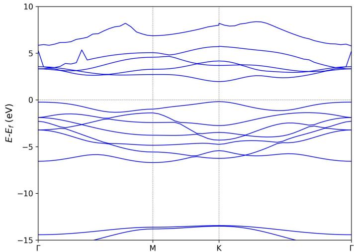

<details>
<summary>line chart</summary>

| k-point | Band 1 (eV) | Band 2 (eV) | Band 3 (eV) | Band 4 (eV) | Band 5 (eV) | Band 6 (eV) | Band 7 (eV) | Band 8 (eV) | Band 9 (eV) | Band 10 (eV) |
|---------|-------------|-------------|-------------|-------------|-------------|-------------|-------------|-------------|-------------|--------------|
| Γ       | ~5          | ~3          | ~3          | ~3          | ~3          | ~3          | ~3          | ~3          | ~3          | ~3           |
| M       | ~8          | ~5          | ~5          | ~5          | ~5          | ~5          | ~5          | ~5          | ~5          | ~5           |
| K       | ~8          | ~5          | ~5          | ~5          | ~5          | ~5          | ~5          | ~5          | ~5          | ~5           |
| Γ       | ~5          | ~3          | ~3          | ~3          | ~3          | ~3          | ~3          | ~3          | ~3          | ~3           |
</details>

You can also draw the figure from BAND.dat or BAND\_REFORMATTED.dat by ORIGIN, which is described in Section 3.2.

By comparing with the line-mode of KPOINTS (option 302 and 303). The biggest advantages of 25 is that the k spacing along K-path is averaged, so that saves computational cost.

Versions prior to 0.72 took the same number of K-points for energy line, resulting in uneven K-distribution on different paths, as shown in the left figure below. The latest version of VASPKIT supports automatic determination of K-points number on different energy band paths based on a given k-point interval, thus ensuring uniform spattering throughout the band calculation, as shown in right Figure below.

KPOINTS generated from vaspkit 251 keeps the spacing between every k points. So, one can use less 0-weighted k points to get a similar qualified band structure, and thus, take less time when doing band structure calculations.

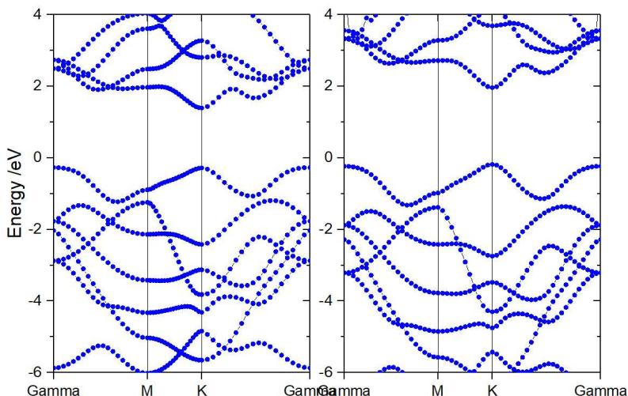

<details>
<summary>line chart</summary>

| K-point | Energy (eV) - Panel 1 | Energy (eV) - Panel 2 | Energy (eV) - Panel 3 | Energy (eV) - Panel 4 |
|---------|------------------------|------------------------|------------------------|------------------------|
| K       | ~2.5                   | ~2.0                   | ~-1.5                  | ~-3.0                  |
| M       | ~2.0                   | ~1.5                   | ~-1.0                  | ~-2.5                  |
| Gamma   | ~2.5                   | ~2.0                   | ~-0.5                  | ~-2.0                  |
</details>

To get projected hybrid functional band structure, please use 253, 254, 255:

Ensure the LORBIT = 10 or LORBIT = 11 parameter in INCAR to output projection information.

253) Get Projected Band-Structure for Selected Atoms  
254) Get Projected Band-Structure for Each ELEMENT  
255) Get the Sum of Projected Band-Structure for Selected Atoms

For example: by using 253, a free format input is available. You can input any atoms by its index and any elements symbol. Projected band structure will saved for each element one by one.

```txt
---> (01) Reading Input Parameters From INCAR File...
---> (02) Reading Fermi-Energy from DOSCAR File...
oooooooo The Fermi Energy will be set to zero eV ooooooooooooooooo
---> (03) Reading Structural Parameters from POSCAR File...
---> (04) Reading Energy-Levels From EIGENVAL File...
---> (05) Reading Band-Weights From PROCAR File...
---> (06) Reading K-Paths From KPATH.in File...
|----
Input the element-symbol and/or atom-index to SUM [Total-atom: 3]
(Free Format is OK, e.g., C Fe H 1-4 7 8 24)
---->
1-3
---> (07) Written SELECTED_ATOM_LIST File!
---> (08) Written PBAND_A1.dat File!
---> (09) Written PBAND_A2.dat File!
---> (10) Written PBAND_A3.dat File!
---> (11) Written KLMES.dat File!
---> (12) Written KLABELS File!
```

Elements projected band structure obtained by using 254,

254  
```txt
--> (01) Reading Input Parameters From INCAR File...
--> (02) Reading Fermi-Energy from DOSCAR File...
00000000 The Fermi Energy will be set to zero eV 00000000000000
--> (03) Reading Structural Parameters from POSCAR File...
--> (04) Reading Energy-Levels From EIGENVAL File...
--> (05) Reading Band-Weights From PROCAR File...
--> (06) Reading K-Paths From KPATH.in File...
--> (07) Written PBAND_S.dat File!
--> (08) Written PBAND_Mo.dat File!
--> (09) Written KLMES.dat File!
--> (10) Written KLABELS File!
```

All your input atoms will be summed up and are projected to the band structure by using 255:

255  
```txt
--> (01) Reading Input Parameters From INCAR File...
--> (02) Reading Fermi-Energy from DOSCAR File...
oooooooo The Fermi Energy will be set to zero eV oooooooooooooo
--> (03) Reading Structural Parameters from POSCAR File...
--> (04) Reading Energy-Levels From EIGENVAL File...
--> (05) Reading Band-Weights From PROCAR File...
--> (06) Reading K-Paths From KPATH.in File...
|----
Input the element-symbol and/or atom-index to SUM [Total-atom: 3]
(Free Format is OK, e.g., C Fe H 1-4 7 8 24)
---->
-2
--> (07) Written SELECTED_ATOM_LIST File!
--> (08) Written PBAND_SUM.dat File!
--> (09) Written KLMES.dat File!
--> (10) Written KLABELS File!
```

supplementary: band structure can also be down by pymatgen package:

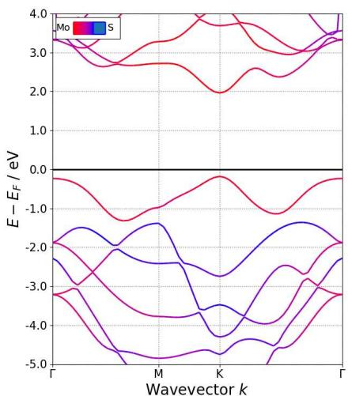

<details>
<summary>line chart</summary>

| Wavevector k | Mo (E - E_F / eV) | S (E - E_F / eV) |
| ------------ | ----------------- | ---------------- |
| Γ            | ~3.5              | ~-2.0            |
| M            | ~2.8              | ~-1.5            |
| K            | ~2.0              | ~-4.0            |
| Γ            | ~3.5              | ~-2.0            |
</details>

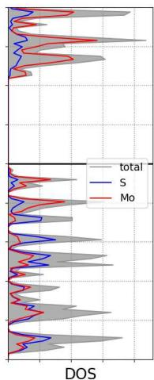

<details>
<summary>line chart</summary>

|  | total | S | Mo |
| --- | --- | --- | --- |
| 0 | 100 | 80 | 70 |
| 1 | 95 | 75 | 65 |
| 2 | 90 | 70 | 60 |
| 3 | 85 | 65 | 55 |
| 4 | 80 | 60 | 50 |
| 5 | 75 | 55 | 45 |
| 6 | 70 | 50 | 40 |
| 7 | 65 | 45 | 35 |
| 8 | 60 | 40 | 30 |
| 9 | 55 | 35 | 25 |
| 10 | 50 | 30 | 20 |
| 11 | 45 | 25 | 15 |
| 12 | 40 | 20 | 10 |
| 13 | 35 | 15 | 5 |
| 14 | 30 | 10 | 0 |
| 15 | 25 | 5 | -5 |
| 16 | 20 | 0 | -10 |
| 17 | 15 | -5 | -15 |
| 18 | 10 | -10 | -20 |
| 19 | 5 | -15 | -25 |
| 20 | 0 | -20 | -30 |
| 21 | -5 | -25 | -35 |
| 22 | -10 | -30 | -40 |
| 23 | -15 | -35 | -45 |
| 24 | -20 | -40 | -50 |
| 25 | -25 | -45 | -55 |
| 26 | -30 | -50 | -60 |
| 27 | -35 | -55 | -65 |
| 28 | -40 | -60 | -70 |
| 29 | -45 | -65 | -75 |
| 30 | -50 | -70 | -80 |
| 31 | -55 | -75 | -85 |
| 32 | -60 | -80 | -90 |
| 33 | -65 | -85 | -95 |
| 34 | -70 | -90 | -100 |
| 35 | -75 | -95 | -105 |
| 36 | -80 | -100 | -110 |
| 37 | -85 | -105 | -115 |
| 38 | -90 | -110 | -120 |
| 39 | -95 | -115 | -125 |
| 40 | -100 | -120 | -130 |
| 41 | -105 | -125 | -135 |
| 42 | -110 | -130 | -140 |
| 43 | -115 | -135 | -145 |
| 44 | -120 | -140 | -150 |
| 45 | -125 | -145 | -155 |
| 46 | -130 | -150 | -160 |
| 47 | -135 | -155 | -165 |
| 48 | -140 | -160 | -170 |
| 49 | -145 | -165 | -175 |
| 50 | -150 | -170 | -180 |
| 51 | -155 | -175 | -185 |
| 52 | -160 | -180 | -190 |
| 53 | -165 | -185 | -195 |
| 54 | -170 | -190 | -200 |
| 55 | -175 | -195 | -205 |
| 56 | -180 | -200 | -210 |
| 57 | -185 | -205 | -215 |
| 58 | -190 | -210 | -220 |
| 59 | -195 | -215 | -225 |
| 60 | -200 | -220 | -230 |
| 61 | -205 | -225 | -235 |
| 62 | -210 | -230 | -240 |
| 63 | -215 | -235 | -245 |
| 64 | -220 | -240 | -250 |
| 65 | -225 | -245 | -255 |
| 66 | -230 | -250 | -260 |
| 67 | -235 | -255 | -265 |
| 68 | -240 | -260 | -270 |
| 69 | -245 | -265 | -275 |
| 70 | -250 | -270 | -280 |
| 71 | -255 | -275 | -285 |
| 72 | -260 | -280 | -290 |
| 73 | -265 | -285 | -295 |
| 74 | -270 | -290 | -300 |
| 75 | -275 | -295 | -305 |
| 76 | -280 | -300 | -310 |
| 77 | -285 | -305 | -315 |
| 78 | -290 | -310 | -320 |
| 79 | -295 | -315 | -325 |
| 80 | -300 | -320 | -330 |
| 81 | -305 | -325 | -335 |
| 82 | -310 | -330 | -340 |
| 83 | -315 | -335 | -345 |
| 84 | -320 | -340 | -350 |
| 85 | -325 | -345 | -355 |
| 86 | -330 | -350 | -360 |
| 87 | -335 | -355 | -365 |
| 88 | -340 | -360 | -370 |
| 89 | -345 | -365 | -375 |
| 90 | -350 | -370 | -380 |
| 91 | -355 | -375 | -385 |
| 92 | -360 | -380 | -390 |
| 93 | -365 | -385 | -395 |
| 94 | -370 | -390 | -400 |
| 95 | -375 | -395 | -405 |
| 96 | -380 | -400 | -410 |
| 97 | -385 | -405 | -415 |
| 98 | -390 | -410 | -420 |
| 99 | -395 | -415 | -425 |
</details>

## Effective Mass

For electrons or holes in a solid, the effective mass $(m^{*})$ is a quantity that is used to simplify band structures by modeling the behavior of a free particle with that mass. At the highest energies of the valence band in semiconductors (Ge, Si, GaAs, ...), and the lowest energies of the conduction band in semiconductors (GaAs, ...), the band structure $E(\mathbf{k})$ can be locally approximated as:

$$
E (\mathbf {k}) = E _ {0} + \frac {\hbar^ {2} \mathbf {k} ^ {2}}{2 m ^ {*}}
$$

where $E(\mathbf{k})$ is the energy of an electron at wavevector $\mathbf{k}$ in that band, $E0$ is a constant giving the edge of energy of that band. So $m^*$ can be calculated by following equation:

$$
\frac {1}{m ^ {*}} = \frac {1}{\hbar^ {2}} \frac {\partial^ {2} E}{\partial k _ {i} \partial k _ {j}}
$$

Usually, we are interested in the $m^*$ from one high symmetry point to another high symmetry point. So the direction of $k_i$ and $k_j$ are same, such as $K \to M$ , $K \to \Gamma$ . To get the second-order partial derivative, KPOINTS file should include K points very near to that high symmetry point. VASPKIT can generate KPOINTS file for VASP calculation and get the effective mass automatically. (Note: Now, VASPKIT only support effective mass calculation for Non-Charged & Non-Magnetic Semiconductor!)

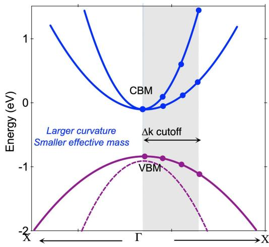

<details>
<summary>line chart</summary>

| Material | Energy (eV) |
| -------- | ----------- |
| CBM      | 0           |
| VBM      | -1          |
</details>

## Example: Single Layer MoS2 effective mass

1. Find out the band edges by band structure calculation. The VBM is at K, and the CBM is also at K.  
2. Select the direction to do second-order derivative. Here, we select K -> M, K -> Γ to calculate their electron and hole effective mass.  
3. Prepare POSCAR and VPKIT.in:

1 # "1" for pre-process (generate KPOINTS), "2" for post-process (calculate m\*)  
6 # number of points for quadratic function fitting.  
0.015 # k-cutoff, unit Å-1.  
2 # number of tasks for effective mass calculation  
0.333333 0.3333333 0.000 0.000 0.000 0.000 K->Γ # Specified two K-points and direction  
0.333333 0.3333333 0.000 0.500 0.000 0.000 K->M # Specified two K-points and direction

4. Run VASPKIT 912, and input the parameters for K-Mesh Scheme, and VASPKIT will generate a KPOINTS file based on the VPKIT.in file with 0-weight K-points.

```diff
+---- Warm Tips ----+
    Test ONLY for Non-Charged & Non-Magnetic Semiconductor
+----+
--> (01) Reading VPKIT.in File...
--> (02) Reading Structural Parameters from POSCAR File...
==================== K-Mesh Scheme ====================
1) Monkhorst-Pack Scheme
2) Gamma Scheme
0) Quit
9) Back
---->>
```

2

```txt
+----Warm Tips ----+
```

\- Accuracy Levels: Gamma-Only: 0;

Low: 0.06\~0.04;

Medium: 0.04\~0.03;

Fine: 0.02-0.01.

\- 0.03-0.04 is Generally Precise Enough!

```txt
+----+
```

```txt
Input KPT-Resolved Value (e.g., 0.04, in unit of 2*PI/Angstrom):
```

```txt
-->
```

0.04

1

--> (03) Written KPOINTS File!  
--> (04) Written INCAR file!  
--> (05) Written POTCAR File with the Standard Potential!

The generate the KPOINTS is:

<table><tr><td colspan="6">Parameters to Generate KPOINTS (Don&#x27;t Edit This Line): 0.0400 12 2 6</td></tr><tr><td colspan="6">24 Reciprocal lattice</td></tr><tr><td>0.00000000000000</td><td>0.00000000000000</td><td>0.00000000000000</td><td>1</td><td></td><td></td></tr><tr><td>0.11111111111111</td><td>0.00000000000000</td><td>0.00000000000000</td><td>6</td><td></td><td></td></tr><tr><td>0.22222222222222</td><td>0.00000000000000</td><td>0.00000000000000</td><td>6</td><td></td><td></td></tr><tr><td>0.33333333333333</td><td>0.00000000000000</td><td>0.00000000000000</td><td>6</td><td></td><td></td></tr><tr><td>0.44444444444444</td><td>0.00000000000000</td><td>0.00000000000000</td><td>6</td><td></td><td></td></tr><tr><td>0.11111111111111</td><td>0.11111111111111</td><td>0.00000000000000</td><td>6</td><td></td><td></td></tr><tr><td>0.22222222222222</td><td>0.11111111111111</td><td>0.00000000000000</td><td>12</td><td></td><td></td></tr><tr><td>0.33333333333333</td><td>0.11111111111111</td><td>0.00000000000000</td><td>12</td><td></td><td></td></tr><tr><td>0.44444444444444</td><td>0.11111111111111</td><td>0.00000000000000</td><td>6</td><td></td><td></td></tr><tr><td>0.22222222222222</td><td>0.22222222222222</td><td>0.00000000000000</td><td>6</td><td></td><td></td></tr><tr><td>0.33333333333333</td><td>0.22222222222222</td><td>0.00000000000000</td><td>12</td><td></td><td></td></tr><tr><td>0.33333333333333</td><td>0.33333333333333</td><td>0.00000000000000</td><td>2</td><td></td><td></td></tr><tr><td>0.33333300000000</td><td>0.33333330000000</td><td>0.00000000000000</td><td>0 # K-&gt;Γ</td><td></td><td></td></tr><tr><td>0.32795808307727</td><td>0.33136593967371</td><td>0.00000000000000</td><td>0</td><td></td><td></td></tr><tr><td>0.32258316615454</td><td>0.32939857934742</td><td>0.00000000000000</td><td>0</td><td></td><td></td></tr><tr><td>0.31720824923180</td><td>0.32743121902113</td><td>0.00000000000000</td><td>0</td><td></td><td></td></tr><tr><td>0.31183333230907</td><td>0.32546385869484</td><td>0.00000000000000</td><td>0</td><td></td><td></td></tr><tr><td>0.30645841538634</td><td>0.32349649836855</td><td>0.00000000000000</td><td>0</td><td></td><td></td></tr><tr><td>0.33333300000000</td><td>0.33333330000000</td><td>0.00000000000000</td><td>0 # K-&gt;M</td><td></td><td></td></tr><tr><td>0.33673240318272</td><td>0.32574567174541</td><td>0.00000000000000</td><td>0</td><td></td><td></td></tr><tr><td>0.34013180636544</td><td>0.31815804349082</td><td>0.00000000000000</td><td>0</td><td></td><td></td></tr><tr><td>0.34353120954815</td><td>0.31057041523622</td><td>0.00000000000000</td><td>0</td><td></td><td></td></tr><tr><td>0.34693061273087</td><td>0.30298278698163</td><td>0.00000000000000</td><td>0</td><td></td><td></td></tr><tr><td>0.35833001591359</td><td>0.29539515872704</td><td>0.00000000000000</td><td>0</td><td></td><td></td></tr></table>

## 5. Submit VASP job.

6. Replace the first line of VPKIT.in by 2. Then re-run VASPKIT 913 to get the effective mass of electron and hole.

913

Warm Tips Test ONLY for Non-Charged & Non-Magnetic Semiconductor!

-->> (01) Reading VPKIT.in File...  
--> (02) Reading Structural Parameters from POSCAR File...  
--> (03) Reading Input Parameters From INCAR File.  
--> (04) Reading Energy-Levels From EIGENVAL File...

Effective-Mass is obtained by fitting a third order polynomial,

which yields masses are less sensitive to the employed k-points.

Band Index: LUMO = 10 HOMO = 9

Effective-Mass (in m0) Electron (Prec.) Hole (Prec.)

K-Path Index 1: K->Γ 0.480 (0.2E-07) -0.577 (0.2E-07)

K-Path Index 2: K->M 0.527 (0.8E-07) -0.705 (0.2E-06)

+----+

Kormányos et al. calculated the effective masses of electron and hole carriers for the MoS2 monolayers to be 0.44 and 0.54, respectively [see 2D Mater. 2 (2015) 049501]. Note: If the valence band and the conduction band bottom are degenerate, such as GaAs and GaN, it will be difficult to guarantee accuracy at this time.

## Band-unfolding

The electronic structures of real materials are perturbed by various structural defects, impurities, fl?uctuations of the chemical composition in compound alloys and so on. In DFT calculations, these defects and incommensurate structures are usually investigated by using supercell (SC) models. However, interpretation of $E(\vec{k})$ versus $\vec{k}$ band structures is most effective within the primitive cell (PC). Popescu and Zunger [see PRL 104, 236403 (2010) and PRB 85, 085201 (2012)] proposed the effective band structures (EBS) method which can unfold the band structures of supercells into the Brillouin zone (BZ) of the correspondive primitive cell. Such band unfolding techniques greatly simplify the analysis of the results and enabling direct comparisons with experimental measurements, for example, angle-resolved photoemission spectroscopy (ARPES), often represented along the high-symmetry directions of the primitive cell BZ.

Next we will build a rectangle-like $MoS_{2}$ supercell with single sulfur vacancy and perform band unfolding calculation using VASP together with VASPKIT codes.

(a) S vacancy point defect model  
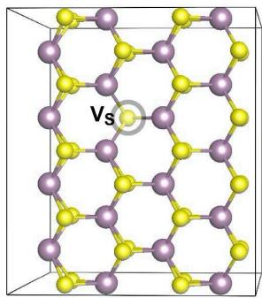

<details>
<summary>chemical</summary>

Molecular structure diagram showing Vs atom in a hexagonal lattice with purple and yellow atoms
</details>

(b) EBS of perfect supcell  
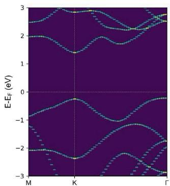

<details>
<summary>line chart</summary>

| k-point | Band 1 (eV) | Band 2 (eV) | Band 3 (eV) |
| ------- | ----------- | ----------- | ----------- |
| M       | -2.0        | -1.5        | 0.0         |
| K       | -2.5        | -1.0        | 0.5         |
| Γ       | -2.0        | -1.5        | 0.0         |
</details>

(c) EBS of supcell with a S vacancy  
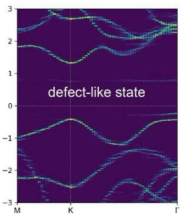

<details>
<summary>text_image</summary>

defect-like state
M K Γ
</details>

First step: Prepare the following files;

1. POSCAR for monolayer MoS $_{2}$

primitive cell

```csv
MoS2-H.POSCAR
1.0000000000000000
3.1904063769892548 0.000000000000000 0.000000000000000
-1.5952031884946274 2.7629729709066906 0.000000000000000
0.000000000000000 0.00000000000000 17.6585355706663840
Mo S
1 2
Direct
0.3333333429999996 0.666666687000029 0.50000000000000
0.666666687000029 0.3333333429999996 0.411790278143051
0.666666687000029 0.3333333429999996 0.5882996918569924
```

2. KPATH.in file for MoS $_{2}$

primitive cell (not for supercell), you can generate it by run vaspkit with task 302 for 2D or 303 for bulk, or edit it manually. We choose the K-Path of M-K-Γ for monolayer MoS2.

```csv
KPATH for MoS2
20
Line mode
Rec
0.00000000000 0.50000000000 0.00000000000 # M
0.33333333333 0.33333333333 0.00000000000 # K
0.33333333333 0.33333333333 0.00000000000 # K
0.00000000000 0.00000000000 0.00000000000 # GAMMA
```

3. INCAR file for static calculation, set LWAVE = TRUE.. To avoid the error 'ERROR! Computed NPLANE=\*\*\*\* != input NPLANE=\*\*\*\*', please set PREC=N or a medium/lower value of energy cutoff.

```proteindb
SYSTEM = MoS2
ISTART = 1
LREAL = F
PREC = N
LWAVE = .TRUE.
LCHARG = F
ISMEAR = 0
SIGMA = 0.05
NELM = 60
NELMIN = 6
EDIFF = 1E-08
```

4. TRANSMAT.in file (optional). The content of this file is

```txt
Read transformation matrix from the TRANSMAT.in file if it exists.
2 0 0 # must be three integers
0 3 0 # must be three integers
0 0 3 # must be three integers
```

where the first line is the comment line, and the integers from second line to four lines are the elements of 3\$:raw-latex:times'\$3 the transmission matrix :math:\`M, the relationship of lattice vectors between supercell E( $\vec{A}$ ) satisfies E( $\vec{a}$ )

$$
\left( \begin{array}{c} \vec {A} _ {1} \\ \vec {A} _ {2} \\ \vec {A} _ {3} \end{array} \right) = M \cdot \left( \begin{array}{c} \vec {a} _ {1} \\ \vec {a} _ {2} \\ \vec {a} _ {3} \end{array} \right) = \left( \begin{array}{c c c} m _ {1 1} & m _ {1 2} & m _ {1 3} \\ m _ {2 1} & m _ {2 2} & m _ {2 3} \\ m _ {3 1} & m _ {3 2} & m _ {3 3} \end{array} \right) \cdot \left( \begin{array}{c} \vec {a} _ {1} \\ \vec {a} _ {2} \\ \vec {a} _ {3} \end{array} \right)
$$

If the off-diagonal elements in $M$ are zero, the lattice vectors of supercell will be parallel to those of primitive cell.

Second step: Run vapskit with task 400 to generate SUPERCELL.vasp and TRANSMAT (if TRANSMAT.in not exist). We modify the SUPERCELL.vasp file by removing a sulfur atom to creat signle S vacancy (V:math: '\_text{S}') point defect;

The primitive cell of $MoS_{2}$ monolayer belongs to hexagonal crystal system. We can build a rectangle-supercell by using vaspkit with task 400. If the TRANSMAT.in file does not exist, vaspkit will read the 9 elements of M by dialogue menu (see the following commands). Otherwise, the elements of M will be read from the TRANSMAT.in file.

```txt
vaspkit -task 400
+----+
|    VASPKIT Version: 1.00.RC (17 Jun. 2019) |
|    A Pre- and Post-Processing Program for VASP Code |
|    Running VASPKIT Under Command-Line Mode |
+----+
---> (01) Reading Structural Parameters from POSCAR File...
Enter the new lattice verctor a in terms of old:
(MUST be three integers, e.g., 1 2 3)
4    0    0
Enter the new lattice verctor b in terms of old:
2    4    0
Enter the new lattice verctor c in terms of old:
0    0    1
+---- Summary ----+
The Transformation Matrix P is:
4    0    0
2    4    0
0    0    1
Lattice Constants in New Cell: 12.762 11.052 17.659
Lattice Angles in New Cell: 90.00   90.00   90.00
Total Atoms in New Cell: 48
Volume of New Cell is 16 times of the Old Cell
+----+
---> (02) Written SUPERCELL.vasp File
```

Third step: cp SUPERCELL.vasp POSCAR and cp TRANSMAT TRANSMAT.in (if TRANSMAT.in not exist) and run vaspkit with task 281 to generate KPOINTS file;

```diff
---->
28
+---- Warm Tips ----+
    See some examples in vaspkit/examples/band_unfolding.
    Only Support KPOINTS file Generated by VASPKIT.
    Please Set LWAVE= .TRUE. in the INCAR file.
+----+
==================== Band-Unfolding ====================
281) Generate KPOINTS File for Band-Unfolding Calculation
282) Calculate Effective Band Structure

0) Quit
9) Back
---->
281
--> (01) Reading Structural Parameters from POSCAR File...
+----+
| Selective Dynamics is Activated! |
+----+
==================== K-Mesh Scheme ====================
1) Monkhorst-Pack Scheme
2) Gamma Scheme

0) Quit
9) Back
---->
2
+---- Warm Tips ----+
Input Resolution Value to Determine K-Mesh for SCF Calculation:
(Typical Value: 0.02-0.03 is Generally Precise Enough)
---->
0.03
Input Resolution Value along K-Path for Band Calculation:
(Typical Value: 0.02-0.04 for DFT and 0.04-0.06 for hybrid DFT)
---->
0.03
+----+
--> (02) Readin Transformation Matrix from TRANSMAT.in file...
--> (03) Reading K-Paths From KPATH.in File...
+---- Summary ----+
K-Mesh for SCF Calculation: 3 3 1 # Based on SC reciprocal lattice length
The Number of K-Point along K-Path 1: 21 # Based on PC reciprocal lattice length
The Number of K-Point along K-Path 2: 43 # Based on PC reciprocal lattice length
+----
```

Forth step: Submit vasp job;

Fifth step: Run vaspkit with task 282 to get EBS;

```haskell
---->>   
282   
+---- Warm Tips ----+  
Current Version Only Support the Standard Version of VASP code.   
+----+   
--> (01) Reading the header information in WAVECAR file...   
+---- WAVECAR Header ----+  
SPIN = 1   
NKPTS = 68   
NBANDS = 252   
ENCUT = 280.00   
Coefficients Precision: Complex*8   
Maximum number of G values: GX = 18, GY = 16, GZ = 25   
Estimated maximum number of plane-waves: 30159   
+----+   
--> (02) Start to read WAVECAR file, take your time ^.^ Percentage complete: 25.0% Percentage complete: 50.0% Percentage complete: 75.0% Percentage complete: 100.0%   
--> (03) Readin Transformation Matrix from TRANSMAT.in file...   
--> (04) Reading Fermi-Energy from DOSCAR File...   
ooooooo The Fermi Energy will be set to zero eV oooooooooooooo   
--> (05) Reading KPOINTS_MAPPING_TABLE.in file...   
--> (06) Reading K-Paths From KPATH.in File...   
--> (07) Start to Calculate Effective Band Structure... Percentage complete: 25.0% Percentage complete: 50.0% Percentage complete: 75.0% Percentage complete: 100.0%   
--> (08) Written EBS.dat File!   
--> (09) Written KLABELS File!
```

Last step: You can use vaspkit/examples/band\_unfolding/eps\_plot.py or other scripts to plot.

## 3D Band Structure

In solid-state physics, the most usual electronic band structure (or simply band structure) is 2D band structure, which shows the energy change along the K-path line.

VASPKIT can also do 3D band structure, which select K-path on a surface of Irreducilbe Brillouin zone. And calculate the K-dependent band energies on those K-points. This method is often used to 2D materials, such as graphene.

## Example: Graphene 3D Band Structure

1. Prepare graphene POSCAR and INCAR files for SCF calculation as descript in Section 3.1  
2. Run VASPKIT and select 231 to generate a KPOINTS file for 3D band calculation. The execution interface is as follows. The generated KPOINTS contains 1-weighted KPOINTS and 0-weight KPOINTS (Note that in order to obtain a smooth 3D energy band, the resolution value used to generate the KPOINTS file should be set at around 0.01)

231

```diff
+----Warm Tips ----+
* Accuracy Levels: (1) Low: 0.04~0.03;
(2) Medium: 0.03~0.02;
(3) Fine: 0.02~0.01.
* 0.015 is Generally Precise Enough!
+----+
Input KP-Resolved Value (unit: 2*PI/Ang):
----
0.015
--> (01) Reading Structural Parameters from POSCAR File...
--> (02) Written KPOINTS File!
```

3. Submit VASP job.

4. After the VASP calculation is complete, run VASPKIT again and enter the 232 or 233 command. The 233 command can output the VBM band and CBM band to BAND.HOMO.grd and BAND.LUMO.grd. 232 can get the calculation data of any other band. Here we choose 233:

```txt
233
+----Warm Tips ----+
    ONLY Reliable for Band-Structure Calculations!
+----+
---> (1) Reading Input Parameters From INCAR File...
---> (2) Reading Structural Parameters from POSCAR File...
---> (3) Reading Fermi-Level From DOSCAR File...
oooooooo The Fermi Energy will be set to zero eV ooooooooooooooooo0
---> (4) Reading Energy-Levels From EIGENVAL File...
---> (5) Reading Kmesh From KPOINTS File...
---> (6) Written BAND.HOMO.grd File.
---> (7) Written BAND.LUMO.grd File.
---> (8) Written KX.grd and KY.grd Files.
```

5. run python VASPKITdir/examples/3D\_band/how\_to\_visual.py to get the 3D band structure.

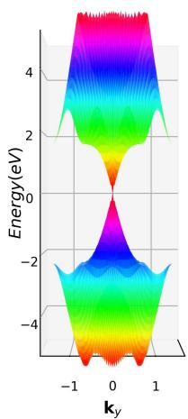

<details>
<summary>line chart</summary>

| k_y | Energy(eV) |
| --- | --- |
| -1.0 | 0.0 |
| -0.5 | 2.0 |
| 0.0 | 0.0 |
| 0.5 | 2.0 |
| 1.0 | 0.0 |
</details>

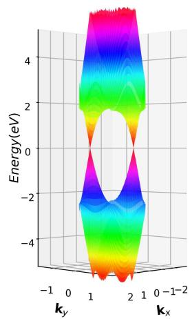

<details>
<summary>3d surface plot</summary>

| k_y / k_x | Energy(eV) |
|-----------|------------|
| -1        | -4         |
| 0         | -2         |
| 1         | 0          |
| 2         | 2          |
| 1         | 4          |
| 0         | 4          |
| -1        | -4         |
| 0         | -2         |
| 1         | 0          |
| 2         | 2          |
| 1         | 4          |
| 0         | 4          |
| -1        | -4         |
| 0         | -2         |
| 1         | 0          |
| 2         | 2          |
| 1         | 4          |
|
| 0         | 4          |
| -1        | -4         |
| 0         | -2         |
| 1         | 0          |
| 2         | 2          |
| 1         | 4          |
| 0         | 4          |
| -1        | -4         |
| 0         | -2         |
| 1         | 0          |
| 2         | 2          |
|
| 1         | 4          |
| 0         | 4          |
| -1        | -4         |
| 0         | -2         |
| 1         | 0          |
| 2         | 2          |
|
| 1         | 4          |
| 0         | 4          |
| -1        | -4         |
| 0         | -2         |
| 1         | 0          |
</details>

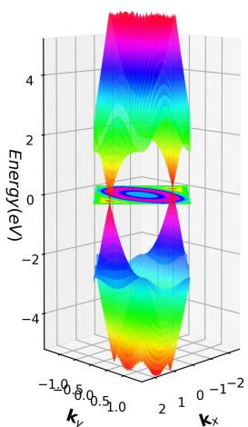

<details>
<summary>3d surface plot</summary>

| k_x    | Energy(eV) |
| ------ | ---------- |
| -1.0   | ~4         |
| -0.5   | ~2         |
| -0.1   | ~0         |
| 0.0    | ~-2        |
| 0.5    | ~-4        |
| 1.0    | ~-2        |
| 1.5    | ~0         |
| 2.0    | ~2         |
| 2.5    | ~4         |
| 3.0    | ~2         |
| 3.5    | ~0         |
| 4.0    | ~-2        |
</details>

## Density of States

VASPKIT is very powerful at post-process DOS results. Set $\boxed{\text{LORBIT}} = 10$ or 11, VASP will output DOS and $I$ -decomposed or $Im$ -decomposed projected DOS for every atoms to DOSCAR and vasprun.xml. VASPKIT can extract those information as users' input.

Merits:

1. Do not need to download DOSCAR or vasprun.xml. Direct extract useful DOS on server.  
2. Selection way for PDOS is convenient. Elements, atoms, and orbitals can be selected and sumed as you want.  
3. Automatic shift fermi energy to 0 eV. It can read the E-fermi energy form OUTCAR and shift the DOS data by E-fermi. If one do not want to do shift, just close it in \~/.vaspkit

```sql
SET_FERMI_ENERGY_ZERO .FALSE. # .TRUE. or .FALSE.;
```

4. Output file can be read by ORIGIN directly with no modification.

## Extract and output DOS and PDOS

Option 11 is used to DOS post-process.

Options Functions

<table><tr><td>1 1 1</td><td>Get the total DOS</td><td>Input: None.Output: TDOS.dat contains the total DOS; ITC</td></tr><tr><td>1 1 2</td><td>Output projected DOS for selected atoms to separate files.</td><td>Input: Input the element-symbol and/or atom-index to SUM</td></tr><tr><td>1 1 3</td><td>Output projected DOS for every elements to separate files.</td><td>Input: None.Output: PDOS_Elements_UP (_DW).dat, pdc</td></tr><tr><td>1 1 4</td><td>Output sum of projected DOS for selected atoms to one file.</td><td>Input: Input the element-symbol and/or atom-index to SUM</td></tr><tr><td>1 1 5</td><td>Output sum of projected DOS for selected atoms and orbitals to one file.</td><td>Input: Input the element-symbol and/or atom-index to SUM</td></tr></table>

Example: PDOS of CO adsorption on Ni(100) surface.

Enter /vaspkit.0.73/examples/LDOS\_PDOS/Partial\_DOS\_of\_CO\_on\_Ni\_111\_surface,

Run VASPKIT (113) Projected Density-of-States for Each Element,

VASPKIT will output PDOS\_Ni.dat, PDOS\_C.dat, and PDOS\_O.dat, which contain the PDOS information of Ni, C, and O:

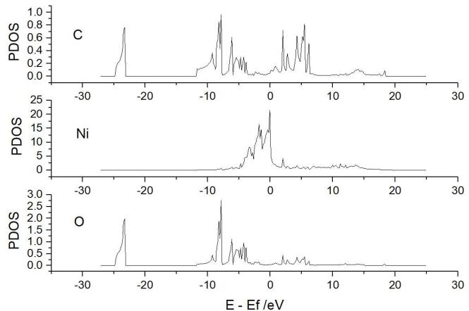

<details>
<summary>line chart</summary>

| E - Ef /eV | C     | Ni    | O     |
| ---------- | ------- | ------- | ------- |
| -30        | 0.0   | 0.0   | 0.0   |
| -20        | 0.8   | 0.0   | 2.0   |
| -10        | 0.6   | 0.0   | 2.5   |
| 0          | 0.9   | 25.0  | 1.5   |
| 10         | 0.7   | 0.0   | 0.5   |
| 20         | 0.1   | 0.0   | 0.0   |
| 30         | 0.0   | 0.0   | 0.0   |
</details>

Run VASPKIT (114) The Sum of Projected Density-of-States for Selected Atoms, and then input 67, VASPKIT will output the sum PDOS of CO molecule.

Run VASPKIT (115) The Sum of Projected DOS for Selected Atoms and orbitals. If we want s and p orbital of O, s and p orbital of C, d orbital of Ni.

```txt
Input the Symbol and/or Number of Atoms to Sum [Total-atom: 7]
(Free Format is OK, e.g., C Fe H 1-4 7 8 24), Press "Enter" if you want to end entry!

---->>
0
Input the Orbitals to Sum
Which orbital? s py pz px dxy dz2 dxz dx2 f-3 ~ f3, "all" for summing ALL.
s
...
...
```

Input 0 - s - 0 - p - C - s - C - p - Ni - d - 'Enter' - 0, Then PDOS\_USER.dat file will generate in this folder, which contains:

```txt
#Energy O_s O_p C_s C_p Ni_d
-27.10266 0.00000 0.00000 0.00000 0.00000 0.00000
-26.92966 0.00000 0.00000 0.00000 0.00000 0.00000
-26.75566 0.00000 0.00000 0.00000 0.00000 0.00000
-26.58266 0.00000 0.00000 0.00000 0.00000 0.00000
...
...
```

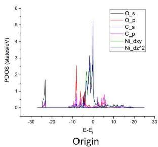

<details>
<summary>line chart</summary>

| Origin | O_s | O_p | C_s | C_p | Ni_dxy | Ni_dz^2 |
| ------ | --- | --- | --- | --- | ------ | ------- |
| -30    | 0   | 0   | 0   | 0   | 0      | 0       |
| -20    | 0   | 0   | 0   | 0   | 0      | 0       |
| -10    | 0   | 0   | 0   | 0   | 0      | 0       |
| 0      | 0   | 0   | 0   | 0   | 0      | 0       |
| 10     | 0   | 0   | 0   | 0   | 0      | 0       |
| 20     | 0   | 0   | 0   | 0   | 0      | 0       |
| 30     | 0   | 0   | 0   | 0   | 0      | 0       |
</details>

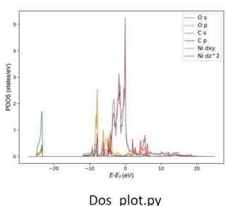

<details>
<summary>line chart</summary>

| E-Er (eV) | PPOS (ratios/eV) |
| --------- | ---------------- |
| -20       | 1.5              |
| -10       | 3.0              |
| 0         | 5.0              |
| 10        | 0.5              |
| 20        | 0.1              |
</details>

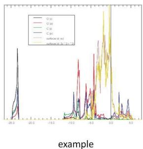

<details>
<summary>line chart</summary>

| x | O (M) | C (M) | C (J) | surface (mJ) | surface (30°-24°) |
| --- | --- | --- | --- | --- | --- |
| -20.0 | 0.0 | 0.0 | 0.0 | 0.0 | 0.0 |
| -18.0 | 0.0 | 0.0 | 0.0 | 0.0 | 0.0 |
| -16.0 | 0.0 | 0.0 | 0.0 | 0.0 | 0.0 |
| -14.0 | 0.0 | 0.0 | 0.0 | 0.0 | 0.0 |
| -12.0 | 0.0 | 0.0 | 0.0 | 0.0 | 0.0 |
| -10.0 | 0.0 | 0.0 | 0.0 | 0.0 | 0.0 |
| -8.0 | 0.0 | 0.0 | 0.0 | 0.0 | 0.0 |
| -6.0 | 0.0 | 0.0 | 0.0 | 0.0 | 0.0 |
| -4.0 | 0.0 | 0.0 | 0.0 | 0.0 | 0.0 |
| -2.0 | 0.0 | 0.0 | 0.0 | 0.0 | 0.0 |
| 0.0 | 0.0 | 0.0 | 0.0 | 0.0 | 0.0 |
| 2.0 | 0.0 | 0.0 | 0.0 | 0.0 | 0.0 |
| 4.0 | 0.0 | 0.0 | 0.0 | 0.0 | 0.0 |
| 6.0 | 0.0 | 0.0 | 0.0 | 0.0 | 0.0 |
| 8.0 | 0.0 | 0.0 | 0.0 | 0.0 | 0.0 |
| 10.0 | 0.0 | 0.0 | 0.0 | 0.0 | 0.0 |
| 12.0 | 0.0 | 0.0 | 0.0 | 0.0 | 0.0 |
| 14.0 | 0.0 | 0.0 | 0.0 | 0.0 | 0.0 |
| 16.0 | 0.0 | 0.0 | 0.0 | 0.0 | 0.0 |
| 18.0 | 0.0 | 0.0 | 0.0 | 0.0 | 0.0 |
| 20.0 | 0.0 | 0.0 | 0.0 | 0.0 | 0.0 |
| 22.0 | 0.0 | 0.0 | 0.0 | 0.0 | 0.0 |
| 24.0 | 0.0 | 0.0 | 0.0 | 0.0 | 0.0 |
| 26.0 | 0.0 | 0.0 | 0.0 | 0.0 | 0.0 |
| 28.0 | 0.0 | 0.0 | 0.0 | 0.0 | 0.0 |
| 36.75 | -15 | -15 | -15 | -15 | -15 |
| -2 | -15 | -15 | -15 | -15 | -15 |
| -18 | -15 | -15 | -15 | -15 | -15 |
| -16 | -15 | -15 | -15 | -15 | -15 |
| -14 | -15 | -15 | -15 | -15 | -15 |
| -12 | -15 | -15 | -15 | -15 | -15 |
| -1 | -15 | -15 | -15 | -15 | -15 |
| -8 | -15 | -15 | -15 | -15 | -15 |
| -6 | -15 | -15 | -15 | -15 | -15 |
| -4 | -15 | -15 | -15 | -15 | -15 |
| -2 | -15 | -15 | -15 | -15 | -15 |
| + | -15 | -15 | -15 | -15 | -15 |
| + | + | + | + | + | + |
| + | + | + | + | + | + |
| + | + | + | + | + | + |
| + | + | + | + | + | + |
| + | + | + | + | + | + |
| + | + | + | + | + | + |
</details>

The Input the Symbol and/or Number of Atoms command accept free format input. You can enter the 1-3 4 Ni to accumulate PDOS by selecting elements 1, 2, 3, 4 and Ni. The Input the Orbitals to Sum command only supports standard input. If you use LORBIT=18, only s p d f can be selected. If you use LORBIT=11, s py pz px dxy dzz dzz dxz dxz f-3 f-2 f-1 f0 f1 f2 are also supported.

## d-band Center

The DOS projected onto the d-states that interact with the adsorbate state can be characterized by the center of d-projected DOS.

$$
\varepsilon_ {\mathrm{d}} = \frac {\int_ {- \infty} ^ {\infty} n _ {\mathrm{d}} (\varepsilon) \varepsilon d \varepsilon}{\int_ {- \infty} ^ {\infty} n _ {\mathrm{d}} (\varepsilon) d \varepsilon}
$$

Example: Pt metal cell, the energy window is set up to the Fermi energy.

```diff
503
+----Warm Tips ----+
    See An Example in vaspkit/examples/d_band_center.
    d-Band Center is Sensitive to the Number of Unoccupied Band.
Anyway, the Trends are More Important than the Absolute Energies.
+----
---> (01) Reading Input Parameters From INCAR File...
---> (02) Reading Fermi-Energy from DOSCAR File...
ooooooo The Fermi Energy will be set to zero eV oooooooooooooo
---> (03) Reading DOS Data From DOSCAR File...
---> (04) Reading Structural Parameters from POSCAR File...
+----Your Option ----+
The default energy window of integration is [-11.82 24.30]
Do you want to change the change (Y/N)?
y
Please enter the new energy window with blank (e.g., -10 10)
-11.8 0
+----
---> (05) Written D_BAND_CENTER File!
```

the d-band center for every atoms and the total d-band center is written in D\_BAND\_CENTER file as following:

```markdown
# Atom ID d-Band-Center (eV)
Pt1: -3.1184
Total: -3.1184
```

```txt
Notice:
The energy window of integration is [-11.80 0.00].
The calculated d-band-center presented here are referenced to Fermi level, i.e., E_F=0 eV.
```

## Thermo Energy Correction

Calculation of the free energy change in catalysis is one of the most important thing. But VASP do not have module that can directly calculate molecular free energy. Thus, the free energy correction in the some publications is inconsistent, inaccurate. (Note: Computational chemistry programs such as Gaussian have a complete free energy calculation module.)

## Gas Molecule Free Energy Correction

The equations used for computing thermochemical data for Gas in VASPKIT is equivalent to those in Gaussian. (https://gaussian.com/thermo/) The partition function from any component can be used to determine the entropy contribution S from that component:

$$
S = N k _ {B} + N k _ {B} \ln \left(\frac {q (V , T)}{N}\right) + N k _ {B} T \left(\frac {\partial \ln q}{\partial T}\right) _ {V}
$$

When molar values are given $n = N/N_{A}$ , and based on Ideal gas approximation, $N_{A}k_{B} = R$ , We write the S as:

$$
\begin{array}{l} S = R + R \ln (q (V, T)) + R T \left(\frac {\partial \ln q}{\partial T}\right) _ {V} \\ = R \ln (q (V, T) e) + R T \left(\frac {\partial \ln q}{\partial T}\right) _ {V} \\ = R \left(\ln \left(q _ {\mathrm{t}} q _ {\mathrm{e}} q _ {\mathrm{r}} q _ {\mathrm{v}} e\right) + T \left(\frac {\partial \ln q}{\partial T}\right) _ {V}\right) \\ \end{array}
$$

The internal thermal energy U can also be obtained from the partition function:

$$
U = N k _ {B} T ^ {2} \left(\frac {\partial \ln q}{\partial T}\right) _ {V} = R T ^ {2} \left(\frac {\partial \ln q}{\partial T}\right) _ {V}
$$

The partition functions of translational, electronic, rotational, vibrational contribution are calculated as the equations list in (https://gaussian.com/thermo/). Then the entropy correction and internal thermal energy correction are calculated at specific temperature and pressure.

$$
U = E _ {t} + E _ {e} + E _ {v} + E _ {r}
$$

$$
S = S _ {t} + S _ {e} + S _ {v} + S _ {r}
$$

For linear molecules, degree of vibrational freedom is 3N - 5, VASPKIT will neglect smallest 5 frequencies. For non-linear molecules, degree of vibrational freedom is 3N - 6, VASPKIT will neglect smallest 6 frequencies.

VASPKIT also include zero-point energy (ZPE) in thermo energy correction from the frequency calculation OUTCAR.

$$
\varepsilon_ {\mathrm{ZPE}} = \frac {h \nu}{2}
$$

The Gibbs free energy (G) and enthalpy (H) include $\Delta PV = \Delta NRT$ based on ideal gas approximation.

$$
H = U + k _ {B} T
$$

The Gibbs free energy G can be derived with the help of the total entropy S,

$$
G = H - T S
$$

At last, VASPKIT will output:

1. Zero-point energy $\varepsilon_{ZPE}$ ;  
2. Thermal correction to $U(T)$ , $= \varepsilon_{\mathrm{ZPE}} + \Delta U_{0\rightarrow T}$  
3. Thermal correction to H(T), = $\varepsilon_{ZPE} + \Delta U_{0 \rightarrow T} + PV = \varepsilon_{ZPE} + \Delta H_{0 \rightarrow T}$

4. Thermal correction to G(T), = $\varepsilon_{ZPE} + \Delta U_{0\rightarrow T} + PV + TS = \varepsilon_{ZPE} + \Delta G_{0\rightarrow T}$

where $\Delta U_{0\to T}$ , $\Delta H_{0\to T}$ , and $\Delta G_{0\to T}$ are interal energy, enthalpy, and Gibbs free energy difference between 0 K and $T$ K.

## Example: Thermo energy correction for O2 molecule:

1. Do a frequency calculation. After calculation, check the frequencies:

```txt
1 f = 46.979964 THz 295.183821 2PiThz 1567.082879 cm-1 194.293584 meV
2 f = 1.952595 THz 12.268518 2PiThz 65.131565 cm-1 8.075288 meV
3 f = 1.120777 THz 7.042052 2PiThz 37.385108 cm-1 4.635164 meV
4 f/i= 0.006984 THz 0.043884 2PiThz 0.232971 cm-1 0.028885 meV
5 f/i= 1.046106 THz 6.572876 2PiThz 34.894327 cm-1 4.326347 meV
6 f/i= 1.294104 THz 8.131095 2PiThz 43.166663 cm-1 5.351986 meV
```

Because of O2 is linear molecule, VASPKIT will neglect smallest five frequencies.

2. In the same folder, run VASPKIT 502. Input temperature(K), pressure(Atm), and spin multiplicity in turn.

```haskell
502
+---- Warm Tips ----+
    See An Example in vaspkit/examples/thermo_correction/ethanol.
This Feature Was Contributed by Nan XU, Jincheng Liu and Sobereva
Included Vibrations, Translation, Rotation & Electron contribution
GAS molecules should not be with any fix.
--> (01) Reading Structural Parameters from CONTCAR File...
--> (02) Analyzing Molecular Symmetry Information...
Molecular Symmetry is: D(inf)h
Linear molecule found!
+----+
Please input Temperature(K)!
298.15
Please input Pressure(Atm)!
1
Please input Spin multiplicity!--(Number of Unpaired electron + 1)
3
---->>
--> (03) Extracting frequencies from OUTCAR...
--> (04) Reading OUTCAR File...
--> (05) Calculating Thermal Corrections...
U(T) = ZPE + Delta_U(0->T)
H(T) = U(T) + PV = ZPE + Delta_U(0->T) + PV
G(T) = H(T) - TS = ZPE + Delta_U(0->T) + PV - TS

Zero-point energy E_ZPE : 2.240 kcal/mol 0.097144 eV
Thermal correction to U(T): 3.724 kcal/mol 0.161475 eV
Thermal correction to H(T): 4.316 kcal/mol 0.187167 eV
Thermal correction to G(T): -10.302 kcal/mol -0.446723 eV
Entropy S : 205.141 J/(mol*K) 0.002126 eV
```

So, ZPE is 0.097144 eV. Thermal correction to $U(T)$ , $H(T)$ , and $G(T)$ are 0.161475, 0.187167, and -0.446723 eV, respectively. The entropy correction is

$$
S = - [ G (T) - H (T) ] / T = 0. 0 0 2 1 2 6 1 \mathrm{eV} / \mathrm{K} = 2 0 5. 1 3 \mathrm{J} \cdot \mathrm{K} ^ {- 1} \cdot \mathrm{mol} ^ {- 1}
$$

To get the free energy of O2, add the G(T) to electronic energy:

$$
\mathrm{G} (\mathrm{O} 2) = - 9. 8 5 4 + - 0. 4 4 7 = - 1 0. 3 0 1 \mathrm{eV}
$$

## Adsorbed Molecular Free Energy Correction

Unlike gas molecules, adsorbed molecules form chemical bonds with substrate, which limits the translational and rotational freedom of the adsorbed molecules. So the contribution of translation and rotation to entropy and enthalpy is significantly reduced (so called hindered translator / hindered rotor model). This does not mean no translational or rotational contribution.

One common method is to attribute the translational or rotational part of the contribution to vibration, that is, the 3N vibrations of the surface-adsorbing molecules (except the virtual frequency) are all used to calculate the correction of the thermo energy.

The small the vibration frequencies have large contribution to entropy. It is very likely that a small vibration frequency will lead to abnormal entropy and free energy correction. So, it suggests that when the free energy of the surface adsorption molecule is corrected, the contribution of the frequency below 50 cm-1 is calculated as 50 cm-1, and VASPKIT also does this. And VASPKIT neglects the electron motion because of its small contribution.

And the PV term is also delete. At last VASPKIT will output:

1. Zero-point energy $\varepsilon_{ZPE}$ ;  
2. Thermal correction to $U(T) = H(T) = \varepsilon_{\mathrm{ZPE}} + \Delta U_{0 \to T}$  
3. Thermal correction to G(T) = $\varepsilon_{ZPE} + \Delta U_{0\rightarrow T} + TS = \varepsilon_{ZPE} + \Delta G_{0\rightarrow T}$

## Example: Thermo energy correction for adsorbed O on Au(111)

1. Fix all slab metal atoms, do frequency calculation for the adsorbed molecule. Check the frequencies:

```txt
$ grep cm OUTCAR
1 f = 10.904836 THz 68.517103 2PiTHz 363.746154 cm-1 45.098792 meV
2 f = 10.827330 THz 68.030119 2PiTHz 361.160834 cm-1 44.778253 meV
3 f = 10.751668 THz 67.554721 2PiTHz 358.637024 cm-1 44.465340 meV
```

2. In the same folder, run VASPKIT 501. Input temperature(K).

```txt
501
+---- Warm Tips ----+
This Feature Was Contributed by Nan XU, Qiang LI and Jincheng LIU.
See An Example in vaspkit/examples/thermo_correction/ORR.
Only vibrations! No Translation & Rotation & Electron contributions.
```

Please Enter The Temperature (K):  
```txt
298.15
--> (01) Reading OUTCAR File...
+---- Summary ----+
Neglect PV contribution to translation for adsorbed molecules.
To avoid abnormal entropy contribution,
frequencies less than 50 cm-1 are set to 50 cm-1.
U(T) = H(T) = ZPE + Delat_U(0->T)
G(T) = H(T) - TS = ZPE + Delat_U(0->T) - TS
```

Temperature (K): 298.1  
```txt
Zero-point energy E_ZPE : 1.549 kcal/mol 0.067171 eV
Thermal correction to U(T): 2.206 kcal/mol 0.095670 eV
Thermal correction to H(T): 2.206 kcal/mol 0.095670 eV
Thermal correction to G(T): 1.207 kcal/mol 0.052342 eV
Entropy S : 14.021 J/(mol*K) 0.000145 eV
```

So, ZPE is 0.067171 eV. Thermal correction to $U(T)$ , $H(T)$ , and $G(T)$ are 0.095670, 0.187167, and -0.446723 eV, respectively.

## Mechanical Properties

## Determine elastic constants based on energy-strain method

Within the linear elastic region, the stress $\sigma$ response of solids to external loading strain $\varepsilon$ satisfies the generalized Hooke's law and can be simplified in the Voigt notation

$$
\sigma_ {i} = \sum_ {j = 1} ^ {6} c _ {i j} \varepsilon_ {j},
$$

where the strain or stress are represented as a vector with 6 independent components respectively, i.e., $1 \leq i, j \leq 6$ . $C_{ij}$ is the second order elastic stiffness tensor expressed by a $6 \times 6$ symmetric matrix in units of GPa. The elastic stiffness tensor $C_{ij}$ can be determined based on the first-order derivative of the stress-strain curves.

An alternative approach to calculate theoretical elastic constants is based on the energy variation by applying small strains to the equilibrium lattice configuration. The elastic energy $\Delta E\left(V,\{\varepsilon_{i}\}\right)$ of a solid under strain in the harmonic approximation is given by

$$
\Delta E (V, \{\varepsilon_ {i} \}) = E (V, \{\varepsilon_ {i} \}) - E (V _ {0}, 0) = \frac {V _ {0}}{2} \sum_ {i, j = 1} ^ {6} C _ {i j} \varepsilon_ {j} \varepsilon_ {i},
$$

where $E(V, \{\varepsilon_{i}\})$ and $E(V_{0}, 0)$ are the total energies of the distorted and undistorted lattice cells, with the volume of V and $V_{0}$ respectively. The energy-strain method corresponds that the elastic stiffness tensor is derived from the second-order derivative of the total energies versus strain. In general, the stress-strain method requires higher computational precise to achieve the same accuracy as energy-strain method. Nevertheless, the former requires much smaller set of distortions than the latter. Considering that the energy-strain has less stress sensitivity than the stress-strain one, the former method has been implemented into the VASPKIT code.

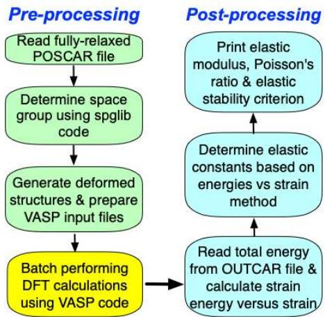

<details>
<summary>flowchart</summary>

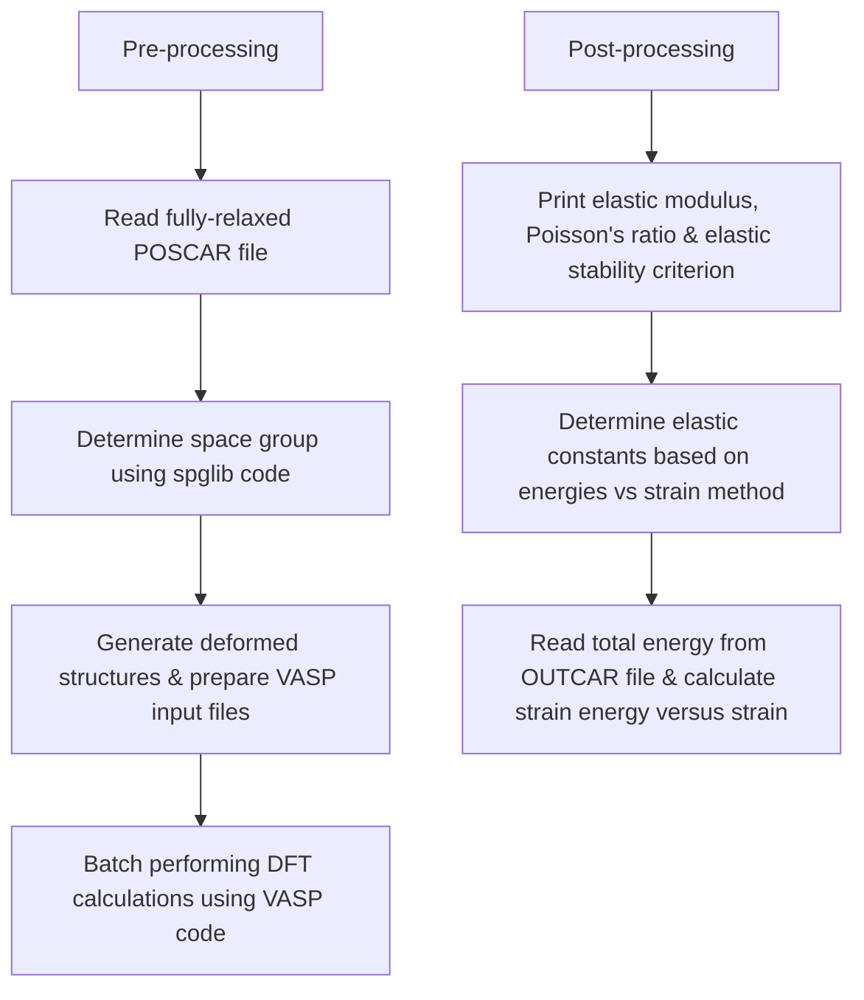
</details>

<table><tr><td>Crystal system</td><td>Space-group</td><td>No. of independent elastic constants</td></tr><tr><td>Triclinic</td><td>1-2</td><td>21</td></tr><tr><td>Monoclinic</td><td>3-15</td><td>13</td></tr><tr><td>Orthorhombic</td><td>16-74</td><td>9</td></tr><tr><td>Tetragonal I</td><td>89-142</td><td>6</td></tr><tr><td>Tetragonal II</td><td>75-88</td><td>7</td></tr><tr><td>Trigonal I</td><td>149-167</td><td>6</td></tr><tr><td>Trigonal II</td><td>143-148</td><td>7</td></tr><tr><td>Hexagonal</td><td>168-194</td><td>5</td></tr><tr><td>Cubic</td><td>195-230</td><td>3</td></tr></table>

The number of independent elastic constants depends on the symmetry of crystal. The lower the symmetry means the more the independent elastic constants. For example, the cubic crystals have three but the triclinic ones have 21 independent elastic constants. Next we take diamond as an example and calculate its elastic contents (vaspkit/examples/elastic/diamond\_3D). Thera are three independent elastic constants for FCC crystal, $\mathrm{C}_{11}$ , $\mathrm{C}_{12}$ and $\mathrm{C}_{44}$ . Thus, the elastic energy is given by

$$
\Delta E \left(V, \{\varepsilon_ {i} \}\right) = \frac {V _ {0}}{2} [ \varepsilon_ {1} \quad \varepsilon_ {2} \quad \varepsilon_ {3} \quad \varepsilon_ {4} \quad \varepsilon_ {5} \quad \varepsilon_ {6} ] \left[ \begin{array}{c c c c c c} C _ {1 1} & C _ {1 2} & C _ {1 2} & 0 & 0 & 0 \\ C _ {1 2} & C _ {1 1} & C _ {1 2} & 0 & 0 & 0 \\ C _ {1 2} & C _ {1 2} & C _ {1 1} & 0 & 0 & 0 \\ 0 & 0 & 0 & C _ {4 4} & 0 & 0 \\ 0 & 0 & 0 & 0 & C _ {4 4} & 0 \\ 0 & 0 & 0 & 0 & 0 & C _ {4 4} \end{array} \right] \left[ \begin{array}{c} \varepsilon_ {1} \\ \varepsilon_ {2} \\ \varepsilon_ {3} \\ \varepsilon_ {4} \\ \varepsilon_ {5} \\ \varepsilon_ {6} \end{array} \right]
$$

To determine the elastic constants for the cubic phase, we apply the tri-axial shear strain $\varepsilon = (0, 0, 0, \delta, \delta, \delta)$ , to the crystal. Then

$\Delta E = \frac{V_0}{2}\big(C_{44}\varepsilon_4\varepsilon_4 + C_{44}\varepsilon_5\varepsilon_5 + C_{44}\varepsilon_6\varepsilon_6\big)$ The $C_{44}$ can be calculated from $\frac{\Delta E}{V_0} = \frac{3}{2} C_{44}\delta^2$ . Similarly, we apply $\varepsilon = (\delta, \delta, 0, 0, 0, 0)$ and get $\Delta E = \frac{V}{2}\big(C_{11}\varepsilon_1\varepsilon_1 + C_{11}\varepsilon_2\varepsilon_2 + C_{12}\varepsilon_1\varepsilon_2 + C_{12}\varepsilon_2\varepsilon_1\big)$

$$
\text { Apply   } \varepsilon = (\delta , \delta , \delta , 0, 0, 0) \text {   to   get   } \frac {\Delta E}{V _ {0}} = \frac {3}{2} (C _ {1 1} + 2 C _ {1 2}) \delta^ {2}.
$$

Finally, math::\` mathrm{C}\_{11}\`, math::\` mathrm{C}\_{12}\` and math::\` mathrm{C}\_{44}\` can be calcauclated by solving these equations.

The relationship of lattice vectors between distorted and fully relaxed lattice cells is:

$$
\left( \begin{array}{c} a ^ {\prime} \\ b ^ {\prime} \\ c ^ {\prime} \end{array} \right) = \left( \begin{array}{c} a \\ b \\ c \end{array} \right) \cdot (I + \varepsilon)
$$

where math::\`boldsymbol{I}' is the identity matrix, The strain tensor

ε is defined by

$$
\pmb {\varepsilon} = \left( \begin{array}{l l l} \varepsilon_ {1} & \frac {\varepsilon_ {6}}{2} & \frac {\varepsilon_ {5}}{2} \\ \frac {\varepsilon_ {6}}{2} & \varepsilon_ {2} & \frac {\varepsilon_ {4}}{2} \\ \frac {\varepsilon_ {5}}{2} & \frac {\varepsilon_ {4}}{2} & \varepsilon_ {3} \end{array} \right)
$$

## Fisrt Step: Prepare the following files:

1. Prepare the fully-relaxed POSCAR file including the standard conventional cell of diamond. You can get the standard conventional cell by running vaspkit with task of 603/604;  
2. Run vaspkit with task of 102 to generate KPOINTS with fine k-mesh.  
3. Prepare INCAR as follows.

```txt
Global Parameters  
ISTART = 0  
LREAL = F  
PREC = High  
LWAVE = F  
LCHARG = F  
ADDGRID= .TRUE.  
Electronic Relaxation  
ISMEAR = 0  
SIGMA = 0.05  
NELM = 40  
NELMIN = 4  
EDIFF = 1E-08  
Ionic Relaxation  
NELMIN = 6  
NSW = 100  
IBRION = 2  
ISIF = 2 (Must be 2)  
EDIFFG = -1E-02
```

4, Prepare VPKIT.in file and set the value of first line to 1 (1 means pre-processing);

```csv
1 ! 1 for pre-processing; 2 for post-processing
3D ! 2D for two-dimensional, 3D for bulk
7 ! number of strain case
-0.015 -0.010 -0.005 0.000 0.005 0.010 0.015 ! Strain range
```

and run vaspkit-201

---->>

201

->>> (01) Reading VPKIT.in File...

Warm Tips

See an example in vaspkit/examples/elastic/diamond\_3D, Require the fully-relaxed and standardized Conventional cell.

+

-->> (02) Reading Structural Parameters from POSCAR File...

-> C44 folder created successfully!

-> strain -0.015 folder created successfully!

-> strain -0.010 folder created successfully!

-> strain -0 005 folder created successfully!

--> strain 0.000 folder created successfully!

1. 2023年，公司实现营业收入4,677.5万元，较2022年增长18.9%。

> strain\_10.005 folder created successfully;

> strain\_10.010 holder created successfully?

-> strain\_+0.015 folder created successfully!

-> C11\_C12\_I folder created successfully!

-> strain\_-0.015 folder created successfully!

-> strain -0.010 folder created successfully!

-> strain -0.005 folder created successfully!

-> strain 0.000 folder created successfully!

> strain +0.005 folder created successfully!

> strain\_10.005 roller created successfully;

-> strain\_+0.010 folder created successfully!

-> strain\_+0.015 folder created successfully!

-> C11\_C12\_II folder created successfully!

-> strain -0.015 folder created successfully!

-> strain -0.010 folder created successfully!

> strain. 0.005 faldon created successfully!

, strain\_0.005 folder created successfully;

\- strain\_0.000 folder created successfully!

-> strain\_+0.005 folder created successfully!

-> strain +0.010 folder created successfully!

-> strain +0.015 folder created successfully!

Second step: Batch performing DFT calucaltions using VASP code;

Third step: Modify the value of the first line in VPKIT.in file to 2 (2 means post-processing); and run vaspkit-201 again. You will get the following information,

-->

201

-->> (01) Reading VPKIT.in File..

11 =0)

(0> +----+/\\

\_(()\_|VPKIT.in will be renamed to INPUT.in in future version|\_V

// +----+ \\

-->>> (01) Reading VPKIT.in File...

+---- Warm Tips ----+

See some examples in vaspkit/examples/elastic,

Require the fully-relaxed and standardized Conventional cell.

+----+

(02) Reading Structural Parameters from POSCAR File..

--> (03) Calculating Fitting Coefficients of Energy vs. Strain.

--> Current directory: Fitting Precision

C44 Folder: 0.817E-09

C11\_C12\_I Folder: 0.814E-08

C11 C12 II Folder: 0.135E-07

+---- Summary ----+

Crystal Class: m-3m

Space Group: Fd-3m

Crystal System: Cubic system

Including Point group classes: 23, 2/m-3, 432, -43m, 4/m-32/m

There are 3 independent elastic constants

<table><tr><td>C11</td><td>C12</td><td>C12</td><td>0</td><td>0</td><td>0</td></tr><tr><td>C12</td><td>C11</td><td>C12</td><td>0</td><td>0</td><td>0</td></tr><tr><td>C12</td><td>C12</td><td>C11</td><td>0</td><td>0</td><td>0</td></tr><tr><td>0</td><td>0</td><td>0</td><td>C44</td><td>0</td><td>0</td></tr><tr><td>0</td><td>0</td><td>0</td><td>0</td><td>C44</td><td>0</td></tr><tr><td>0</td><td>0</td><td>0</td><td>0</td><td>0</td><td>C44</td></tr></table>

Stiffness Tensor C\_ij (in GPa):

<table><tr><td>1050.640</td><td>126.640</td><td>126.640</td><td>0.000</td><td>0.000</td><td>0.000</td></tr><tr><td>126.640</td><td>1050.640</td><td>126.640</td><td>0.000</td><td>0.000</td><td>0.000</td></tr><tr><td>126.640</td><td>126.640</td><td>1050.640</td><td>0.000</td><td>0.000</td><td>0.000</td></tr><tr><td>0.000</td><td>0.000</td><td>0.000</td><td>559.861</td><td>0.000</td><td>0.000</td></tr><tr><td>0.000</td><td>0.000</td><td>0.000</td><td>0.000</td><td>559.861</td><td>0.000</td></tr><tr><td>0.000</td><td>0.000</td><td>0.000</td><td>0.000</td><td>0.000</td><td>559.861</td></tr></table>

Compliance Tensor S\_ij (in GPa^{-1}):

<table><tr><td>0.000977</td><td>-0.000105</td><td>-0.000105</td><td>0.000000</td><td>0.000000</td><td>0.000000</td></tr><tr><td>-0.000105</td><td>0.000977</td><td>-0.000105</td><td>0.000000</td><td>0.000000</td><td>0.000000</td></tr><tr><td>-0.000105</td><td>-0.000105</td><td>0.000977</td><td>0.000000</td><td>0.000000</td><td>0.000000</td></tr><tr><td>0.000000</td><td>0.000000</td><td>0.000000</td><td>0.001786</td><td>0.000000</td><td>0.000000</td></tr><tr><td>0.000000</td><td>0.000000</td><td>0.000000</td><td>0.000000</td><td>0.001786</td><td>0.000000</td></tr><tr><td>0.000000</td><td>0.000000</td><td>0.000000</td><td>0.000000</td><td>0.000000</td><td>0.001786</td></tr></table>

Anisotropic mechanical properties of bulk singlecrystal:

<table><tr><td>Mechanical Properties</td><td>Min</td><td>Max</td><td>Anisotropy</td></tr><tr><td>Bulk Modulus B (GPa)</td><td>434.640</td><td>434.640</td><td>1.000</td></tr><tr><td>Young&#x27;s Modulus E (GPa)</td><td>1023.395</td><td>1175.046</td><td>1.148</td></tr><tr><td>Shear Modulus G (GPa)</td><td>462.000</td><td>559.861</td><td>1.212</td></tr><tr><td>Poisson&#x27;s Ratio v</td><td>0.012</td><td>0.119</td><td>9.987</td></tr><tr><td>Linear compressibility</td><td>0.767</td><td>0.767</td><td>1.000</td></tr></table>

Linear compressibility beta is in unit of $\mathrm{TPa}^{\wedge -1}$

References:

[1] Marmier A, Comput. Phys. Commun. 181, 2102-2115 (2010)

[2] Gaillac R, J. Phys. Condens. Matter 28, 275201 (2016)

Average mechanical properties of bulk polycrystal:

<table><tr><td>Mechanical Properties</td><td>Voigt</td><td>Reuss</td><td>Hill</td></tr><tr><td>Bulk Modulus B (GPa)</td><td>434.64</td><td>434.640</td><td>434.640</td></tr><tr><td>Young&#x27;s Modulus E (GPa)</td><td>1116.34</td><td>1109.298</td><td>1112.824</td></tr><tr><td>Shear Modulus G (GPa)</td><td>520.72</td><td>516.130</td><td>518.423</td></tr><tr><td>Poisson&#x27;s Ratio v</td><td>0.07</td><td>0.075</td><td>0.073</td></tr><tr><td>P-wave Modulus (GPa)</td><td>1128.93</td><td>1122.814</td><td>1125.871</td></tr><tr><td>Pugh&#x27;s Ratio (B/G)</td><td>0.83</td><td>0.842</td><td>0.838</td></tr><tr><td>Vickers Hardness (GPa)[6]</td><td>91.69</td><td>90.237</td><td>90.962</td></tr><tr><td>Vickers Hardness (GPa)[7]</td><td>94.70</td><td>93.170</td><td>93.935</td></tr></table>

Pugh's Ratio (B/G): 0.84 --> Brittle region (< 1.75)

Cauchy Pressure Pc (GPa): -433.2 --> Metallic-like bonding (< 0)

Kleinman's parameter: 0.29 --> Bonding Bending dominated (< 0.5)

Universal Elastic Anisotropy: 0.04

Chung-Buessem Anisotropy: 0.0

Isotropic Poisson's Ratio: 0.07

Longitudinal wave velocity (m/s): 17945.173

Transverse wave velocity (m/s): 12177.146

Average wave velocity (m/s): 13280.911

Debye temperature (K): 2212.9

References:

[1] Voigt W, Lehrbuch der Kristallphysik (1928)

[2] Reuss A, Z. Angew. Math. Mech. 9 49-58 (1929)

[3] Hill R, Proc. Phys. Soc. A 65 349-54 (1952)

[4] Debye temperature J. Phys. Chem. Solids 24, 909-917 (1963)

[5] Elastic wave velocities calculated using Navier's equation

[6] Chen X-Q, Intermetallics 19, 1275 (2011)

[7] Tian Y-J, Int. J. Refract. Hard Met. 33, 93-106 (2012)

Eigenvalues of the stiffness matrix (in GPa):

Eigenvalue lamda\_1 = 559.861 > 0 meeted.

Eigenvalue lamda\_2 = 559.861 > 0 meeted.

Eigenvalue lamda\_3 = 559.861 > 0 meeted.

Eigenvalue lamda\_4 = 924.000 > 0 meeted.

Eigenvalue lamda\_5 = 924.000 > 0 meeted.

Eigenvalue lamda\_6 = 1303.921 > 0 meeted.

Elastic stability criteria as seen in PRB 90, 224104 (2014).

Criteria (i) C11 - C12 > 0 meeted.

Criteria (ii) C11 + 2C12 > 0 meeted.

Criteria (iii) C44 > 0 meeted.

This Structure is Mechanically Stable.

--> (04) Written ELASTIC\_TENSOR File!

## Optical Properties

## Linear Optical Properties

The linear optical properties can be obtained from the frequency-dependent complex dielectric function $\varepsilon(\omega)$

$$
\varepsilon (\omega) = \varepsilon_ {1} (\omega) + i \varepsilon_ {2} (\omega),
$$

where $\varepsilon_{1}(\omega)$ and $\varepsilon_{2}(\omega)$ are the real and imaginary parts of the dielectric function, and $\omega$ is the photon frequency.

The frequency-dependent linear optical spectra, e.g., refractive index $n(\omega)$ , extinction coefficient $\kappa(\omega)$ , absorption coefficient $\alpha(\omega)$ , energy-loss function $L(\omega)$ , reflectivity $R(\omega)$ can be calculated from the real $\varepsilon_{1}(\omega)$ and $\varepsilon_{2}(\omega)$ parts [See Ref. A. M. Fox, Optical Properties of Solids]:

$$
n (\omega) = \left[ \frac {\sqrt {\varepsilon_ {1} ^ {2} + \varepsilon_ {2} ^ {2}} + \varepsilon_ {1}}{2} \right] ^ {\frac {1}{2}}
$$

$$
k (\omega) = \left[ \frac {\sqrt {\varepsilon_ {1} ^ {2} + \varepsilon_ {2} ^ {2}} - \varepsilon_ {1}}{2} \right] ^ {\frac {1}{2}}
$$

$$
\alpha (\omega) = \frac {\sqrt {2} \omega}{c} \left[ \sqrt {\varepsilon_ {1} ^ {2} + \varepsilon_ {2} ^ {2}} - \varepsilon_ {1} \right] ^ {\frac {1}{2}}
$$

$$
L (\omega) = \mathrm{Im} \left(\frac {- 1}{\varepsilon (\omega)}\right) = \frac {\varepsilon_ {2}}{\varepsilon_ {1} ^ {2} + \varepsilon_ {2} ^ {2}}
$$

$$
R (\omega) = \frac {(n - 1) ^ {2} + k ^ {2}}{(n + 1) ^ {2} + k ^ {2}}
$$

In VASPKIT Ver. 1.00 or later, it is not necessary to run optical.sh to extract image and real parts of dielectric function from vasprun.xml at first step (optional). You can run vaspkit -task 711 to get the these linear optical spectrums at one shot. The program will read dielectric function from vasprun.xml directly if both REAL,in and IMAG,in files not exist. We take Si as an example and calculate its optical properties at GW0+BSE leve, as shown in figure below.

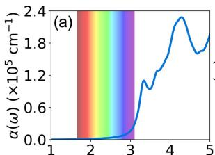

<details>
<summary>line chart</summary>

| x    | α(ω) (×10⁵ cm⁻¹) |
| ---- | ---------------- |
| 1    | 0.0              |
| 2    | 0.0              |
| 3    | 0.0              |
| 4    | 1.8              |
| 5    | 2.0              |
</details>

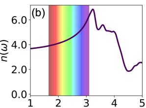

<details>
<summary>line chart</summary>

| x    | n(ω) |
| ---- | ---- |
| 1.0  | 3.8  |
| 2.0  | 4.2  |
| 3.0  | 6.0  |
| 4.0  | 5.0  |
| 5.0  | 2.5  |
</details>

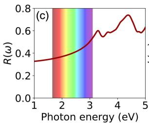

<details>
<summary>line chart</summary>

| Photon energy (eV) | R(ω) |
| ------------------ | ---- |
| 1                  | 0.3  |
| 2                  | 0.35 |
| 3                  | 0.5  |
| 4                  | 0.7  |
| 5                  | 0.6  |
</details>

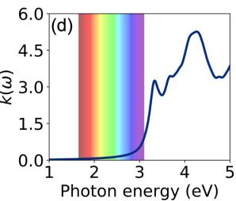

<details>
<summary>line chart</summary>

| Photon energy (eV) | K(ω) |
| ------------------ | ---- |
| 1.0                | 0.0  |
| 2.0                | 0.0  |
| 3.0                | 0.0  |
| 4.0                | 4.5  |
| 5.0                | 3.5  |
</details>

```diff
---->>   
71  
--------Optical Options------  
711) Linear Optical Spectrums  
712) Transition Dipole Moment at Single kpoint  
713) Transition Dipole Moment for DFT Band-Structure  
0) Quit  
9) Back  
---->>   
711  
+----Warm Tips----+  
    See an example in vaspkit/examples/Si_bse_optical.  
    This module is NOT suitable for low-dimensional materials.  
+----+  
---------Energy Unit------  
Which Energy Unit Do You Want to Adopt?  
1) eV  
2) nm  
3) THz  
---->>   
1  
--> (01) Reading Dielectric Function From vasprun.xml File...  
--> (02) Reading IMAG.in and REAL.in Files...  
--> (03) Written Optical Files Successfully!
```

## Transition Dipole Moment

The transition dipole moment (TDM) or transition moment, usually denoted for a transition between an initial state $a$ and a final state $b$ , is the electric dipole moment associated with the transition between the two states. In general the TDM is a complex vector quantity that includes the phase factors associated with the two states. Its direction gives the polarization of the transition, which determines how the system will interact with an electromagnetic wave of a given polarization, while the square of the magnitude gives the strength of the interaction due to the distribution of charge within the system. The SI unit of the transition dipole moment is the Coulomb-meter (Cm); a more conveniently sized unit is the Debye (D). The transition probabilities between the valence and the conduction band are revealed by the calculated sum of the squares of TDM (in unit of Debey $^2$ ).

We task cubic $CsPbI_{3}$ perovskite phase as an example and present the PBE calculated band structures and corresponding TDM in figure below. This system has 44 valence electrons in all. Next we calculate the squares of transition dipole moment from the highest valence band (band index 22) to the lowest conduction band (band index 23). It is found the results are well agreed with the previous finding (see Ref. J. Phys. Chem. Lett. 2017, 8, 2999–3007).

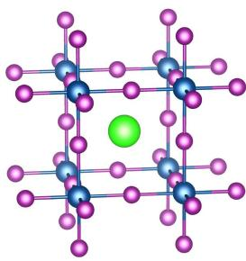

<details>
<summary>chemical</summary>

Molecular structure diagram showing a central green atom bonded to four blue atoms in a lattice arrangement
</details>

Cubic CsPbI $_3$ perovskite

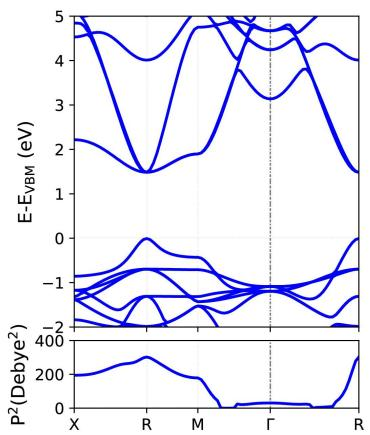

<details>
<summary>line chart</summary>

| X-axis | E-EvBM (eV) | P²(Debye²) |
|--------|-------------|------------|
| X      | ~5          | ~200       |
| R      | ~1.5        | ~300       |
| M      | ~4.5        | ~0         |
| Γ      | ~3          | ~0         |
| R      | ~1.5        | ~400       |
</details>

The calculating process is very similar with the band structure calculation except for setting LWAVE= .TRUE, in the INCAR file. More details on these calculations are given in vaspkit/examples/tdm.

```txt
-------->
71
--------Optical Options ------>
711) Linear Optical Spectrums
712) Transition Dipole Moment at Single kpoint
713) Transition Dipole Moment for DFT Band-Structure

0) Quit
9) Back
-------->
713
+---------Warm Tips ------+
    See an example in vaspkt/examples/tdm.
ONLY Support KPOINTS created by VASPKIT for hybrid bandstructure.
+---------+
-------- Band-Structure Mode ------+
1) DFT Band-Structure Calculation
2) Hybrid-DFT Band-Structure Calculation

------->
1
Please input TWO bands separated by spaces.
(e.g., 4 5 means to get TDM between 4 and 5 bands at all kpts)

------->
22 23
+---------Warm Tips ------+
    Current Version Only Support the Standard Version of VASP code.
+---------+
---> (01) Reading the header information in WAVECAR file...
+---------WAVECAR Header ------+
SPIN = 1
NKPTS = 80
NBANDS = 36
ENCUT = 400.00
Coefficients Precision: Complex*8
Maximum number of G values: GX = 11, GY = 11, GZ = 11
Estimated maximum number of plane-waves: 5575
+---------+
---> (02) Start to read WAVECAR file, take your time ^.^
    Percentage complete: 25.0%
    Percentage complete: 50.0%
    Percentage complete: 75.0%
    Percentage complete: 100.0%
---> (03) Reading K-Paths From KPOINTS File...
---> (04) Start to calculate Transition Dipole Moment...
    Percentage complete: 25.0%
    Percentage complete: 50.0%
    Percentage complete: 75.0%
    Percentage complete: 100.0%
---> (05) Written TDM.dat File!
```

If one want to calculate the square of TDM between two state at single k-point. Just run vaspkit with task 712, for example,

```haskell
71
--------Optical Options ------
711) Linear Optical Spectrums
712) Transition Dipole Moment at Single kpoint
713) Transition Dipole Moment for DFT Band-Structure

0) Quit
9) Back
-------->
712
+----Warm Tips ----+
    See an example in vaspkit/examples/tdm.
    Please Set LWAVE= .TRUE. in the INCAR file.
+----+
Input ONE kpoint and TWO bands separated by spaces.
(e.g., 1 4 5 means to get TDM between 4 and 5 band at 1st kpt)
-------->
1 22 23
+----Warm Tips ----+
    Current Version Only Support the Standard Version of VASP code.
+----+
---> (01) Reading the header information in WAVECAR file...
+----WAVECAR Header ----+
SPIN = 1
NKPTS = 80
NBANDS = 36
ENCUT = 400.00
Coefficients Precision: Complex*8
Maximum number of G values: GX = 11, GY = 11, GZ = 11
Estimated maximum number of plane-waves: 5575
+----+
Square of TDM (Debye^2): X Y Z Total
0.000 201.617 0.000 201.617
```

Cleary, the calculate total-square of TDM at X point for cubic $CsPbI_{3}$ is 201.62 Debey $^{2}$ .

## Structure and Symmetry Tools

VASPKIT is powerful at structure edition. Read and modify the structural files.

## Redefine Lattice

VASPKIT option 400 can build supercell and rotate the lattice vector. It requires three coefficients for each new vector by following equation:

$$
\left( \begin{array}{c} A \\ B \\ C \end{array} \right) = \left( \begin{array}{c c c} c _ {1} & c _ {2} & c _ {3} \\ c _ {4} & c _ {5} & c _ {6} \\ c _ {7} & c _ {8} & c _ {9} \end{array} \right) \left( \begin{array}{c} a \\ b \\ c \end{array} \right)
$$

A, B, and C are new lattice vectors, a, b, and c are old lattice vectors.

Example: Build Au(111) - $(\sqrt{3} \times \sqrt{3})R30^{\circ}$ slab from primitive slab

$$
\mathrm{Au} (1 1 1) - \mathrm{p} (1 \times 1)
$$

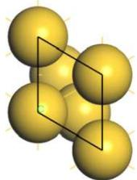

$$
\left( \begin{array}{c c c} 1 & - 1 & 0 \\ 2 & 1 & 0 \\ 0 & 0 & 1 \end{array} \right) \left( \begin{array}{c} a \\ b \\ c \end{array} \right) = \left( \begin{array}{c} a - b \\ 2 a + b \\ c \end{array} \right) \mathrm{Au} (1 1 1) - (\sqrt {3} \times \sqrt {3}) R 3 0 ^ {o}
$$

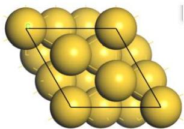

<details>
<summary>natural_image</summary>

3D molecular model showing a cluster of yellow spheres enclosed by a black parallelogram (no labels or text)
</details>

Build a supercell with its length of new lattice vector equal to $\sqrt{3}a$ .

400

--> (01) Reading Structural Parameters from POSCAR File...

Enter the new lattice vector a in terms of old:

(MUST be three integers, e.g., 1 2 3)

1 -1 0

Enter the new lattice vector b in terms of old:

2 1 0

Enter the new lattice verctor c in terms of old:

0 0 1

+---- Summary ----+

The Transformation Matrix P is:

1 -1 0

2 1 0

θ θ 1

Lattice Constants in New Cell: 4.995 4.995 17.064

Lattice Angles in New Cell: 90.00 90.00 60.00

Total Atoms in New Cell:

Volume of New Cell is 3 times of the Old Cell

## Build Supercell

VASPKIT 401 can build supercell by three number C1, C2, C3.

$$
\left( \begin{array}{c} A \\ B \\ C \end{array} \right) = (c _ {1} \quad c _ {2} \quad c _ {3}) \left( \begin{array}{c} a \\ b \\ c \end{array} \right)
$$

For example, build supercell with length is 2 times in the a and b direction and keep the c vector.

```txt
401
================== Structural File ===================
1) POSCAR
2) CONTCAR
3) The Specified Filename

0) Quit
9) Back
------------------------
1
    --> (01) Reading Structural Parameters from POSCAR File...
+---- Warm Tips ----+
Enter the repeated unit along a, b and c directions with space!
(MUST be three integers, e.g., 1 2 3)

------------------------
2 2 1
    --> (02) Written SC221.vasp File
```

## Fix Atoms by Layers

VASP default structural optimization allows all atoms to move freely in all directions (x, y, z). In some cases, structural optimization calculations require to fix some atoms. For example, surface calculations with slab model need to fix some bottom atoms.

To fix atoms, the POSCAR seventh line should be switched to selective dynamics (only the first character is relevant and must be s or s). This mode allows to provide extra flags for each atom signaling whether the respective coordinate(s) of this atom will be allowed to change during the ionic relaxation. F means fix, and T means not fix.

VASPKIT provides options 402 to fix atoms by layers:

1. Input the file name that we want to fix. 1 for POSCAR, 2 for CONTCAR, 3 for specified name but should also be POSCAR format.  
2. Input a threshold (unit: Å) to separate layers. Only atomic layers' z coordinates difference is bigger than the threshold, those layers can be recognized. Otherwise, it will be recognized to be one layer. VASPKIT shows some suggested threshold and its corresponding layers number.

Then VASPKIT will print the recognized layers number.

3. Choose the layers that we want to fix. VASPKIT will automatically fix those bottom layers and output a POSCAR\_FIX file. Before VASP calculation, cp POSCAR\_FIX POSCAR.

```txt
402
================== Structural File ===================
1) POSCAR
2) CONTCAR
3) The Specified Filename

0) Quit
9) Back
================-->>
1
---> (01) Reading Structural Parameters from POSCAR File...
Threshold: 0.3 layers: 4
Threshold: 0.6 layers: 4
Threshold: 0.9 layers: 4
Threshold: 1.2 layers: 4
Threshold: 1.5 layers: 4
Please choose a threshold to separate layers->
1
Found 4 layers, choose how many layers to be fixed=>
2
Fixed atoms are: 1 4
---> (02) Written POSCAR_FIX File!
```

## Fix Atoms by Height

VASPKIT 403 can also fix atoms, but by a range of z coordinates. Similar as the option 402, first select a structural file, and then input two numbers to set the z coordinate range. Then, select the output format Fractional or Cartesian, it will output POSCAR\_FIX file.

If the (1) Fractional coordinates is select, the input z\_min z\_max numbers should be the z fractional coordination and the output file POSCAR\_FIX also is written as fractional style.

If the (2) Cartesian coordinates is select, the input z\_min z\_max numbers should be the z Cartesian coordination and the output file POSCAR\_FIX also is written as Cartesian style.

```txt
403
================== Structural File ===================
1) POSCAR
2) CONTCAR
3) The Specified Filename

0) Quit
9) Back
================-->
1
--> (01) Reading Structural Parameters from POSCAR File...
+----+
| Selective Dynamics is Activated!    |
+----+
Atoms between your chosen section in z direction will be fixed
Type z_min z_max, Note: z_min < z_max
0 5
Read and Write atomic coordinates as:
(1) Fractional coordinates
(2) Cartesian coordinates
2
Fixed atoms are:    1    4
--> (02) Written POSCAR_FIX File!
```

## Swap Axis of Lattice Vector

VASPKIT 407 can do swap two axis of lattice vector.

## Symmetry Tools

VASPKIT can identify symmetry of crystal from POSCAR or CONTCAR by 601 or 608, respectively.

For example $\theta$ -Al2O3:

```txt
601
--> (01) Reading Structural Parameters from POSCAR File...
+---- Summary ----+
    Prototype: A2B3
    Total Atoms: 10
    Formula Unit: Al203 [ Alphabetically Listed: Al203 ]
    Full Formula Unit: Al406
    Crystal System: Monoclinic
    Crystal Class: 2/m
    Bravais Lattice: mC
    Lattice Constants: 6.142 6.142 5.671
    Lattice Angles: 76.387 103.613 152.294
    Volume: 96.475
    Density (g/cm3): 3.510
    Space Group: 12
    Point Group: 5 [ C2h ]
    International: C2/m
    Symmetry Operations: 4
```

If POSCAR is conventional cell, VASPKIT 602 can transfer it to primitive Cell.

If POSCAR is primitive cell, VASPKIT 602 can transfer it to conventional Cell.

VASPKIT can also identify point group of molecule from POSCAR 609,

For example: point group of O2 molecule is $D_{\infty h}$ :

```txt
6
==================== Symmetry Options ====================
601) Symmetry Finding for Crystals
602) Primitive Cell Finding
603) Conventional Cell Finding (experimental)
604) Standardize Crystal Cell
608) Summary for Relaxed-Structure
609) Symmetry Finding for Molecules and Clusters

0) Quit
9) Back
================-->>
609
--> (01) Reading Structural Parameters from CONTCAR File...
--> (02) Analyzing Molecular Symmetry Information...
Molecular Symmetry is: D(inf)h
```

## Potential related

## Planar Average Potential

Planar average for grid files is one of the basic function of VASPKIT. It supports all grid files of VASP output, such as CHGCAR, PARCHG, LOCPOT, ELFCAR. All such grid files are written by following commands in Fortran:

```txt
WRITE(IU, FORM) (((C(NX,NY,NZ),NX=1,NGXC),NY=1,NGYZ),NZ=1,NGZC)
```

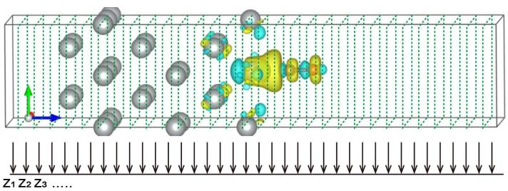

<details>
<summary>text_image</summary>

Z₁ Z₂ Z₃ ......
</details>

For one selected direction, such as z direction. VASPKIT do an average in XY plane on each NZ,

$$
\sum_ {i j} \Delta x _ {i} \Delta y _ {j} \rho_ {i, j} / \sum_ {i j} \Delta x _ {i} \Delta y _ {j}
$$

The output POTPAVG.dat contains two columns. First column is z coordinate (in Å), Second column is Planar Average-Potential (in eV) or Densitiy (in e).

Here, take LOCPOT as an example. It contains total local potential (in eV) when LVTOT = .TRUE. exists in the INCAR file, or contains electrostatic potential (in eV) when LVHAR = .TRUE. exists in the INCAR file. Electrostatic potential is desirable for the evaluation of the work-function, because the electrostatic potential converges more rapidly to the vacuum level than the total potential. To get the work-function, potential along z direction (i.e. slab normal direction) must be averaged in the slab planes.

Hamiltonian of Kohn-Sham is:

$$
\hat {H} = - \frac {1}{2} \nabla^ {2} - \sum_ {A} \frac {Z _ {A}}{| \boldsymbol {r} - \boldsymbol {R} _ {A} |} + \int_ {\infty} \frac {\rho (\boldsymbol {r} ^ {\prime})}{| \boldsymbol {r} - \boldsymbol {r} ^ {\prime} |} d \boldsymbol {r} ^ {\prime} + v _ {x c} [ \rho (\boldsymbol {r}) ]
$$

Electrostatic potential is the summation of second (ionic) and third (hartree) parts of Hamiltonian.

## Example, Work-function of Au(111) slab with five atomic layers.

1. Do an optimization and a single-point calculation to get the LOCPOT file, single-point INCAR as following:

```python
####### initial parameters I/O #####  
SYSTEM = Au  
NCORE = 5  
ISTART = 1  
ICHARG = 1  
LWAVE = .TRUE.  
LCHARG = .TRUE.  
LVTOT = .FALSE.  
LVHAR = .TRUE.  
LELF = .FALSE.  
##### Electronic Relaxation ####  
ENCUT = 400  
ISMEAR = 1  
SIGMA = 0.2  
EDIFF = 1E-6  
NELMIN = 5  
NELM = 300  
GGA = PE  
LREAL = Auto  
IDIPOL = 3
```

2. Run VASPKIT 426 function, and select the surface normal direction:

```diff
426
+---- Warm Tips ----+
You MUST Know What You are Doing
Check Convergence of Planar Average Value on Vacuum-Thickness!
+----+
================------ Specified Direction ====================
Which Direction is for the Planar Average?
1) x Direction
2) y Direction
3) z Direction
0) Quit
9) Back
----------------------------------------
3
---> (1) Reading Structural Parameters from LOCPOT File...
---> (2) Reading Local Potential From LOCPOT File...
---> (3) Written POTPAVG.dat File!
+---- Warm Tips ----+
Check the Convergence of Vacuum-Level Versus Vacuum Thickness!
+----+
+---- Summary ----+
Vacuum-Level (eV): 6.695
+----+
```

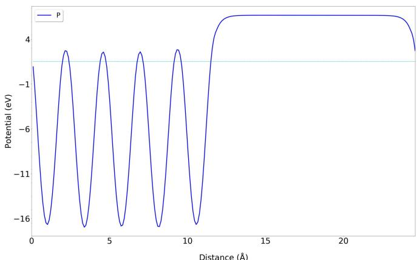

<details>
<summary>line chart</summary>

| Distance (Å) | Potential (eV) |
| ------------ | -------------- |
| 0            | -1             |
| 1            | -16            |
| 2            | -1             |
| 3            | -16            |
| 4            | -1             |
| 5            | -16            |
| 6            | -1             |
| 7            | -16            |
| 8            | -1             |
| 9            | -16            |
| 10           | -1             |
| 11           | -16            |
| 12           | 4              |
| 13           | 4              |
| 14           | 4              |
| 15           | 4              |
| 16           | 4              |
| 17           | 4              |
| 18           | 4              |
| 19           | 4              |
| 20           | 4              |
| 21           | 4              |
| 22           | 4              |
| 23           | 4              |
| 24           | 4              |
| 25           | 4              |
| 26           | 4              |
| 27           | 4              |
| 28           | 4              |
| 29           | 4              |
| 30           | 4              |
</details>

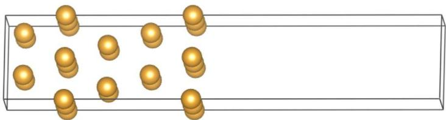

<details>
<summary>natural_image</summary>

Diagram of golden spheres inside a rectangular container (no text or symbols)
</details>

So, the Vacuum-Level is 6.695, POTPAVG.dat as following:

```txt
# Planar Distance (in Angstrom), Planar Average-Potential (in eV) or -Densitiy (in e)
0.0000 0.27377302E+01
0.1025 0.94832051E+00
0.2049 -0.13842911E+01
0.3074 -0.40872693E+01
0.4099 -0.69356914E+01
0.5123 -0.96882699E+01
0.6148 -0.12150765E+02
0.7172 -0.14164741E+02
...
```

## 3. Get the fermi level by:

grep E-fermi OUTCAR

E-fermi : 1.5199

XC(G=0): -6.7056

alpha+bet : -6.4642

## 4. Draw the Plane-averaged electrostatic potential figure.

So, work function can be calculated as:

$$
\Phi = E _ {\mathrm{vac}} - E _ {\mathrm{F}}
$$

$\Phi = 6.695 - 1.5199 = 5.1751 \mathrm{eV}$

## Macroscopic Averaged Potential

Besides planar averaged potential, VASPKIT can also calculate macroscopic-averaged potential, which is obtained by converging the planar averaged potential with a moving average. e.g. If one want to do planar-averaged potential in z-direction, use $z = \text{average}(x, y)$ for every $z$ . If one want to do macroscopic-averaged potential in z-direction, use $z = \text{average}(x, y, z \pm \Delta z')$ for every $z$ , where $2\Delta z'$ is the layer distance for repeat structures.

For example: MoS2/WS2 heterogeneous junction.

1. Do a single-point calculation with LVHAR = .TRUE.  
2. Run VASPKIT 427 to obtain planar averaged potential and macroscopic averaged potential from LOCPOT.  
1. Select which direction to do planar average?  
2. Input the period length to calculate macroscopic average. (To accelerate the convergence, this value should be close to and smaller than the layer distance)  
3. Input iteration number to get smoother macroscopic curve.

```diff
427
+---- Warm Tips ----+
You MUST Know What You are Doing
Check Convergence of Planar Average Value on Vacuum-Thickness!
+----+
================------ Specified Direction ====================
Which Direction is for the Planar Average?
1) x Direction
2) y Direction
3) z Direction

0) Quit
9) Back
-------->
1
--> (01) Reading Structural Parameters from LOCPOT File...
--> (02) Reading Local Potential From LOCPOT File...
Please input the period length to calculate macroscopic average:
(Typical value: the minimum length of repeated unit.)

----
1.5
Please input iteration number to get smoother macroscopic curve:
(Must be integer. You can gradually increase from 1 to 3.)

----
3
--> (03) Written PLANAR_AVERAGE.dat File!
+---- Summary ----+
Maximum of macroscopic average: 0.099
Minimum of macroscopic average: -0.101
+----+
--> (04) Written MACROSCOPIC_AVERAGE.dat File!
```

Step 3. Draw graphs from the output MACROSCOPIC\_AVERAGE.dat, and PLANAR\_AVERAGE.dat

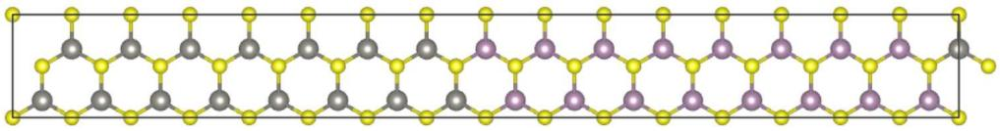

<details>
<summary>chemical</summary>

Molecular structure diagram showing a repeating lattice with gray and purple atoms connected by yellow bonds
</details>

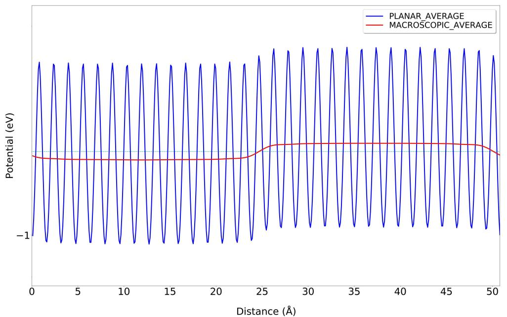

<details>
<summary>line chart</summary>

| Distance (Å) | PLANAR_AVERAGE (eV) | MACROSCOPIC_AVERAGE (eV) |
| ------------ | ------------------- | ------------------------ |
| 0            | ~0.0                | ~-0.5                    |
| 5            | ~0.0                | ~-0.5                    |
| 10           | ~0.0                | ~-0.5                    |
| 15           | ~0.0                | ~-0.5                    |
| 20           | ~0.0                | ~-0.5                    |
| 25           | ~0.0                | ~-0.5                    |
| 30           | ~0.0                | ~-0.5                    |
| 35           | ~0.0                | ~-0.5                    |
| 40           | ~0.0                | ~-0.5                    |
| 45           | ~0.0                | ~-0.5                    |
| 50           | ~0.0                | ~-0.5                    |
</details>

## Density related

## Charge Density and Spin Density

When use spin-polarized parameter (SPIN = 2), the output CHGCAR will contain charge density and spin density. VASPKIT can extract the charge density and spin density by options 311 and 312 respectively. Outputs are saved in CHARGE.vasp and SPIN.vasp.

VASPKIT can also calculate the Spin-Up & Spin-Down density by option 313. The outputs are saved in SPIN\_UP.vasp & SPIN\_DW.vasp files

## Charge Density Difference

VASPKIT is powerful for post-processing grid file from VASP, such as CHGCAR, ELFCAR, LOCPOT, PARCHG.

CHGCAR contains the lattice vectors, atomic coordinates, the total charge density multiplied by the volume on the fine FFT-grid (NG(X,Y,Z)F), and the PAW one-center occupancies. By subtract two or more CHGCAR, One can get the charge density difference.

Note: From electrostatic potential (LOCPOT), electron localization function (ELFCAR), and partial charge (PARCHG) density difference calculation can also be accomplished by the same method of VASPKIT.

Charge density difference is one of the important way to investigate electronic structure. It can intuitively get the electron flow from the interaction of two fragments. And explore the essence of chemical bond. There are several forms of charge density difference.:

(1) The charge density of the total system subtract the density of two or more segments that make up it:

$$
\Delta \rho = \rho_ {A B} - \rho_ {A} - \rho_ {B}
$$

(2) Charge density difference before and after self-consistent calculation. Also known as deformation charge density:

$$
\Delta \rho = \rho (A B _ {\mathrm{self-consistent}}) - \rho (A B _ {\mathrm{atomic}})
$$

(3) Density in one electronic state subtracts density in another. For example, the charge density under an applied electric field subtracts the charge density without an external electric field. Another example is the density of the excited state minus the density of the ground state.

$$
\Delta \rho = \rho (A B _ {\text { state   1 }}) - \rho (A B _ {\text { state   0 }})
$$

Among the three charge density differences mentioned above, no matter which calculation, must ensure that the cell parameters and coordinates of atoms must be consistent.

## Example: Charge density difference of two fragments

Take CO adsorption on Ni(100) surface as an example:

1. Optimize the structure of CO/Ni(100),  
2. Do the single-point self-consistent calculation of Ni(100) and CO respectively. ATTENTION: The atomic position of CO and Ni(100) fragments should be taken from optimized CO/Ni(100) CONTCAR, do NOT optimized the CO and Ni(100) fragments!  
3. Run VASPKIT 314. to input the path of three CHGCAR respectively:

314

File Options

Input the Names of Charge/Potential Files with Space:

(e.g., to get AB-A-B, type: \~/AB/CHGCAR ./A/CHGCAR ../B/CHGCAR)

(e.g., to get A-B, type:\~/A/CHGCAR ./B/CHGCAR)

---->>

./CHGCAR ./co/CHGCAR ./slab/CHGCAR

--> (01) Reading Structural Parameters from ./CHGCAR File...  
--> (02) Reading Charge Density From ./CHGCAR File...  
-->>> (03) Reading Structural Parameters from ./co/CHGCAR File...  
--> (04) Reading Charge Density From ./co/CHGCAR File.  
-->> (05) Reading Structural Parameters from ./slab/CHGCAR File...  
--> (06) Reading Charge Density From ./slab/CHGCAR File...  
--> (07) Written CHGDIFF.vasp File!

The output CHGDIFF.vasp is also a grid that can be opened by VESTA.

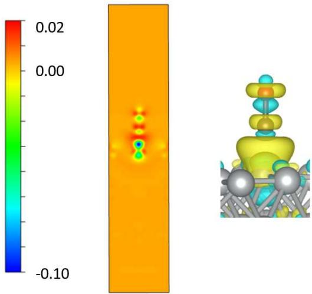

<details>
<summary>heatmap</summary>

| Value Range | Color Intensity |
|-------------|-----------------|
| -0.10       | Blue            |
| 0.00        | Green           |
| 0.02        | Red             |
</details>

## Example: Deformation charge density of CO

1. Do self-consistent calculation for CO molecule.  
2. Make a new folder, do non-selfconsistent calculations to output a superposition of atomic charge densities.  
3. Run VASPKIT 314 Input the path of two CHGCAR respectively.

314

File Options

Input the Names of Charge/Potential Files with Space:

(e.g., to get AB-A-B, type: \~/AB/CHGCAR ./A/CHGCAR ../B/CHGCAR)

(e.g., to get A-B, type:\~/A/CHGCAR ./B/CHGCAR)

\- - - - - - - - - - - >>

/CHGCAR ./deform/CHGCAR

-->> (01) Reading Structural Parameters from ./CHGCAR File...  
--> (02) Reading Charge Density From ./CHGCAR File...  
--> (03) Reading Structural Parameters from ./deform/CHGCAR File...  
--> (04) Reading Charge Density From ./deform/CHGCAR File...  
--> (05) Written CHGDIFF.vasp File!

4. Output the CHGDIFF.vasp file and open it by VESTA.

$$
\Delta \rho = \rho (A B _ {\text { self - consistent }}) - \rho (A B _ {\text { atomic }})
$$

Charge Density Difference (e/Bohr $^{3}$ )  
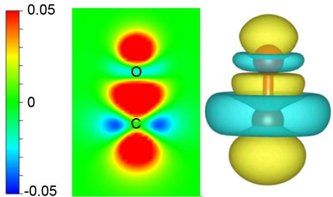

<details>
<summary>chemical</summary>

Molecular orbital visualization with electron density map and 3D molecular structure
</details>

## Example: Charge density difference of InSe with electric field

1. Optimized the InSe structure with no external electric field.  
2. Do self-consistent single-point calculation based the optimized structure.

EFIELD = 0.05

IDIPOL = 3

LDIPOL = .TRUE.

EFIELD controls the magnitude of the applied electric force field in units of eV/Å.

3. Run VASPKIT 314 do charge density difference.  
4. Output the CHGDIFF.vasp file and open it by VESTA.

Charge Density Difference (e/Bohr $^{3}$ )  
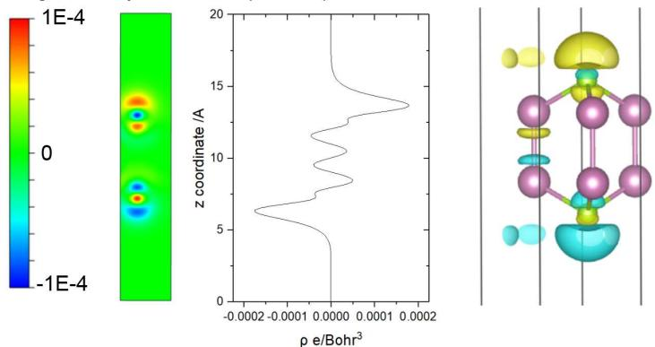

<details>
<summary>heatmap</summary>

| ρ e/Bohr³ | z coordinate /A |
| --------- | --------------- |
| -0.0002   | 0               |
| -0.0001   | 5               |
| 0.0000    | 10              |
| 0.0001    | 15              |
| 0.0002    | 20              |
</details>

## WaveFunction Visualization in Real-Space

VASPKIT can extract the planewave coefficients of Kohn-Sham (KS) orbital from the WAVECAR file and output the real-space wavefunction. Users need to input which K point to plot, and which band to plot.

Note: Now, VASPKIT can only output wavefunction for specified one K-point and one band at one time. To sum several K points or setting the energy range, the partial charge density calculation in the VASP can do it.

## Example: WaveFunction of CO molecule

1. Check the band structure or IBZKPT file to check which K point do you want to plot? For CO molecule calculation, there is only one Gamma point. So input 1

```txt
Which K-POINT do you want to plot? (1<= ikpt <=1)
```

```txt
1
```

2. Check the band structure or EIGENVAL file to check which band do you want to plot? The EIGENVAL file shows as following. The five column are 1, band number; 2, spin up band energy; 3, spin down band energy; 4, spin up occupation number; 5, spin down occupation number.

1 -29.245473 -29.245473 1.000000 1.000000 2 -14.032873 -14.032873 1.000000 1.000000 3 -11.728864 -11.728864 1.000000 1.000000 4 -11.728864 -11.728864 1.000000 1.000000 5 -9.029100 -9.029099 1.000000 1.000000 6 -2.131725 -2.131723 0.000000 0.000000 7 -2.131725 -2.131723 0.000000 0.000000 8 -0.143054 -0.143371 0.000000 0.000000 If we want to check the HOMO and LUMO or VBM and CBM, select band 5, 6, 7 in turn.

```diff
511
+---- Warm Tips ----+
```

Open Real-Space WaveFunction Files with VESTA/VMD Package.

```txt
+----+
Which K-POINT do you want to plot? (1<= ikpt <=1)
```

```txt
...... >>
```

1

Which BAND do you want to plot? (1<= iband <=36)

```txt
-->
```

```diff
5
+---- Warm Tips ----+
```

Current Version Only Support the Standard Version of VASP code.

```txt
+---+=---+=---+=---+=---+=---+=---+=---+=---+=
```

-->> (01) Reading the header information in WAVECAR file...

```txt
+---- WAVECAR Header ----+
```

SPIN = 2

NKPTS = 1

NBANDS = 36

ENCUT = 400.00

Coefficients Precision: Complex\*8

Maximum number of G values: GX = 25, GY = 25, GZ = 25

Estimated maximum number of plane-waves: 65450

-->>> (02) Start to Post-Process Wavefunctions..

--> (03) Reading Structural Parameters from POSCAR File...

--> (04) Written RWAV\_B0005\_K0001\_UP.vasp File!

--> (05) Written IWAV\_B0005\_K0001\_UP.vasp File!

-->>> (06) Written RWAV B0005 K0001 DW.vasp File!

--> (07) Written IWAV\_B0005\_K0001\_DW.vasp File!

Note: Now, VASPKIT can only output wavefunction for specified one K points and one band at one time. To sum several K points or setting the energy range, VASP partial charge calculation can do it.

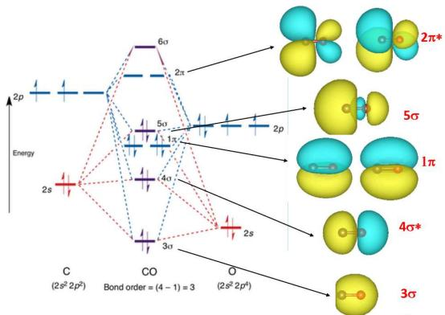

<details>
<summary>chemical</summary>

Molecular orbital diagram showing electron density distributions and bonding order for carbon (2s²2p²) and oxygen (2s²2p⁴) orbitals
</details>

RwAV is real part of wavefunction and IwAV is imaginary part of wavefunction. Usually, we just need to plot and analyze the real part. B0005 is band number, K0001 is K point number in IBZKPT file. Spin up and spin down are output separately.

Show RWAV\_B0005\_K0001\_UP.vasp, RWAV\_B0006\_K0001\_UP.vasp, and RWAV\_B0007\_K0001\_UP.vasp ... files by VESTA.

## Example: WaveFunction of MoS2/WS2 Heterojunctions

Check the IBZKPT file and EIGENVAL file. The EIGENVAL shows the VBM and CBM at Gamma is:

```txt
287 -2.799024 1.000000
288 -2.799005 1.000000
289 -0.201544 0.000000
290 -0.201541 0.000000
...
```

Extract the 288 and 289 bands at Gamma point. Run VASPKIT, input 511-1-288 and 511-1-289. Open the RWAV files by VESTA.

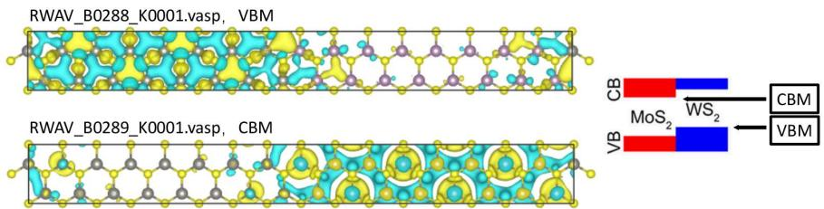

<details>
<summary>chemical</summary>

Molecular structure diagrams of RWAV protein variants (B0288_K0001.vasp and B0289_K0001.vasp) showing VBM, CB, MoS₂, and WS₂ components
</details>

## Fermi Surface

In condensed matter physics, the Fermi surface is the surface in reciprocal space which separates occupied bands from unoccupied bands at zero temperature. The shape of the Fermi surface is derived from the periodicity and symmetry of the crystalline lattice and from the occupation of electronic energy bands.

1. prepare the optimized POSCAR of FCC Cu. Note that it must be the primitive cell.  
2. Run VASPKIT and enter the 261 command to generate the KPOINTS and POTCAR files for calculating the Fermi surface.

```diff
---->>
261
+----Warm Tips ----+
    \* Accuracy Levels: (1) Medium: 0.02~0.01;
    (2) Fine: < 0.01;
    \* 0.01 is Generally Precise Enough!
+----
Input KPT-Resolved Value (unit: 2*PI/Angstrom):
---->>
0.008
---> (1) Reading Structural Parameters from POSCAR File...
---> (2) Written KPOINTS File!
```

3. Submit VASP job.

4. After the VASP calculation is completed, run VASPKIT again, input 262 command, and generate the FERMISURFACE.bxsf file containing the Fermi surface data.

```txt
---->>
262
---> (1) Reading Input Parameters From INCAR File...
---> (2) Reading Structural Parameters from POSCAR File...
---> (3) Reading Fermi-Level From DOSCAR File...
ooooooo000 The Fermi Energy will be set to zero eV oooooooo00000000
---> (4) Reading Energy-Levels From EIGENVAL File...
---> (5) Written FERMISURFACE.bxsf File!
```

5. Run the XcrySDen software and follow the steps below. The fifth band through the Fermi surface, so we choose Band Number 5, then click Selected, and then get the Fermi surface of Cu.

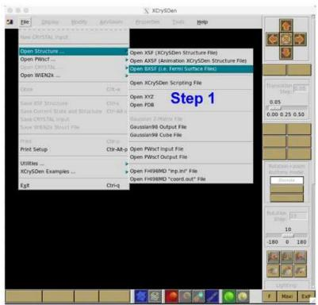

<details>
<summary>text_image</summary>

XCY5Den
File
Display
Modify
Applications
Properties
Tools
Help
Save CRYSTAL Input
Open Structure ...
Open XFSF (XCY5Den Structure File)
Open AXSF (Animation XCY5Den Structure File)
Open AXSF (i.e. film surface free)
Open WREN2x...
Open XCRy5Den Scripting File
Open XYZ
Open POB
Open XCRy5Den Structure File
Open CSFT Structure
Open CSFT Surface and Structure File
Open CSFT Input File
Open CSFT Output File
Open CSFT Scripting File
Open CSFT Scripting File
Print Setup
Print Setup
Utilities
XCY5Den Examples ...
Ctrl+0
Ctrl+0
Ctrl+0
Ctrl+0
Ctrl+0
Ctrl+0
Ctrl+0
Ctrl+0
Ctrl+0
Step 1
Gaussian-2 Mainle File
Gaussian98 Output File
Gaussian98 Cube File
Open XFSF Input File
Open XFSF Output File
Open FH98MD ("rep-in" file)
Open FH98MD "coord.out" file
</details>

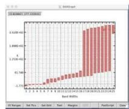


<details>
<summary>text_image</summary>

Select bands for Fermi Surface drawing:
Band number: 1
Band number: 2
Band number: 3
Band number: 4
Band number: 5
✓ Band number: 6
Band number: 7
Band number: 8
Selected
Step 2
</details>


<details>
<summary>text_image</summary>

*** XCySDen - Fermi Surface: /var/folders/r4/m4w8t254wzdjq03tg079nc0000gnT/xc_57150/FERMISURFACE.bxsf
Band #6 Merged Bands
Degree of 1 2 3 4 5 6 Submit Zoom Step: 0.0 0.2 0.4 +
Step 3 Revert Sides Revert Normals
Interpolation: 1 2 3 4 5 6
FERMI Energy: 7.58663 Min Ene: 5.340580e+00 Max Ene: 1.376761e+01 Isolevel: 7.58663
</details>

## Other Functions

## Molecular Dynamics process

721 calculate the Mean Squared Displacement (MSD) based on VASP MD results. First prepare a reference structure file POSCAR.ref. Then run VASPKIT  
721 to calculate MSD. The output MSD.dat contains displacement information $|x|$ , $|y|$ , $|z|$ , and MSD, RMSD.

<table><tr><td># ion_step</td><td> $\left| \mathrm{{dx}}\right|$ </td><td> $\left| \mathrm{{dy}}\right|$ </td><td> $\left| \mathrm{{dz}}\right|$ </td><td>MSD</td><td>sqrt(MSD)</td></tr><tr><td>1</td><td>0.0000016</td><td>0.0000011</td><td>0.0000019</td><td>0.0000000</td><td>0.0000001</td></tr><tr><td>2</td><td>0.1724941</td><td>0.2677518</td><td>0.2270937</td><td>0.0001325</td><td>0.0115120</td></tr><tr><td>3</td><td>0.3367914</td><td>0.5283185</td><td>0.4461284</td><td>0.0005124</td><td>0.0226364</td></tr><tr><td>4</td><td>0.4918222</td><td>0.7752755</td><td>0.6499894</td><td>0.0010922</td><td>0.0330486</td></tr><tr><td>5</td><td>0.6370632</td><td>1.0074569</td><td>0.8382370</td><td>0.0018188</td><td>0.0426475</td></tr><tr><td>6</td><td>0.7959320</td><td>1.2340219</td><td>1.0093023</td><td>0.0026613</td><td>0.0515876</td></tr><tr><td>7</td><td>0.9545851</td><td>1.4665808</td><td>1.1630884</td><td>0.0036234</td><td>0.0601945</td></tr><tr><td>8</td><td>1.1064692</td><td>1.6957629</td><td>1.3186163</td><td>0.0047342</td><td>0.0688057</td></tr><tr><td>9</td><td>1.2477962</td><td>1.9293770</td><td>1.4885940</td><td>0.0060285</td><td>0.0776432</td></tr></table>

ATOM\_DISPLACEMENT.dat contains displacement and RMSD information for each atoms.  
722 calculate the Radial Distribution Function (RDF) also based on VASP MD results.

File Format Transfer

<table><tr><td>From</td><td>to</td><td>VASPKIT Option</td></tr><tr><td>XDATCAR</td><td>PDB</td><td>405</td></tr><tr><td>POSCAR/CONTCAR</td><td>POSCAR (with Cartesian Coordinates)</td><td>4061</td></tr><tr><td></td><td>POSCAR (with Fractional Coordinates)</td><td>4062</td></tr><tr><td></td><td>CIF (POSCAR.cif)</td><td>4063</td></tr><tr><td></td><td>ATAT (lat.in) (experimental)</td><td>4064</td></tr><tr><td></td><td>XCrySDen (POSCAR.xsf)</td><td>4065</td></tr><tr><td></td><td>Quantum-Espresso (pwscf.in)</td><td>4066</td></tr><tr><td></td><td>Elk (elk.in)</td><td>4067</td></tr><tr><td></td><td>Siesta (POSCAR.fdf)</td><td>4068</td></tr><tr><td></td><td>PDB Format (POSCAR.pdb)</td><td>4069</td></tr><tr><td>CIF</td><td>POSCAR</td><td>105</td></tr><tr><td>xsd</td><td>POSCAR</td><td>106</td></tr><tr><td>Bader results</td><td>pqr</td><td>508</td></tr><tr><td>CHGCAR/PARCHG</td><td>XcrySDen (.xsf) format</td><td>318</td></tr><tr><td></td><td>Gaussian (.cube) format</td><td>319</td></tr><tr><td colspan="2">From to</td><td>VASPKIT Option</td></tr><tr><td>LOCPOT/ELFCAR</td><td>XcrySDen (.ksf) format</td><td>428</td></tr><tr><td></td><td>XcrySDen (.ksf) format</td><td>429</td></tr></table>

## USER interface

## Restrictions and Usage Notes

## Cautionary Notes of VASP Wavefunctions

1. The calculated plane-wave coefficients of pseudo periodic part (Bloch function) are read from the given WAVECAR file and the corresponding G-vectors are generated using the algorithm developed in WaveTrans $^{®}$ code. It should be noted that the pseudopotential augmentation is not included in the WAVECAR file. As a result, some caution should be exercised when deriving value from this information. For example, the partial charge density obtained using vaspkit-515 will differ from the PARCHG from VASP, but the qualitative shape of the charge density should match.  
2. The actual number of plane waves (NPWS) of each k value is determined by the maximum plane-wave energy it is used for the VASP run, i.e. all G values for which $\frac{\hbar^{2}|k+G|^{2}}{2m}$ is less than the cut-off energy. Unfortunately, the imprecisely-known scaling factor $\frac{2m}{\hbar^{2}}$ leads to a discrepancy between the NPWS computed by VASPKIT and that contained in the WAVECAR file occasionally. If so, you will encounter an error message saying that "Error: the calculated NPWS is not equal to the read NPWS". Then please adjust the final decimal place (or one beyond that) of FACTOR\_ENCUT2NPWS (default value: 0.26246583) in the \~/.vaspkit file (1.3 and newer version). If such an adjustment is successfully determined, please contact wangvei@icloud.com with the new value, so that it can be incorporated into a future version of VASPKIT.

## Usage FAQs

1. The fermi energy is set to zero in the DOS.dat and BAND.dat files by default, unless the parameter SET\_FERMI\_ENERGY\_ZERO in the \~/.vaspkt file is set to .FALSE.;  
2. The fermi energy is read from the DOSCAR file by default, unless the FERMI\_ENERGY.in file exists. You can also set the fermi energy manually in the second line of the FERMI\_ENERGY.in file.